# Lab 01: Creating and using an agent from Copilot Studio for managing a Real Estate Application

**Lab Duration** – 90 minutes

**Introduction**

Contoso Real Estate specializes in the sale and management of both
commercial and residential properties. Currently, customer information
is efficiently stored within their Dataverse instance, allowing for
streamlined data management. However, the booking process presents a
significant challenge.

At present, customers can only request bookings via phone, leading to an
overwhelmed phone line and long waiting time. This situation not only
frustrates customers but also risks losing potential business as many
are unable to connect with the office to request services.

To address these issues, Contoso Real Estate is committed to developing
a comprehensive digital solution. This solution will empower customers
to easily access information about the booking process and submit
booking requests online.

**Objectives**

- Build a standalone agent for Contoso Real Estates from Copilot Studio
  (that will allow customers to discover information about the real
  estate booking process and create booking requests for the office to
  review.)

- Create Topics to set up the logic of the bookings.

- Create the Dataverse tables required for the bookings.

- Publish the copilot.

:::danger
**Lab 03** needs to be completed by the end of Day 1 in order to execute the Day 2 lab. Even if Labs 01 and 02 are not completed, please ensure to complete Lab 03 by the end of Day1.
:::

## Exercise 0: Setting up your environment

### Task 1: Login to VM

1.  Login to the VM using the **Username** and **Password** from
    the **Home** tab.
    
    
    
### Task 2: Synchronize the VM clock

1.  After logging into the VM, right click on the clock at the bottom
    right corner of the screen.

2.  Select **Adjust date and time.**

    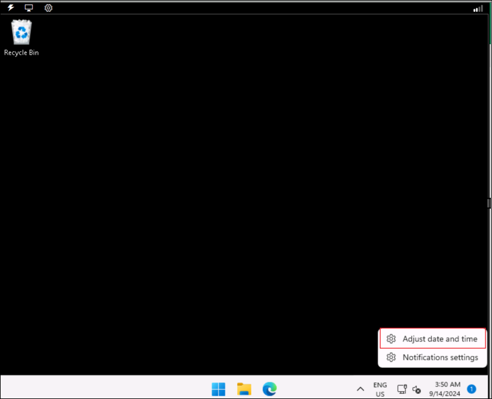

3.  On the Settings screen that opens up, click on **Sync now** under
    Additional settings.

    

4.  This takes care of synchronizing the time just in case the automatic
    synchronization does not work.

5.  **Close** the Settings pane.

    

## Exercise 1: Setting up Power Apps and Dataverse

### Task 1: Sign up for the Microsoft Power Apps Developer Plan

1.  Open a browser and navigate  to !!https://powerapps.microsoft.com/free/!! and select
    **Start free** or **Try for free**.

    

2.	Login using the Office Tenant Credentials **Username** and **Password** from the **Home** tab if prompted. This will be your **login credentials** to all the Microsoft sites and apps for the labs.

    
   
4.  Under **Let's get started**, enter the **Administrative Username** from the **Home** tab  in the text
    box, check the agreement box and select **Start free**.

    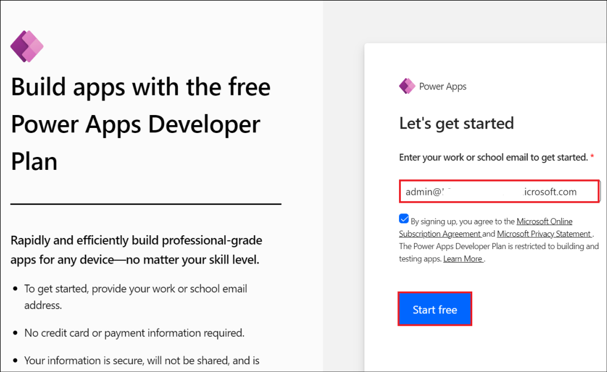

3.  If you see a prompt that you have an existing account with
    Microsoft. Select **Sign in**. Enter your password.

4.  If prompted, Select **Yes** to stay signed in.

5.  Click on **Environment** in the top-right corner of the screen and
    select **Dev One**.

    

### Task 2: Create a solution

1.  From the Power Apps Maker
    Portal(!!https://make.powerapps.com/!!), select **Solutions**
    form the left pane.

    

2.  Click on **+ New solution**.

    

3.  Enter !!**Bookings**!! for the Display name and click on **+ New
    publisher**.

    

4.  Enter the below details and then click on **Save**.

    |	Property |	Value |
    |:-----|:--------|
    | Display name	|!!Contoso!!	|
    |	Name |	!!Contoso!!|
    | Prefix |!!Contoso!!	|

    

    ::: secondary
    **Note:** If you get a message stating that the publisher is already available, close the publisher creation pane and select the Publisher in the New Solution creator pane.
    :::
    
6.  Select **Contoso (contoso)** under Publisher and then click on
    **Create**.

    

7.  Select **Back to solutions** in the top-left of the screen.

    

### Task 3: Set the preferred solution

1.  Under Solutions in the Maker portal, select **Manage** for **Set
    your preferred solution**.

    

2.  Select **Bookings (contoso)** under **Unless otherwise specified,
    save my changes in** and select **Apply**.

    

    

### Task 4: Create the Real Estate Properties custom table

Follow these steps to create a new custom table in Dataverse for Real
Estate Properties.

1.  From the left navigation pane, select **Tables**, select the drop
    down next to **+ New table** and then select **Create** **new
    tables**.

    

2.  Click on **Got it** in the **Let’s set up your data** dialog.

    

3.  On the Create new tables screen, click on **+ New table -\> Add
    columns and data**.

    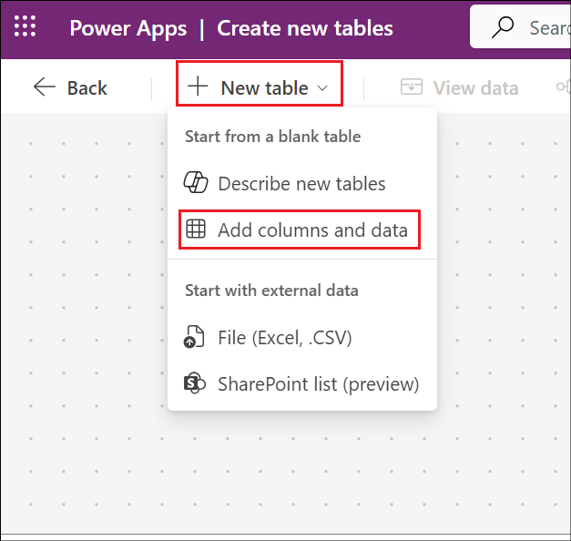

4.  Rename the table name from **Table1** to !!**Real Estate Property**!! and then click on **Save and exit**.

    

5.  Click on **Save and exit** in the confirmation dialog.

    

6.  Once saved, click on the **Custom** tab to find the newly created
    table there. Click on the **Real Estate Property** table.

    

7.  Under the **Real Estate Property columns and data**, change the name
    of the column called **New Column** (Click on the drop down next to
    **New Column** and select **Edit Column** and update the **Display
    name**) to !!**Property Name**!! and select **Save**.

    

8.  Select the **+** button to add a new column in the columns and data
    pane. In the New column pane, enter the following values, and then
    select **Save**.

    - Display name: !!**Asking Price**!!

    - Data type: Currency

    

    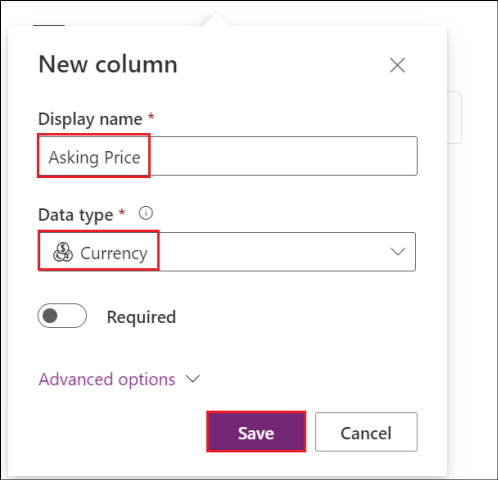

9.  Add the following two columns.

    |	Display name | Data type	|
    |:-----|:--------|
    |!!Street!!	|	Single line of text (this value is the default)|
    |	!!City!!|	Single line of text (this value is the default)|

10. Add another column with the below values

    - **Display name**: !!Bedrooms!!

    - **Data type**: Choice -\> Choice

    

    Create the choice values:

    Select **+ New choice** under **Sync this choice with** option

    

    - Under **Choices**, provide the Display name as !!**Bedrooms**!!.
    
    - You see two entry fields titled **Label** and **Value**.
      Enter **1** under the label. Power Apps assigns a value automatically
      but you can change the value to **1**.

    &nbsp;
    
    - Select **+ New choice** and make **2** the new entry for Label
      and **2** for Value.
    
    &nbsp;
    
    - Select **+ New choice** and make **3** the new entry for Label
      and **3** for Value.
    
    &nbsp;
    
    - Select **+ New choice** and make **4** the new entry for Label
      and **4** for Value.
    
    &nbsp;
    
    - Select **+ New choice** and make **5** the new entry for Label
      and **5** for Value.
    
    &nbsp;
    
    - Select **Save**.

    

    Select the added choice **Bedrooms**, by clicking the drop down of
**Sync this choice with**

    

    Click on **Save**.

    

11. Select the **+** button to add a new column in the columns and data
    pane.

12. In the New column pane, enter the following values, and then
    select **Save**:

    - **Display name**: !!Bathrooms!!

    - **Data type**: Choice -\> Choice

    

    Create the choice values:

    Select **+ New choice** under **Sync this choice with**.

    - Under **Choices**, provide the Display name as !!Bathrooms!!.

    &nbsp;
    
    - You see two entry fields titled **Label** and **Value**.
      Enter **1** under the label. Power Apps assigns a value automatically
      but you can change it to **1**.
    
    - Select **+ New choice** and make **2** the new entry for Label
      and **2** for Value.
    
    - Select **+ New choice** and make **3** the new entry for Label
      and **3** for Value.
    
    - Select **+ New choice** and make **4** the new entry for Label
      and **4** for Value.
    
    - Select **+ New choice** and make **5** the new entry for Label
      and **5** for Value.
    
    - Select **Save**.

    

    Select the created choice and click on Save in the column addition pane.

    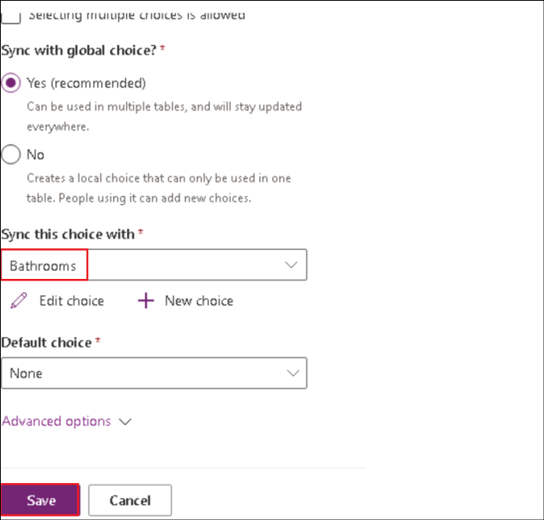

13. Add another column by selecting the **+** button again in the
    columns and data pane.

    In the New column pane, enter the following values, and then
select **Save**:

    - **Display name**: !!**Client**!!

    - **Data type**: Lookup -\> Lookup

    - **Related Table**: Contact

    

14. Once the columns are all created, under **Real Estate Property
    columns and data**, enter the following test data:

    :::secondary:::
    Note: If the required columns are not getting displayed, adjust the columns that are displayed by selecting the **+\<number>more**
    :::

    

    - Property Name: !!**1100 High Villas**!!

    - Asking Price: !!**250,000**!!

    - Bathrooms: **3**

    - Bedrooms: **2**

    - City: !!**Redmond**!!

    - Street: !!**Main Avenue**!!

    - Client: **Select any contact**

    

### Task 5: Create the Bookings table

Follow these steps to create a new custom table in Dataverse for Real
Estate Property Bookings.

1.  From the left navigation pane, select **Tables**, select **Create**
    **new tables**.

    

2.  On the **Create new tables** screen, click on **+ New table -\> Add
    columns and data**.

    

3.  Rename the table name from **Table1** to !!**Booking Request**!! and
    then click on **Save and exit**.

    

4.  Click on **Save and exit** in the confirmation dialog.

    

5.  Once saved, click on the **Custom** tab to find the newly created
    table there. Click on the **Booking Request** table.

    

6.  Change the name of the column called **New Column** to !!**Booking Name**!! (Click on the drop down next to **New Column** and select **Edit Column** and update the **Display name**).

    

7.  Click on **+** symbol next to the column names.

    

8.  Create the following columns with the name and data type as
    specified below. Select **Save**.

    -	Display name –  !!Property!!
    -	Data type –  Lookup -> Lookup
    -	Related Table – Real Estate Property
    
        
    
    -	Display name – !!Viewer Name!!
    -	Data type – **Single line of text**
    
    &nbsp;
    
    -	Display name – !!Viewer Email!!
    -	Data type – **Single line of text**
    -	 Format – **Email**

    &nbsp;
    
    -	Display name – !!Booking Date!!
    -	Data type – **Date and time**

    &nbsp;
    
    -	Display name – !!Notes!!
    -	Data type – **Multiple lines of text**

    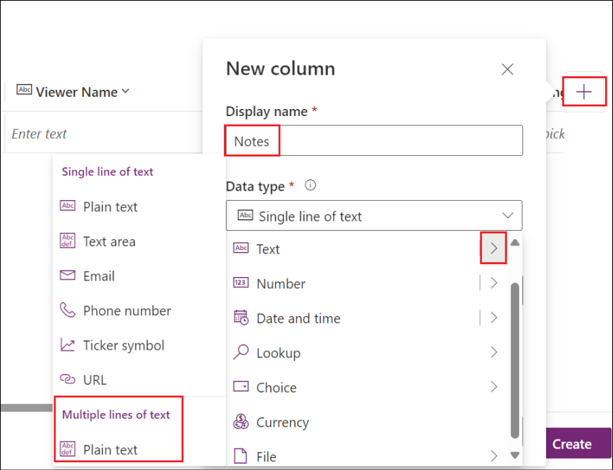

    

10.  Add a choice data type column with the below details.

    -	Display name – !!Decision!!
    -	Data type – Choice -> Choice

    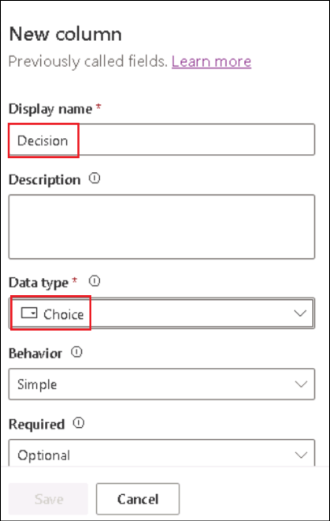

    Under **Sync this choice with**, click on **+ New Choice**. Enter
**Display name** as !!**Decision**!!.

    Enter the below details and click on **Save**.

    - Label – !!**Undecided**!!

    - Value – 1

    - Label – !!**Accepted**!!

    - Value – 2

    - Label – !!**Declined**!!

    - Value – 3

    

    Select the added Choice **Decision** under **Sync this choice with**
field, designate **Undecided** as the **Default choice** and click on
**Save**.

    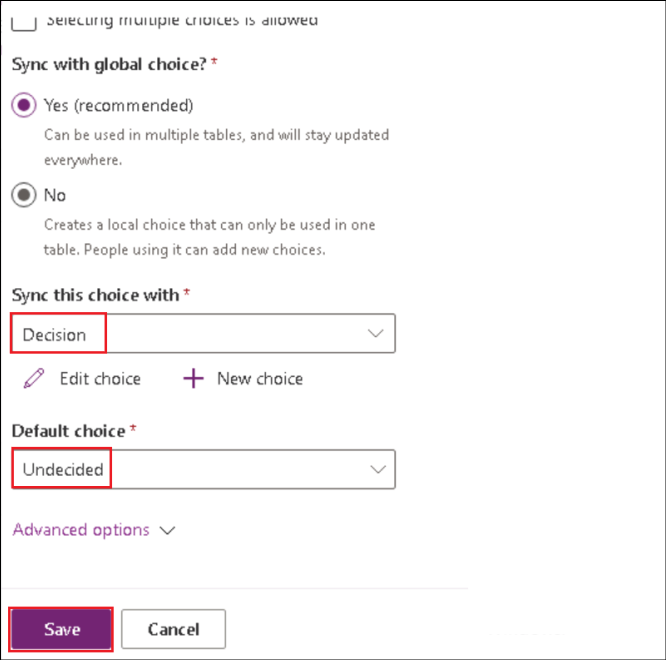

## Exercise 2: Working with Copilot Studio

### Task 1: Sign up for Copilot Studio trial

1.  In a new tab in the browser, navigate to the url !!https://copilotstudio.microsoft.com/!!.

2.  Leave the **Choose your country/region** with the **default** value
    and click on **Get Started**.

    

3.  Click on **Environments** on the top left and select
    **Dev One**.

    

4.  Select **Skip** if you get a Welcome to Copilot Studio! Prompt.

    

### Task 2: Create the Real Estate Booking Service agent

1.  Select **Create** from the left navigation pane and select the **New
    agent** tile.

    

2.  Select **Skip to configure**.

    

3.  Fill in the below details.

    - Name - !!**Real Estate Booking Service**!!
    
    - Description - !!**Create bookings for real estate properties**!!
    
    - Instructions - !!**Create a copilot for topics relating to creating bookings for real estate properties!!**
    
    - Language **–** Select **English**

    

4.  Select the three dots next to the Create button in the top-right of
    the screen and select **Edit advanced settings**.

    

5.  Select the **Bookings** solution and select **Save**.

    

6.  In the top-right of the screen, select **Create**.

    

7.  Once the agent is created, in the Test your copilot pane, enter
    !!**How do I make a booking?**!! and click **Enter** and observe the
    response. You will get a generic response.

    

### Task 3: Configure Security

1.  Select **Settings** in the top-right of the screen.

    

2.  Select the **Security** tab and then select
    the **Authentication** tile.

    

3.  Select **No authentication** and click on **Save**.

    

4.  Select **Save** in the **Save this configuration** prompt.

    

5.  Once the Authentication settings are saved, click on the **Close**
    option to close the **Settings** pane.

    

### Task 4: Remove topics

Sample topics are included with new copilots. Remove these sample
topics. Disable system topics that you don't require.

1.  Select the **Topics** tab from the top menu of the Copilot Overview
    page.

    

2.  You will land in the **Custom** Topics page.

3.  Select the **System** tab. Toggle **Enabled** to **Off** for the
    **Sign in** topic.

    

### Task 5: Publish and test the copilot

1.  Select **Publish** to publish this agent.

    

2.  Select **Publish** in the **Publish this agent** dialog.

    

### Task 6: Demo Website

The Demo website allows users without a license to test your copilot.
You can provide them with the URL to the demo website.

1.  Select the **three dots** next to the **Settings** or the **Publish** button in the
    top-right of the screen and select **Go to demo website**.

    

2.  In the **Type your message** text box, enter !!**What information is needed to book a viewing for a real estate property?**!! and observe the response from the agent.

    

    It will be generic, similar to the one that you got in the Test your agent in the Studio, since we have not configured any specific topics and implemented any logic to the agent yet. We will do it in the upcoming exercises.

## Exercise 3: Create and manage topics using Copilot

### Task 1: Create a topic using Copilot

Topics can be created and edited using natural language.

1.  Navigate back to the browser tab with the Copilot Studio open. From the **Topics** tab, select **Add a topic** and select **Create
    from description with Copilot**.

    

    :::secondary:::
    **Note:** Select Allow if prompted with See text and images copied to the clipboard
    :::
    
3.  Enter the below details and click on **Create**.

    - Name your topic - !!**Customer Details**!!

    - Create a topic to... - !!**Ask the customer for their name and email address**!!

    

4.  A new topic displays with the  trigger phrases and question
    nodes.

5.  Select **Save**.

    

### Task 2: Update nodes with natural language

1.  If the **Edit with copilot** pane isn't shown on the right-hand side
    of the screen, select the **Copilot** icon in the upper part of the
    authoring canvas.

2.  Select the second question node, **What is your email address?**

3.  In the **Edit with Copilot** panel, in the **What do you want to
    do?** field, enter the following text:

    !!**Update the message in this question node to say thank you to the Name variable from the previous node and then proceed to ask the email address question**!!

4.  Select **Update**.

    

5.  Select **Save**.

    

### Task 3: Add nodes with natural language

In addition to adding updating existing nodes, you can use Copilot to
add new ones.

1.  Make sure that no node is selected by clicking in the empty space
    around the nodes.

2.  In the **What do you want to do?** field, enter the following text
    and then select **Update.**

    !!**Add a new multiple-choice question to prompt the user if the details are correct with two options Yes or No**!!

    

3.  A new question node is added to the end of the topic with options
    for the user to select.

4.  Select **Save**.

    

### Task 4: Configure the scope of the variables

1.  Select **Variables** to open the Variables pane.

    

2.  Select the right-hand check boxes for the topic variables and click
    on **Save**.

    

## Exercise 4: Create and manage topics manually

### Task 1: Create a topic from blank

1.  Select the **Topics** tab.

2.  Select **Add a topic** and select **From blank**.

    

3.  Select **Details** to open the Topic details dialog.

    

4.  Fill in the below details and click on **Save**.

    - **Name** - !!Book a Real Estate Showing!!

    - **Display Name –** !!**Book**!!

    - **Description**  - !!Select the property and requested date and create a booking request!!

    

5.  Select **Details** to close the Topic details dialog.

    

### Task 2: Add trigger phrases

1.  Select **Edit** under **Phrases** in the **Trigger**. Enter !!**I want to book a real estate showing**!! under **Add Phrases** and select the **+** icon.

    

2.  Enter the below phrases one by one.

    - !!**Schedule a real estate showing**!!

    - !!**Arrange the viewing for a real estate property**!!

    - !!**Set up an appointment to view a house**!!

    - !!**Plan a property viewing**!!

3.  Once all the phrases are added, select **Save**.

    

### Task 3: Add a message node

1.  Select the **+** icon under the Trigger node and select **Send a
    message**.

    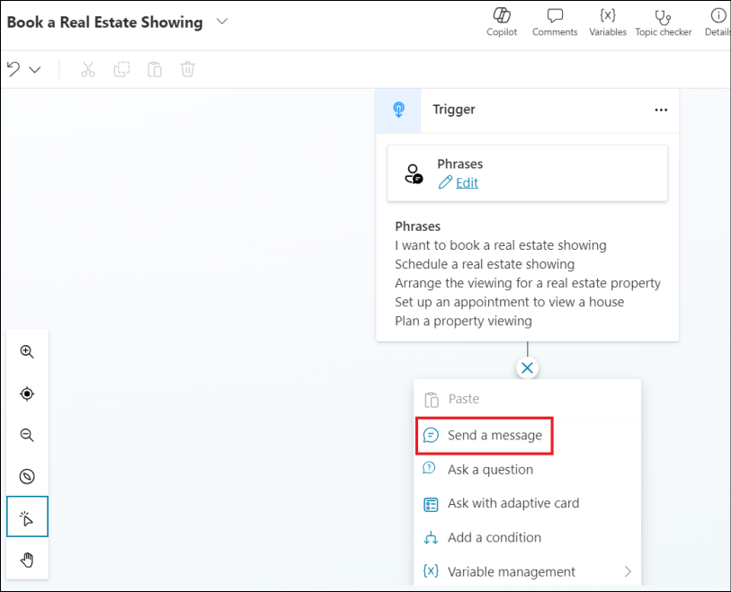

2.  In the **Enter a message** field, enter the following text:

    !!Hi, I can help you with booking a real estate property showing.!!

3.  Select **Save**.

    

### Task 4: Add a Topic management node

1.  Select the **+** icon under the send a message node and
    select **Topic management -\> Go to another topic**.

    

2.  Select the **Customer Details** topic.

    

3.  Select **Save**.

    

### Task 5: Add condition node 

1.  Select the **+** icon under the topic management node and
    select **Add a condition**.

    

2.  Select **DetailsCorrect** for variable.

    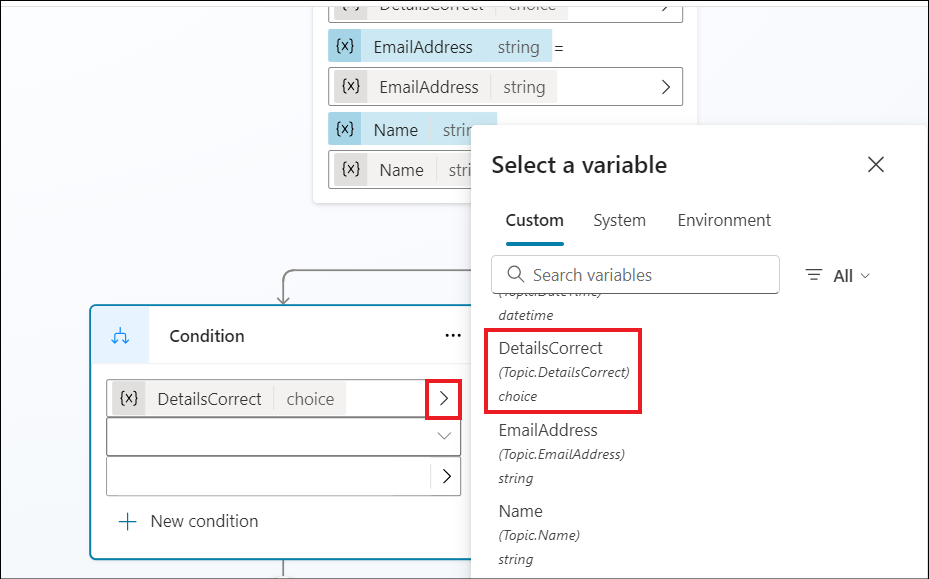

3.  Select the **Condition** as **is equal to**

4.  Select the **value** as **Yes**.

    

5.  Select **Save**.

    

### Task 6: Add question nodes

1.  Select the **+** icon under the left-hand condition node and
    select **Ask a question**. Fill in the below details and click on
    **Save**.

    - Enter a message  - !!Which property do you want to see?!!

    - **Identify** - Select **User's entire response**.

    - **Save user response as** Enter !!**PropertyName**!! for **Variable
  name**

    

2.  Select the the **+** icon under the question node and select **Ask a
    question**. Fill in the below details and click on **Save.**

    - **Enter a message** - !!What date and time do you want to see the property?!!

    - Identify - Select **Date and Time**

    - **Save user response as** - Enter !!**DateTime**!! for **Variable
  name**

    

### Task 7: Test the copilot

1.  Select the **Test** button in the top-right of the screen to open
    the testing panel. Select the **three dots** at the top of the
    testing panel in the top-right of the screen. Select **Track between
    topics**.

    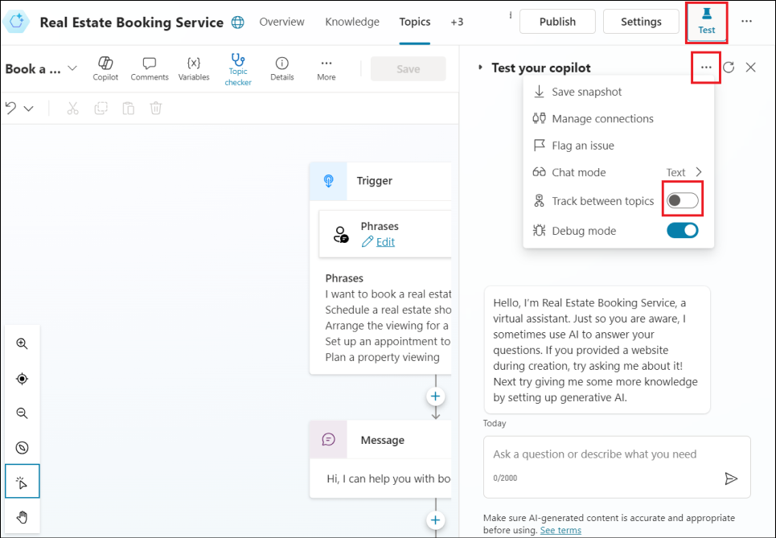

2.  When the **Conversation Start** message appears, your copilot starts
    a conversation.

3.  In response, enter a trigger phrase for the topic that you created:

    !!I want to book a real estate showing!!

4.  The copilot responds with the "**What is your name?**" question.

5.  Enter your name.

    

6.  Then enter your **email** when it prompts for the email. After you
    enter the details, a question appears asking if the information is
    correct, and options to select **Yes** or **No**. Select **Yes**.

    

7.  Enter !!555 Oak Lane, Denver, CO 80203!! to the **Which property to
    you want to see?** prompt.

8.  Enter !!**Tomorrow 10:00 AM**!! to the **What date and time do you
    want to see the property?** prompt.

    

## Exercise 5: Build an Autonomous agent that automatically sends an email when a booking is created or updated

This exercise is to showcase the **When a row is added, modified or deleted** trigger of an Autonomous agent. 

### Task 1: Create an agent

1.  Click on **Agents** from the left navigation pane.

    

3.  Click on **+ New agent** to create a new agent.

    

4.  Click on **Skip to configure** to configure the agent.

    

5.  Enter the below details and click on **Create**.

    **Name** - !!Autonomous agent!!

    **Description** - !!You are an agent to detect the updates to the Booking Requests table!!

    

6.  The agent setup will take few minutes to get completed. Once done,
    the Autonomous agent opens with the **Your agent is ready** message.

    

7.  Select **Settings** from the top right corner.

    

8.  The Generative AI option must be enabled in order to continue with
    the Trigger creation for the agent.

9.  Select the **Generative AI** option from the list of options on the
    left side of the **Settings** screen. Under **Using generative AI in
    conversations**, select **Generative (preview)**. Click on **Save**.

    

10. Close the **Settings** pane.

    

### Task 2: Add trigger to the agent

1.  Back in the Autonomous agent page, scroll down to the **Triggers
    (preview)** section and select **+ Add trigger**.

    

2.  Select **When a row is added, modified or deleted** trigger from the
    **Add trigger** screen.

    

3. Click on **Continue** in the next screen.

4.  Once selected, The **Trigger name** and the **Sign in options** gets
    loaded in the next screen. This will take a few minutes to get
    populated. For the trigger we selected, there will be two apps, one
    being the **Microsoft Copilot Studio** and the other one being the
    **Microsoft Dataverse**.

5.  Once loaded, ensure that the connectivity status is in **green** for
    the sign in options and then click **Next** to continue.

    

6.  In the Add trigger screen, select the below details and click on
    **Create trigger**.

    - Change type – **Added or modified**

    - Table name – **Booking Requests**

    - Scope – **Organization**

    - Trigger instructions – Leave as **default**. This will return the
  entire response to the agent.

    

7.  The Trigger creation may take 3 to 5 minutes to complete.

    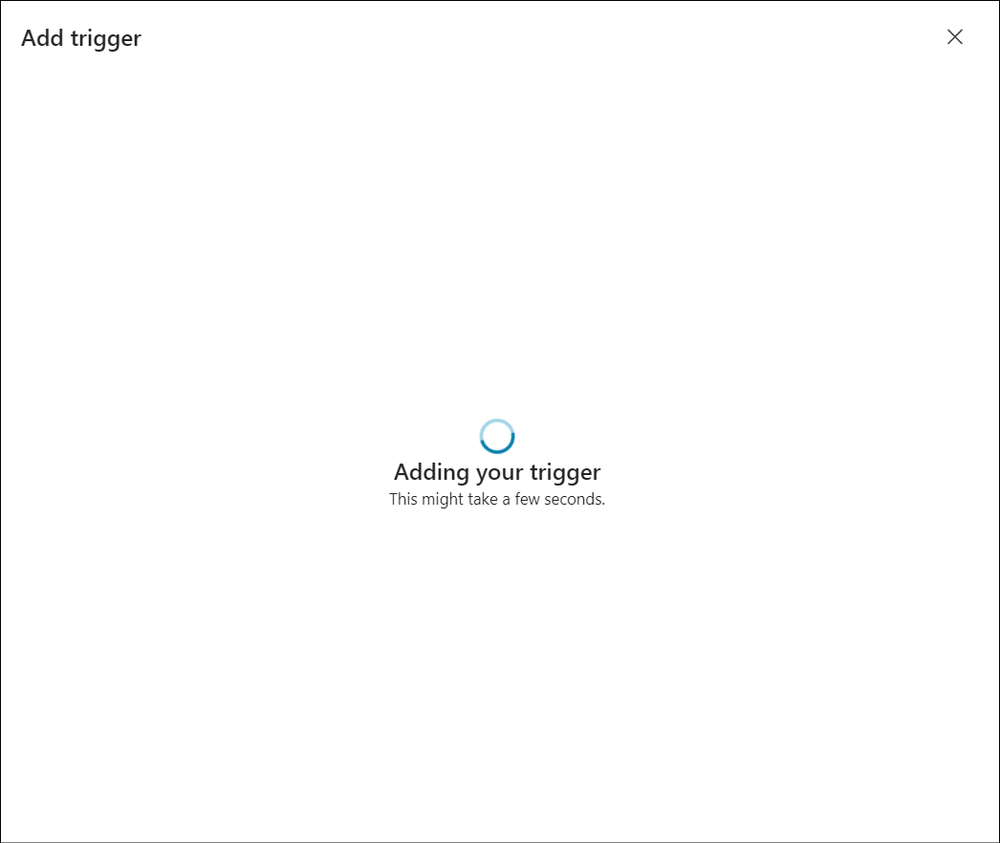

8.  Once done, click on **Close** in the **Time to test your trigger!**
    Screen.

    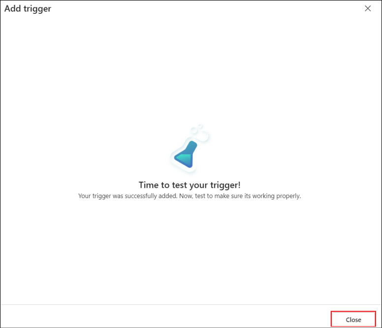

9. Click on the **Actions** tab and select **+ Add action**.

    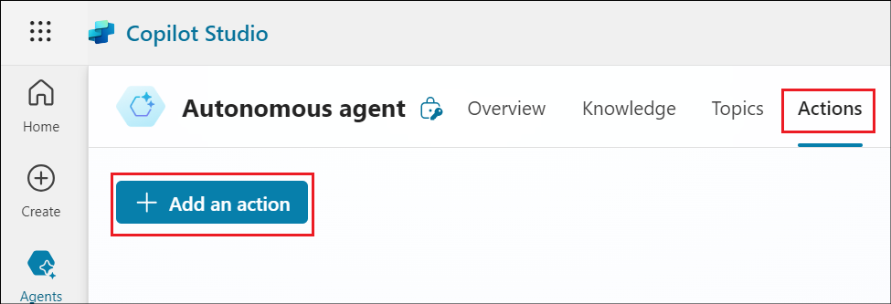
   
10. Search for !!Send an mail!! and select **Send an email (V2) action**.

    

11.  Once the connection is established, click on **Next**.

     
     
12.  Select **End user Authentication** as **Copilot Authentication** and select **Add action**.

     

13.	Select the created Action.

     

14.	Select the **Inputs** tab.

     

15.	Give the email id to which the mail needs to be delivered in the **Description** field and click on **Save**. This can be any mail id you have access to.

    

### Task 3: Add instructions to the agent

1.	Select **Overview** to go to the Overview page and then click on **Edit** in the Overview page.

    

2.  Update the instructions as below, replacing the place holder for Your mail id with the mail id to which the details needs to be sent and click on Save.
   
    !!a.	Read the details of the row that gets added or modified!!
    !!b.	Mail the modified information only to <Your email id> with a proper subject and body added to the email!!

    

4.  Click on **Publish** to publish the agent to all the channels it is
    connected to.

    

5.  Click on **Publish** in the **Publish this agent** dialog box.

    

6.  Once published, you will get a success message.

    

### Task 4: Update the Bookings table

1.  Login to !!https://make.powerapps.com/!! and select **Tables** from
    the left navigation pane.

    

2.  Select **Custom** and select the **Booking Request** table from
    there.

    

3.  Add or update a value in the table.

    

### Task 5: Test the agent

1.  From the agent page, select Test, and switch on the **Activity
    Map**.

    

2.  From the agent page, select the **Test trigger** option. The update
    we made in the Bookings table would have triggered the trigger. We
    will use it to **test** from the copilot studio.

    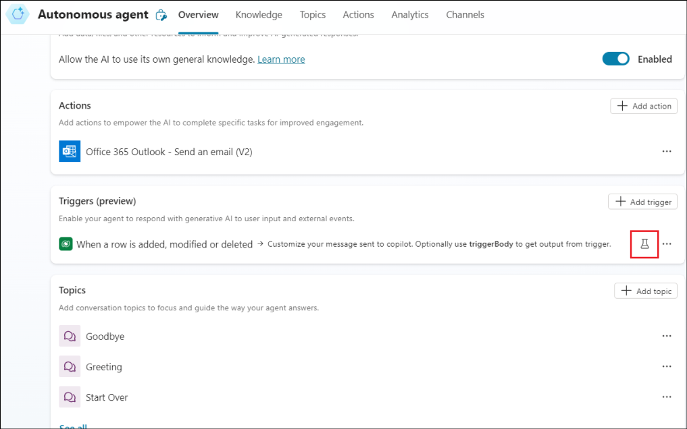

3.  Select the latest entry and click on **Start testing**.

    

4.  The trigger gets invoked.

    

5.  The mail will be sent to the specified mail id.

    

6. Check the corresponding mail box to see if you have received a mail as below.
   
    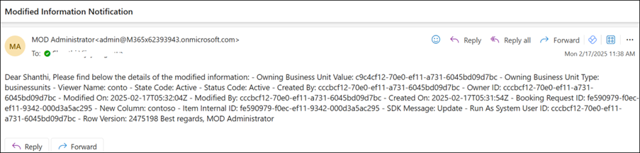

  
**Summary**

In this lab, we have learnt to

- Build an agent from the Copilot Studio and create topics in it.

- Test the agent from the Copilot Studio and publish it to the demo
  web site.

- Build an autonomous agent and test it
