# Lab 01: Creating and using Copilot from Copilot Studio for managing a Real Estate Application

**Lab Duration** – 120 minutes

**Introduction**

Contoso Real Estate specializes in the sale and management of both
commercial and residential properties. Currently, customer information
is efficiently stored within their Dataverse instance, allowing for
streamlined data management. However, the booking process presents a
significant challenge.

At present, customers can only request bookings via phone, leading to an
overwhelmed phone line and long wait times. This situation not only
frustrates customers but also risks losing potential business as many
are unable to connect with the office to request services.

To address these issues, Contoso Real Estate is committed to developing
a comprehensive digital solution. This solution will empower customers
to easily access information about the booking process and submit
booking requests online.

**Objectives**

- Build a standalone copilot for Contoso Real Estates from Copilot
  Studio (that will allow customers to discover information about the
  real estate booking process and create booking requests for the office
  to review.)

- Create Topics to set up the logic of the bookings.

- Create the Dataverse tables required for the bookings.

- Publish the copilot.

- Configure the Dynamics 365 workspace and connect the copilot to it.

- Create a web page using Power Pages and integrate the copilot created
  from Copilot Studio in it.

- Test the escalation to live agent functionality from the web page.

## Exercise 1: Setting up the Dynamics 365 Customer Service

### Task 1: Sign up for Dynamics 365 Customer Service trial

1.  Login to
    +++<https://dynamics.microsoft.com/en-us/customer-service/overview/>+++
    and click on **Try for free**

2.  Enter your Tenant id and click on **Start your free trial**.

3.  Enter the region as **United States**, enter your **Phone number**
    and click on **Submit**.

4.  The **Dynamics 365 Customer Service workspace** opens.

5.  Click on Customer Service workspace to open the **Apps**.

6.  Click on **Customer Service admin center** to open it.

7.  Select **Routing** under **Customer Support** group.

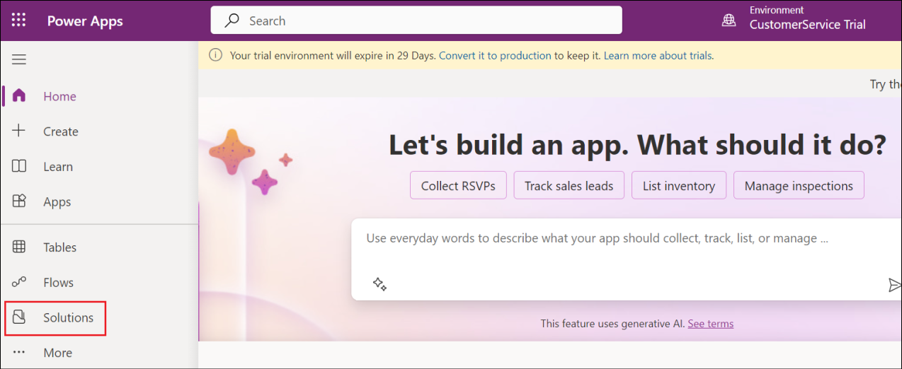

8.  On the **Routing** page, under **Record routing**, click **Manage**
    next to **Turn on Unified Routing for Records**.

9.  On the **Service Configuration Settings** page under **Unified
    routing**, make sure that the **Turn on unified routing** toggle is
    set to **Yes**.

**Note**: The **Turn on unified routing** toggle is set to **Yes** only
if consent is already provided by the tenant administrator.

10. Click **Save**.

### **Task 2: Manage a user in Omnichannel for Customer Service**

1.  In **Dynamics 365 Customer Service admin center**, in the site map,
    select **User management** under **Customer support** group.

2.  On the **User management** page, select **Manage** next
    to **Users**.

3.  Click the dropdown next to **Enabled Users** and select
    **Omnichannel Users**.

4.  On the **Omnichannel Users** page, select a user **MOD
    Administrator** in the list.

5.  On the **MOD Administrator** page, select the **Omnichannel** tab.

6.  Specify the following in the user page.

| **Setting**      | **Value** |
|------------------|-----------|
| Capacity         | 100       |
| Default Presence | available |

7.  Select **Save and close**.

### Task 3: Configure Omnichannel Power Virtual Agent Extension

1.  Open the link,
    +++<https://appsource.microsoft.com/en-cy/product/dynamics-365/mscrm.omnichannelpvaextension?tab=Overview&ref=dynamicsforcrm.com>+++
    and click on Get it now in the Omnichannel Power Virtual Agent
    Extension page.

2.  Select the **CustomerService Trial** under **Select an environment**
    and click on **Install**.

3.  In the Dynamics 365 apps page, click on the entries that shows
    **Update available**, **select** the **check box** to agree to the
    terms and click on **Update**.

Make sure to do this for **all** the entries with **Update available**
as the Status.

### Task 4: Configure search settings in the Power Platform admin center

1.  Login to +++<https://admin.powerplatform.microsoft.com/>+++ using
    your tenant details. Select **Environments** -\> **CustomerService
    Trial**.

2.  Select the drop down next to **Resource** (in the top pane) and
    select **Dynamics 365 apps**.

3.  Make sure that **Omnichannel for Customer Service** is
    **Installed**.

4.  Navigate back to the **Environments -\> CustomerService** **Trial**
    page in the admin center. Select **Settings** from the top pane.

>  alt="A screenshot of a computer Description automatically generated" />

5.  Select **Product** -\> **Features**.

6.  Toggle **Dataverse Search** and **Single table search** option to
    **ON.**

Scroll down and click on the **Save** button at the bottom right.

## Exercise 2: Setting up Power Apps and Dataverse

### Task 1: Sign up for the Microsoft Power Apps Developer Plan

1.  Navigate to +++https://powerapps.microsoft.com/free/+++ and select
    **Start free**.

2.  Under **Let's get started**, enter your **email address** in the
    text box, check the agreement box and select **Start free**.

>  alt="A screenshot of a computer Description automatically generated" />

3.  If you see a prompt that you have an existing account with
    Microsoft. Select **Sign in**. Enter your password.

4.  If prompted, Select **Yes** to stay signed in.

5.  Click on **Environment** in the top-right corner of the screen and
    select **CustomerService Trial**.

>  alt="A screenshot of a computer Description automatically generated" />

### Task 2: Create a solution

1.  From the Power Apps Maker
    Portal(+++<https://make.powerapps.com/>+++), select **Solutions**
    form the left pane.

2.  Click on **+ New solution**.

3.  Enter +++**Bookings**+++ for the Display name and click on **+ New
    publisher**.

4.  Enter the below details and then click on **Save**.

| **Property**     | **Value**     |
|------------------|---------------|
| **Display name** | +++Contoso+++ |
| **Name**         | +++contoso+++ |
| **Prefix**       | +++contoso+++ |

5.  Select **Contoso (contoso)** under Publisher and then click on
    **Create**.

6.  Select **Back to solutions** in the top-left of the screen.

### Task 3: Set the preferred solution

1.  Under Solutions in the Maker portal, select **Manage** for **Set
    your preferred solution**.

2.  Select **Bookings (contoso)** under **Unless otherwise specified,
    save my changes in** and select **Apply**.

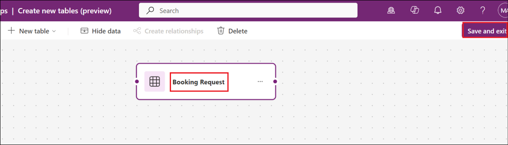

### Task 4: Create the Real Estate Properties custom table

Follow these steps to create a new custom table in Dataverse for Real
Estate Properties.

1.  From the left navigation pane, select **Tables**, select **New
    table**, and then select **Add columns and data**.

2.  Rename the table from **New Table** to +++**Real Estate
    Property**+++.

3.  Change the name of the column called **New Column** to +++**Property
    Name**+++.

4.  Select the **+ New column** button to add a new column in the
    columns and data pane. In the New column pane, enter the following
    values, and then select **Save**.

    - Display name: +++**Asking Price**+++

    - Data type: Currency

>  alt="A screenshot of a table Description automatically generated" />

5.  Add the following two columns.

| **Display name** | **Data type**                                   |
|------------------|-------------------------------------------------|
| +++Street+++     | Single line of text (this value is the default) |
| +++City+++       | Single line of text (this value is the default) |

6.  Add another column with the below values

    - **Display name**: +++Bedrooms+++

    - **Data type**: Choice

Create the choice values:

- Under **Choices** you see two entry fields
  titled **Label** and **Value**. Enter **1** under the label. Power
  Apps assigns a value automatically but you can change the value
  to **1**.

<!-- -->

- Select **+ New choice** and make **2** the new entry for Label
  and **2** for Value.

<!-- -->

- Select **+ New choice** and make **3** the new entry for Label
  and **3** for Value.

<!-- -->

- Select **+ New choice** and make **4** the new entry for Label
  and **4** for Value.

<!-- -->

- Select **+ New choice** and make **5** the new entry for Label
  and **5** for Value.

<!-- -->

- Select **Save**.

7.  Select the **+ New column** button to add a new column in the
    columns and data pane.

8.  In the New column pane, enter the following values, and then
    select **Save**:

    - **Display name**: +++Bathrooms+++

    - **Data type**: Choice

Create the choice values

- Under **Choices** you see two entry fields
  titled **Label** and **Value**. Enter **1** under the label. Power
  Apps assigns a value automatically but you can change it to **1**.

- Select **+ New choice** and make **2** the new entry for Label
  and **2** for Value.

- Select **+ New choice** and make **3** the new entry for Label
  and **3** for Value.

- Select **+ New choice** and make **4** the new entry for Label
  and **4** for Value.

- Select **+ New choice** and make **5** the new entry for Label
  and **5** for Value.

- Select **Save**.

>  alt="A screenshot of a computer Description automatically generated" />

9.  Add another column by selecting the **+ New column** button again in
    the columns and data pane.

In the New column pane, enter the following values, and then
select **Save**:

- **Display name**: +++**Client**+++

- **Data type**: Lookup -\> Lookup

- **Related Table**: Contact

> 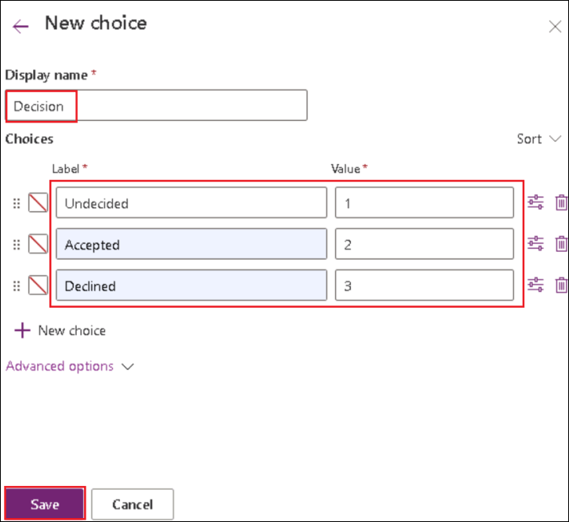 alt="A screenshot of a computer Description automatically generated" />

10. At the bottom of the pane, select **Create**.

11. Once the table is created, under **Real Estate Property columns and
    data**, enter the following test data:

    - Property Name: +++**1100 High Villas**+++

    - Asking Price: +++**250,000**+++

    - Bathrooms: **3**

    - Bedrooms: **2**

    - City: +++**Redmond**+++

    - Street: +++**Main Avenue**+++

    - Client: **Select any contact**

>  alt="A screenshot of a computer Description automatically generated" />

### Task 5: Create the Bookings table

Follow these steps to create a new custom table in Dataverse for Real
Estate Property Bookings.

1.  From the left navigation pane, select **Tables**, select **New
    table**, and then select **Add columns and data**.

> 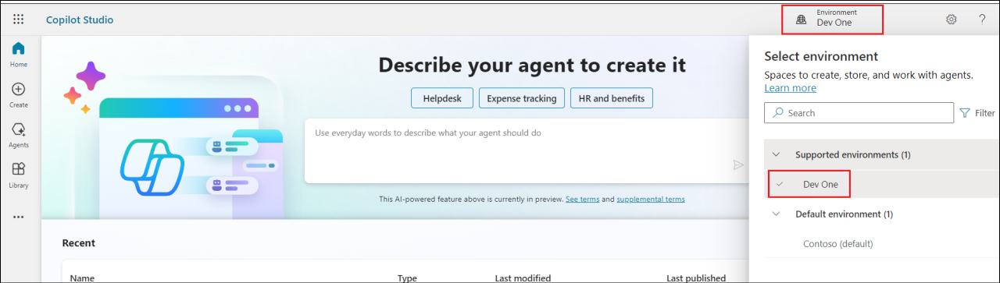 alt="A screenshot of a computer Description automatically generated" />

2.  Rename the table as +++**Booking Request**+++.

> 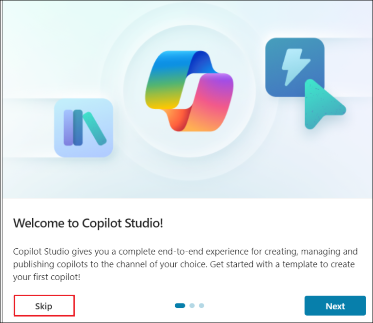 alt="A screenshot of a computer Description automatically generated" />

3.  Change the name of the column called **New Column** to +++**Booking
    Name**+++.

>  alt="A screenshot of a computer Description automatically generated" />

4.  Create the following columns with the name and data type as
    specified in the table below. Select **Save**.

> Display name – +++**Property**+++
>
> Data type – **Lookup** -\> **Lookup**
>
> Related Table – **Real Estate Property**
>
>  alt="A screenshot of a computer Description automatically generated" />
>
> Display name – +++**Viewer Name**+++
>
> Data type – **Single line of text**
>
> Display name – +++**Viewer Email**+++
>
> Data type – **Single line of text**
>
> Format – **Email**
>
> Display name – +++**Booking Date**+++
>
> Data type – **Date and time**
>
> Display name – +++**Notes**+++
>
> Data type – **Multiple lines of text**
>
>  alt="A screenshot of a computer Description automatically generated" />
>
>  alt="A screenshot of a computer Description automatically generated" />
>
> Display name – +++**Decision**+++
>
> Data type – **Choice**

- Label – +++**Undecided**+++

- Value – 1

- Label – +++**Accepted**+++

- Value – 2

- Label – +++**Declined**+++

- Value – 3

> Designate **Undecided** as the **Default choice**.

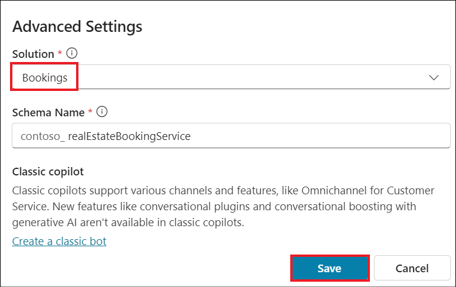

5.  At the bottom of the pane, select **Create**.

>  alt="A screenshot of a computer Description automatically generated" />

6.  Ensure that the table is created successfully.

## Exercise 3: Working with Copilot Studio

### Task 1: Sign up for Copilot Studio trial

1.  Open the url +++https://copilotstudio.microsoft.com/+++.

2.  Leave the **Choose your country/region** with the **default** value
    and click on **Get Started**.

3.  Click on **Environments** on the top left and select
    **CustomerService Trial**.

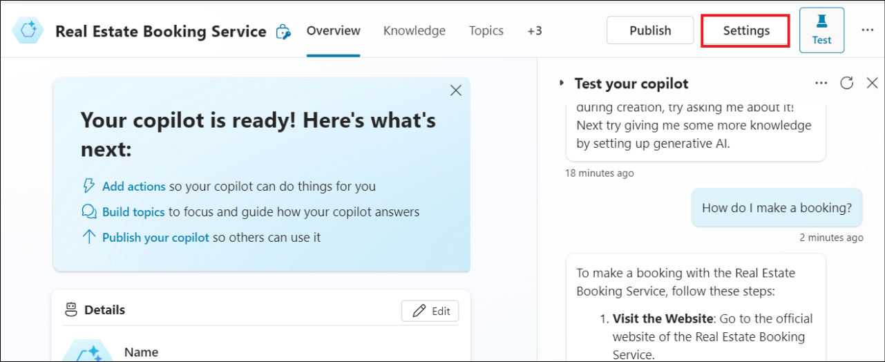

4.  Select **Skip** if you get a Welcome to Copilot Studio! Prompt**.**

### Task 2: Create the Real Estate Booking Service Copilot

1.  Select **Create** from the left navigation pane and select the **New
    copilot** tile.

2.  Select **Skip to configure**.

3.  Fill in the below details.

- Name - +++**Real Estate Booking Service**+++

- Description - +++**Create bookings for real estate properties**+++

- Instructions - +++**Create a copilot for topics relating to creating
  bookings for real estate properties+++**

- Language **–** Select **English**

> 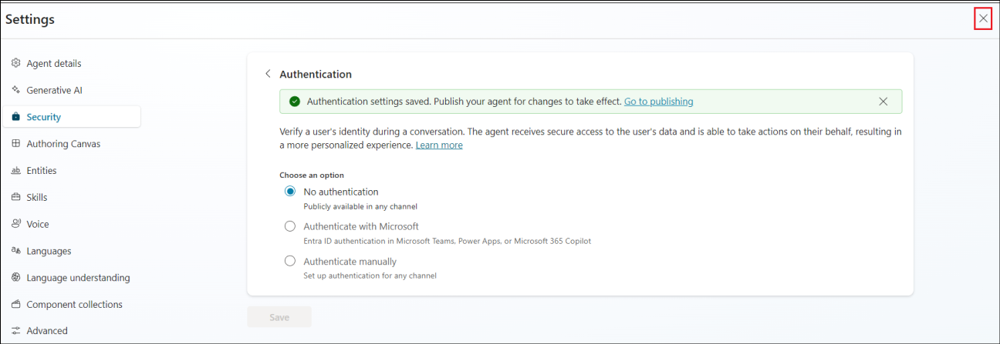 alt="A screenshot of a computer Description automatically generated" />

4.  Select the three dots next to the Create button in the top-right of
    the screen and select **Edit advanced settings**.

5.  Select the **Bookings** solution and select **Save**.

6.  In the top-right of the screen, select **Create**.

7.  Once the copilot is created, in the Test your copilot pane, enter
    **How do I make a booking?** and click **Enter** and observe the
    response.

### Task 3: Configure Security

1.  Select **Settings** in the top-right of the screen.

2.  Select the **Security** tab and then select
    the **Authentication** tile.

3.  Select **No authentication** and click on **Save**.

4.  Select **Save** in the **Save this configuration** prompt.

5.  Once the Authentication settings are saved, click on the **Close**
    option to close the **Settings** pane.

### Task 4: Remove topics

Sample topics are included with new copilots. Remove these sample
topics. Disable system topics that you don't require.

1.  Select the **Topics** tab from the top menu of the Copilot Overview
    page.

2.  You will land in the **Custom** Topics page.

3.  Select the **three dots** next to the **Lesson 1** topic and select
    **Delete**.

4.  Select **Save** in the confirmation window.

5.  Repeat the delete for Lesson 2 and Lesson 3.

6.  Select the **System** tab. Toggle **Enabled** to **Off** for the
    **Sign in** topic.

### Task 5: Publish and test the copilot

1.  Select **Publish** and select **Publish** again.

2.  Select **Publish** in the **Publish this copilot** dialog.

### Task 6: Demo Website

The Demo website allows users without a license to test your copilot.
You can provide them with the URL to the demo website.

1.  Select the **three dots** next to the **Settings** button in the
    top-right of the screen and select **Go to demo website**.

2.  In the **Type your message** text box, enter **What information is
    needed to book a viewing for a real estate property?** and observe
    the response from the copilot.

## Exercise 4: Create and manage topics using Copilot

### Task 1: Create a topic using Copilot

Topics can be created and edited using natural language.

1.  Select your copilot, **Real Estate Booking Service** in the Copilot
    pane on the left-hand side of the Copilot Studio.

2.  Select the **Topics** tab. Select **Add a topic** and select
    **Create from description with Copilot**.

3.  Enter the below details and click on **Create**.

- Name your topic - +++**Customer Details**+++

- Create a topic to... - +++**Ask the customer for their name and email
  address**+++

>  alt="A screenshot of a computer Description automatically generated" />

4.  A new topic displays with the generated trigger phrases and question
    nodes.

5.  Select **Save**.

>  alt="A screenshot of a computer Description automatically generated" />

### Task 2: Update nodes with natural language

1.  If the **Edit with copilot** pane isn't shown on the right-hand side
    of the screen, select the **Copilot** icon in the upper part of the
    authoring canvas.

2.  Select the second question node, **What is your email address?**

3.  In the **Edit with Copilot** panel, in the **What do you want to
    do?** field, enter the following text:

> +++**Update the message in this question node to say thank you to the
> Name variable from the previous node and then proceed to ask the email
> address question**+++

4.  Select **Update**.

5.  Select **Save**.

### Task 3: Add nodes with natural language

In addition to adding updating existing nodes, you can use Copilot to
add new ones.

1.  Make sure that no node is selected by clicking in the empty space
    around the nodes.

2.  In the **Edit with Copilot** panel, in the **What do you want to
    do?** field, enter the following text:

+++**Summarize the information collected in an adaptive card**+++

3.  Select **Update**.

>  alt="A screenshot of a computer Description automatically generated" />

4.  A message node with an Adaptive Card is added to the end of the
    topic.

>  alt="A screenshot of a computer Description automatically generated" />

5.  Select the Adaptive Card. The Adaptive Card properties should appear
    on the right of the screen.

6.  Copy the below content and paste it as the Adaptive card formula if
    it is not already populated properly.

> **{**
>
> **type: "AdaptiveCard",**
>
> **body:**
>
> **\[**
>
> **{**
>
> **type: "TextBlock",**
>
> **size: "Medium",**
>
> **weight: "Bolder",**
>
> **text: "Summary"**
>
> **},**
>
> **{**
>
> **type: "FactSet",**
>
> **facts:**
>
> **\[**
>
> **{**
>
> **title: "Full Name",**
>
> **value: Text(Topic.Name)**
>
> **},**
>
> **{**
>
> **title: "Email Address",**
>
> **value: Text(Topic.EmailAddress)**
>
> **}**
>
> **\]**
>
> **},**
>
> **{**
>
> **type: "TextBlock",**
>
> **text: "Thank you for providing the information."**
>
> **}**
>
> **\]**
>
> **}**
>
> Your card content should now look like the one in the below image.
>
>  alt="A screenshot of a computer program Description automatically generated" />

7.  Open the **Edit with Copilot** icon.

8.  Make sure that no node is selected by clicking in the empty space
    around the nodes.

9.  In the **What do you want to do?** field, enter the following text
    and then select **Update.**

> **Add a new multiple-choice question to prompt the user if the details
> are correct with two options Yes or No**

10. A new question node is added to the end of the topic with options
    for the user to select.

11. Select **Save**.

>  alt="A screenshot of a computer Description automatically generated" />

### Task 4: Configure the scope of the variables

1.  Select **Variables** to open the Variables pane.

2.  Select the right-hand check boxes for the topic variables and click
    on **Save**.

## Exercise 5: Create and manage topics manually

### Task 1: Create a topic from blank

1.  Select the **Topics** tab.

2.  Select **Add a topic** and select **From blank**.

>  alt="A screenshot of a computer Description automatically generated" />

3.  Select **Details** to open the Topic details dialog.

>  alt="A screenshot of a computer Description automatically generated" />

4.  Fill in the below details and click on **Save**.

- **Name** - +++Book a Real Estate Showing+++

- **Display Name –** +++**Book**+++

- **Description**  - +++Select the property and requested date and
  create a booking request+++

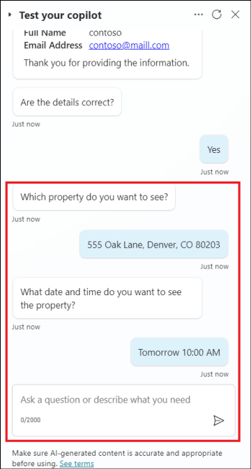

5.  Select **Details** to close the Topic details dialog.

### Task 2: Add trigger phrases

1.  Select **Edit** under **Phrases** in the **Trigger**. Enter +++**I
    want to book a real estate showing**+++ under **Add Phrases** and
    select the **+** icon.

>  alt="A screenshot of a computer Description automatically generated" />

2.  Enter the below phrases one by one.

- +++**Schedule a real estate showing**+++

- +++**Arrange the viewing for a real estate property**+++

- +++**Set up an appointment to view a house**+++

- +++**Plan a property viewing**+++

3.  Once all the phrases are added, select **Save**.

> 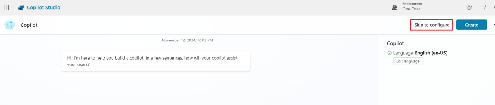 alt="A screenshot of a computer Description automatically generated" />

### Task 3: Add a message node

1.  Select the **+** icon under the Trigger node and select **Send a
    message**.

>  alt="A screenshot of a computer Description automatically generated" />

2.  In the **Enter a message** field, enter the following text:

+++Hi, I can help you with booking a real estate property showing.+++

3.  Select **Save**.

> 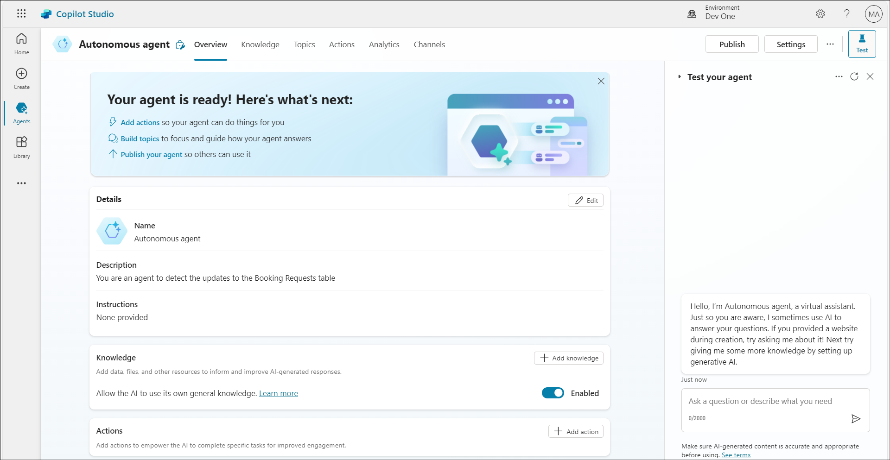 alt="A screenshot of a computer Description automatically generated" />

### Task 4: Add a Topic management node

1.  Select the the **+** icon under the send a message node and
    select **Topic management -\> Go to another topic**.

2.  Select the **Customer Details** topic.

3.  Select **Save**.

### Task 5: Add condition node 

1.  Select the **+** icon under the topic management node and
    select **Add a condition**.

2.  Select **DetailsCorrect** for variable.

3.  Select the **Condition** as **is equal to**

4.  Select the **value** as **Yes**.

5.  Select **Save**.

### Task 6: Add question nodes

1.  Select the **+** icon under the left-hand condition node and
    select **Ask a question**. Fill in the below details and click on
    **Save**.

- Enter a message  - +++Which property do you want to see?+++

- **Identify** - Select **User's entire response**.

- **Save user response as** -
  Enter +++**PropertyName**+++ for **Variable name**

2.  Select the the **+** icon under the question node and select **Ask a
    question**. Fill in the below details and click on **Save.**

- **Enter a message** - +++What date and time do you want to see the
  property?+++

- Identify - Select **Date and Time**

- **Save user response as** - Enter +++**DateTime**+++ for **Variable
  name**

>  alt="A screenshot of a computer Description automatically generated" />

### Task 7: Test the copilot

1.  Select the **Test** button in the top-right of the screen to open
    the testing panel. Select the **three dots** at the top of the
    testing panel in the top-right of the screen. Select **Track between
    topics**.

>  alt="A screenshot of a computer Description automatically generated" />

2.  When the **Conversation Start** message appears, your copilot starts
    a conversation.

3.  In response, enter a trigger phrase for the topic that you created:

+++I want to book a real estate showing+++

4.  The copilot responds with the "**What is your name?**" question.

5.  Enter your name.

>  alt="A screenshot of a chat Description automatically generated" />

6.  Then enter your email when it prompts for the email. After you enter
    the details, an Adaptive Card displays the information that you
    entered, a question asking if the information is correct, and
    options to select **Yes** or **No**. Select **Yes**.

>  style="width:2.62513in;height:4.6044in" />

7.  Enter +++555 Oak Lane, Denver, CO 80203+++ to the **Which property
    to you want to see?** prompt.

8.  Enter **Tomorrow 10:00 AM** to the **What date and time do you want
    to see the property?** prompt.

## Exercise 6: Connect the copilot to Dynamics 365 Customer Service and configure the Escalate topic

### Task 1: Configure the Escalate topic

1.  Select the **Topics** tab and then select the **System** tab. Select
    the **Escalate** topic.

2.  Select the message node of the topic and replace the existing
    content with, +++You will be transferred to a live agent shortly+++

3.  Click on the + symbol to add a node next to the Message node.

4.  Select **Topic management** -\> **Transfer conversation**.

5.  Give a message +++The customer wants to talk to a live agent+++ in
    the Transfer conversation node.

6.  **Save** the Topic.

7.  **Publish** the copilot.

### Task 2: Connect the copilot to Dynamics 365 Customer Service

1.  Click on the **Overview** option to arrive at the Overview page of
    the copilot.

2.  From the copilot page top menu, click on **Channels** (If the
    Channels is not visible, click on the +1 to view the **Channels**
    option)

3.  Select **Dynamics 365 Customer Service** from the Customer
    engagement hub pane.

4.  On the Dynamics 365 Customer Service page, click on **Connect**.

5.  Once you get a **successfully connected** message, click on
    **Close**.

## Exercise 7: Create workstream and channel in Dynamics 365 admin center

### Task 1: Configure workstream 

1.  Login to +++<https://www.office.com>+++ using your admin tenant id.

2.  Select **Apps** from the left pane.

3.  From the list of Apps listed, select **Customer Service admin
    center**.

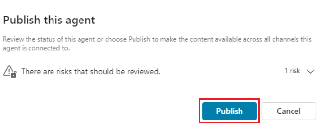

4.  From the admin center page, select **Workstreams** from the left
    pane and then select the **+ New workstream** option.

5.  Fill in the below details, scroll down and click on **Create**.

- Name - +++**Real Estate Workstream**+++

- Owner – **MOD Administrator** (Selected by default)

- Type – **Messaging**

- Channel – **Chat**

>  alt="A screenshot of a chat Description automatically generated" />
>
>  alt="A screenshot of a chat Description automatically generated" />

6.  Once the workstream is created, click on **Set up chat** to set up
    the chat channel.

7.  In the **Live chat setup – Channel details** screen, fill in the
    below details and click on **Next**.

- Name - +++**Real Estate Chat Channel**+++

- Language – **United States**

8.  In the Live chat setup – Chat widget screen, provide the name as
    +++**Real Estate Booking Assistant**+++, accept the other defaults
    and click on **Next**.

9.  In the **Live chat setup – Behaviors** screen, accept the defaults
    and click on **Next**.

10. In the **Live chat setup – User features** screen, toggle **File
    attachment** and **Voice and video calls** options to **off** and
    click on **Next**.

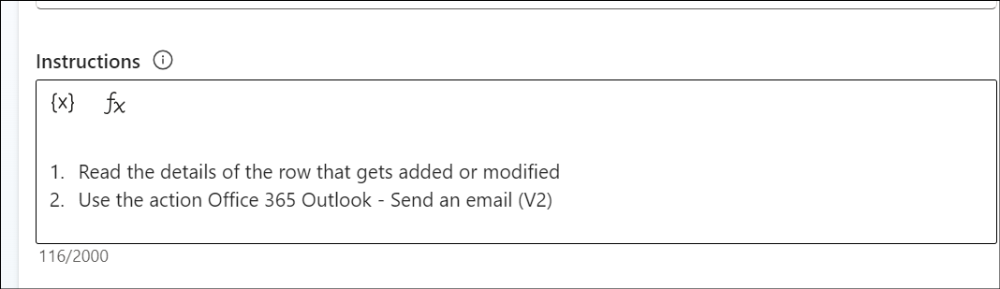

11. In the **Live chat setup – Review and finish** screen, select
    **Create channel**.

12. **Copy** the widget that appears in the **Live chat setup –
    Success** screen and **save** it in a notepad to add it to a webpage
    in the upcoming exercises. Then, click on **Done** to complete the
    configuration.

### Task 2: Add the copilot to the workstream

1.  Back in the **Real Estate Workstream** page, scroll down and click
    on **+ Add bot** in the Bot section.

2.  From the list of copilots on the Add bot screen, select the **Real
    Estate Booking Service** copilot and click on **Connect**.

3.  Ensure that the bot is added to the workstream as in the screenshot
    below.

4.  From the left pane, select **Bots**.

5.  Ensure that the Real Estate Booking Service copilot is connected.

## Exercise 8: Create a webpage and test the escalation to agent

1.  Login to +++https://make.powerpages.microsoft.com/+++ using your
    tenant admin credentials.

2.  Ensure that you are in CustomerService Trial environment.

3.  Click on Skip in the **Tell us about yourself** page.

4.  Scroll down in the next page and click on Start with a template
    option to start creating the site with a template.

5.  Select a template and click on **Choose this template**.

6.  In the Give your site a name textbox, enter the name as +++**Contoso
    Real Estates**+++, accept the other defaults and click on **Done**.

7.  Once the site is created, click on **Edit site header** in the
    **Company name** title.

8.  In the **Edit site header** pane, provide the **Site title** as
    **Contoso Real Estates**.

9.  Click on Edit code in the top right corner of the page.

10. Click on **Open Visual Studio Code**.

11. Click **Allow**.

12. The Home page of the web page opens up in the Visual Studio Code.

13. Scroll to the end of the file. Add the script copied while creating
    the workstream, after eh last line of this file.

14. Save the file, close the Visual Studio Code tab and return to the
    Power pages. Click on **Sync**.

15. Once the Sync is completed, select **Preview** -\> **Desktop.**

16. Your web page opens in a new tab. Find the **Real Estate copilot**
    embedded to the page at the bottom right of the web page. **Click**
    on it.

17. Enter +++Talk to agent+++.

18. On the Customer Service workspace page, you will get a **chat
    request**. Accept it.

19. Once accepted, the chat screen opens up with the message that we had
    given in the Escalate topic. We can also add any other information
    provided by the user here to the live agent.

20. Simulate the chat between the live agent and the customer if you
    wish to see how it works and then ends.

**Summary**

In this lab, we have learnt to

- Build a copilot from the Copilot Studio and create topics in it.

- Test the copilot from the Copilot Studio and publish it to the demo
  web site.

- Publish the copilot to Dynamics 365 workspace and integrate the it in
  a web page.

- Configure and test the escalation to a live agent.
