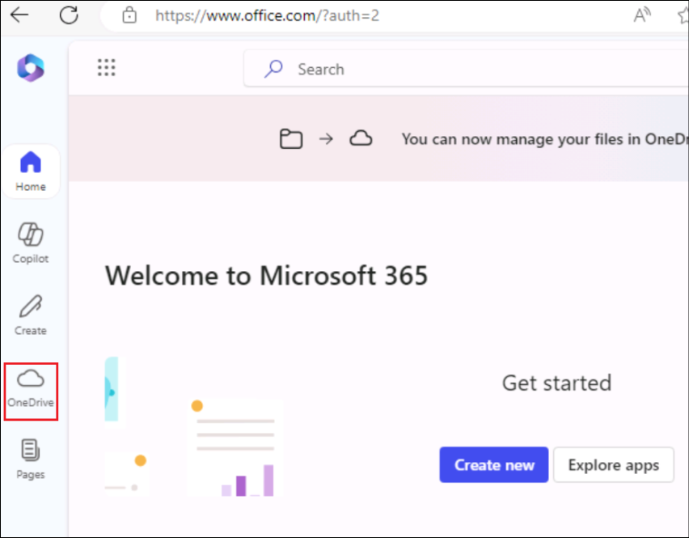
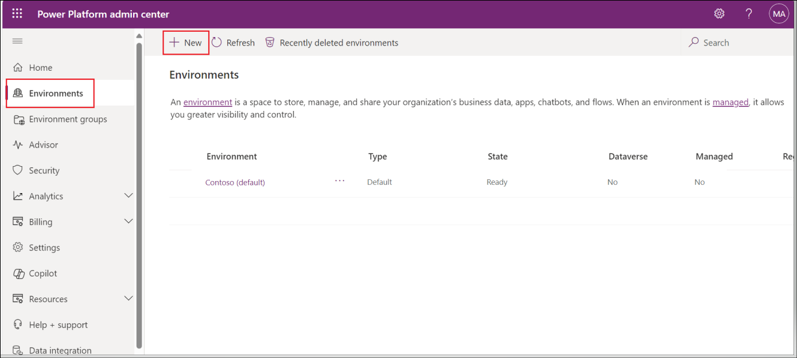
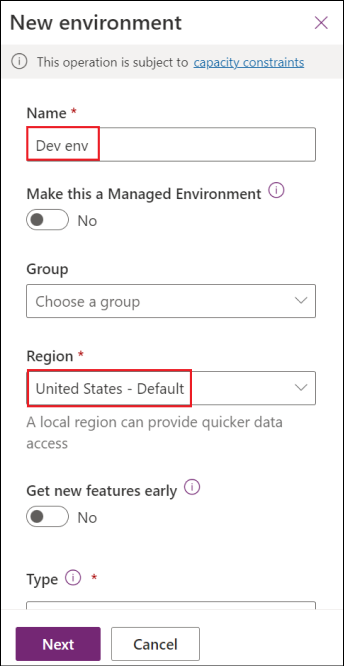
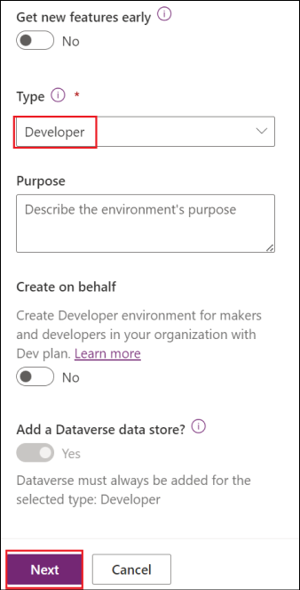

## Lab 02 - Enhancing the Real Estate copilot with Gen AI capabilities

**Lab duration** – 80 minutes

**Objective:**

Implement entities, slot filling and variables usage in the Copilot for
Real Estate app. Enhance the copilot created for the Real Estate app to
elevate the customer experience by implementing Generative AI.

## Exercise 1: Use entities to improve the copilot

Microsoft Copilot Studio uses entities to understand user intent. There
are many prebuilt entities included for commonly used information. You
can create custom entities for your specific purpose.

### Task 1: View prebuilt entities

1.  Select **Settings** in the top-right of the screen.

>  alt="A screenshot of a computer Description automatically generated" />

2.  Select the **Entities** tab. You can see a list of pre-built
    entities.

>  alt="A screenshot of a computer Description automatically generated" />

### Task 2: Create the property type entity

1.  Select **+ Add an entity** and select **+ New entity**.

>  alt="A screenshot of a computer Description automatically generated" />

2.  Select the **Closed list** tile.

>  alt="A screenshot of a web page Description automatically generated" />

3.  Enter the below details

> Name - +++**Property Type**+++
>
> **Enter item** under List items –
>
> +++**Apartment**+++ - Select **Add**
>
>  alt="A screenshot of a computer Description automatically generated" />

4.  Enter +++**Condominium**+++ in the **Enter item** field and
    select **Add**.

5.  Enter +++**Duplex**+++ in the **Enter item** field and
    select **Add**.

>  alt="A screenshot of a computer Description automatically generated" />

6.  Select **+ Synonyms** for **Apartment**, enter +++**Flat**+++, then
    select the **+** icon and select **Done**.

>  alt="A screenshot of a computer Description automatically generated" />

7.  Select **+ Synonyms** for **House**, enter +++**Single-family
    home**+++, then select the **+** icon and select **Done**.

8.  Select **+ Synonyms** for **Condominium**,
    enter +++**Townhouse**+++, then select the **+** icon and
    select **Done**.

9.  Select **Save**.

>  alt="A screenshot of a computer Description automatically generated" />

10. Select **Close**.

>  alt="A screenshot of a computer Description automatically generated" />

### Task 3: Create number of bedrooms entity

1.  Select **+ Add an entity** and select **+ New entity**.

>  alt="A screenshot of a computer Description automatically generated" />

2.  Select the **Regular expression (Regex)** tile.

>  alt="A screenshot of a computer Description automatically generated" />

3.  Enter the below details and click on **Save**.

- Name  - +++**Number of Bedrooms**+++ 

- Pattern  - +++**\[1-5\]**+++ 

>  alt="A screenshot of a cell phone Description automatically generated" />

4.  Select **Close**.

>  alt="A screenshot of a phone Description automatically generated" />

5.  Close the **Settings** pane.

### Task 4: Use entities

1.  Select the **Topics** tab. Select the **Book a Real Estate
    Showing** topic.

>  alt="A screenshot of a computer Description automatically generated" />

2.  Select the **+** icon above the property question node and
    select **Ask a question**.

>  alt="A screenshot of a computer Description automatically generated" />

3.  Fill in the below details.

- **Enter a message** - +++What type of property do you want to see?+++

- **Identify** – Select **Property Type**

- Select **Select options for user** and check the **Display** option
  for all list values.

4.  Select the variable in **Save user response as** and enter
    +++**PropertyType**+++ for **Variable name**

>  alt="A screenshot of a computer Description automatically generated" />

5.  Select the the **+** icon below the new question node and
    select **Ask a question**.

6.  Enter the below details and click on **Save**.

- **Enter a message** - +++How many bedrooms do you need?+++

- **Identify -** Select **Number of Bedrooms**

- **Save user response as** -
  Enter +++NumberofBedrooms+++ for **Variable name**

>  alt="A screenshot of a computer Description automatically generated" />

## Exercise 2: Create Copilot actions

Microsoft Copilot Studio can access data in Microsoft Dataverse using
Power Automate cloud flows

### Task 1: Create Power Automate flow to retrieve a property

1.  Select the **Actions** tab from the top menu. Select **+ Add an
    action**.

>  alt="A screenshot of a computer Description automatically generated" />

2.  Scroll down and select **Create a new flow**.

>  alt="A screenshot of a computer Description automatically generated" />

3.  Sign in to Power Automate if prompted.

4.  Select **Run a flow from Copilot** in the top-left of the screen and
    enter +++**Get Property**+++ as the flow name.

>  alt="A screenshot of a computer Description automatically generated" />

5.  Select the trigger step **Run a flow from Copilot** and select **+
    Add an input**.

>  alt="A screenshot of a computer Description automatically generated" />

6.  Select **Text**.

>  alt="A screenshot of a computer Description automatically generated" />

7.  Enter the below details

- **Input** – +++Bedrooms+++

- **Please enter your input** - +++Number of Bedrooms+++

>  alt="A screenshot of a computer Description automatically generated" />

8.  Select the **+** icon between the two steps in the flow and
    select **Add an action**.

>  alt="A screenshot of a computer Description automatically generated" />

9.  Enter +++**Dataverse**+++ in the **Search** field and select **See
    more** for the Dataverse connector.

>  alt="A screenshot of a computer Description automatically generated" />

10. Select the **List rows** action.

>  alt="A screenshot of a list Description automatically generated" />

11. If prompted for authentication, select **OAuth** and select **Sign
    in**. Sign in using your tenant id if prompted.

>  alt="A screenshot of a login box Description automatically generated" />

12. Select **Real Estate Properties** for table name.

13. Select **Show all**.

14. Enter +++contoso_bedrooms eq+++ in the **Filter Rows** field.

15. Use **Dynamic content** to select the **Bedrooms** parameter and
    select **Add**.

>  alt="A screenshot of a computer Description automatically generated" />

16. Select the **Respond to Copilot** action and select **+ Add an
    output**.

>  alt="A screenshot of a computer Description automatically generated" />

17. Select **Text**.

18. Enter the below details

- **Enter a name** - +++PropertyId+++

- **Enter a value to respond with** - select **Insert Expression** and
  enter the following expression:
  +++first(outputs('List_rows')?\['body/value'\])\['contoso_realestatepropertyid'\]+++

>  alt="A screenshot of a computer Description automatically generated" />

19. Select **Add**.

>  alt="A screenshot of a computer Description automatically generated" />

20. Select **+ Add an output**.

21. Select **Text**.

- **Enter a name** - +++PropertyName+++ 

- **Enter a value to respond with** - select **Insert Expression** and
  enter the following expression:
  +++first(outputs('List_rows')?\['body/value'\])\['contoso_propertyname'\]+++

>  alt="A screenshot of a computer Description automatically generated" />

22. Select **Settings**. Ensure that **Asynchronous Response** is set
    to **Off**.

>  alt="A screenshot of a computer Description automatically generated" />

23. Select **Save draft**.

>  alt="A screenshot of a computer Description automatically generated" />

24. Once save, select **Publish**.

>  alt="A screenshot of a computer Description automatically generated" />

25. Close the Power Automate tab.

### Task 2: Add a Copilot action for retrieving a property

1.  Back in the Copilot Studio page, select **Refresh**.

>  alt="A screenshot of a computer Description automatically generated" />

2.  Select the **Get Property** flow.

>  alt="A screenshot of a computer Description automatically generated" />

3.  Select **Next** in the **Choose an action** screen**.**.

>  alt="A screenshot of a computer Description automatically generated" />

4.  Select **Next** in the **Review inputs and outputs** screen.

>  alt="A screenshot of a computer Description automatically generated" />

5.  Select **Finish** in the **Review and finish** screen.

>  alt="A screenshot of a computer Description automatically generated" />

6.  Select the **Topics** tab. And select the **Book a Real Estate
    Showing** topic.

>  alt="A screenshot of a computer Description automatically generated" />

7.  Select the **+** icon below the **How many bedrooms do you need
    question?** node and select **Call an action**. Select the **Get
    Property** flow.

>  alt="A screenshot of a computer Description automatically generated" />

8.  Select the **NumberofBedrooms** variable for the **Bedrooms** input
    parameter.

>  alt="A screenshot of a computer Description automatically generated" />

9.  Select the **three dots** in the **Which property do you want to
    see?** question node and select **Delete**.

>  alt="A screenshot of a computer Description automatically generated" />

10. Select the the **+** icon under the action node and select **Send a
    message**.

11. Fill in the below details

- **Enter a message** - enter +++Property+++

- Select the **Insert variable** icon and select
  the **PropertyName** variable.

>  alt="A screenshot of a computer Description automatically generated" />

12. Select **Save**.

13. Once saved, select **Publish** and select **Publish**.

>  alt="A screenshot of a computer Description automatically generated" />

14. Click on Publish in the Publish confirmation dialog.

### Task 3: Create Power Automate flow to make a booking

1.  Select the **Actions** tab and select **+ Add an action**.

2.  Scroll down and select **Create a new flow**.

3.  Select **Run a flow from Copilot** in the top-left of the screen and
    enter Create +++**Booking Request**+++ as the flow name.

4.  Select the trigger step **Run a flow from Copilot** and select **+
    Add an input -\> Text**.

5.  Enter the below details

- Input - +++**PropertyId**+++

- Please enter your input **-** +++**Property**+++

6.  Select **+ Add an input -\> Text**

- Input - +++**ViewerName**+++

- Please enter your input **-** +++**Viewer Name**+++

7.  Select **+ Add an input -\>** **Text**.

- Input - +++**ViewerEmail**+++

- Please enter your input **-** +++**Viewer Email**+++

8.  Select the **+** icon between the two steps in the flow and
    select **Add an action**.

9.  Enter +++**Dataverse**+++ in the **Search** field and select **See
    more** for the Dataverse connector.

10. Select the **Add a new row** action.

11. Select **Booking Requests** for table name.

12. Enter +++**Copilot booking**+++ in the **Booking Name** field.

13. Select **Show all**.

14. Enter +++contoso_bookingrequests()+++ in the **Property (Real Estate
    Properties)** field, move the cursor within the brackets, and
    use **Dynamic content**.

15. Select the **PropertyId** parameter.

16. Use **Dynamic content** to select the **ViewerName** parameter for
    the **Viewer Name** field.

17. Use **Dynamic content** to select the **ViewerEmail** parameter for
    the **Viewer Email** field.

18. The parameters will now look similar to those in the screenshot
    below.

19. Select the **Respond to Copilot** action. Select **Settings** and
    ensure that **Asynchronous Response** is set to **Off**.

20. Select **Save draft**.

21. Once saved, select **Publish**.

22. Close the Power Automate tab.

### Task 4: Add a Copilot action for creating a booking request

1.  Back in the Copilot Studio page, select **Refresh**.

2.  Select the **Create Booking Request** flow.

3.  Select **Next** in the Choose an option screen.

4.  Select **Next** in the Review inputs and outputs .

5.  Select **Finish** in the **Review and finish** screen.

6.  Select the **Topics** tab and select the **Book a Real Estate
    Showing** topic.

7.  Select the the **+** icon below the **What date and time do you want
    to see the property?** node and select **Call an action**.

8.  Select the **Booking Request** flow.

9.  Select the **PropertyId** variable for the **PropertyId** input
    parameter.

Select the **Name** variable for the **ViewerName** input parameter.

Select the **EmailAddress** variable for the **ViewerEmail** input
parameter.

>  alt="A screenshot of a computer Description automatically generated" />

10. Select the the **+** icon below the action node. Select **Topic
    management**, then select **Go to another topic** and select **End
    of conversation**.

11. Select **Save**.

12. Once saved, select **Publish** and select **Publish** again in the
    confirmation dialog.

## Exercise 3: Test the copilot 

### Task 1: Test the copilot and make a booking request

1.  Select the **Test** button in the top-right of the screen to open
    the testing panel. Select the **three dots** at the top of the
    testing panel in the top-right of the screen. Select **Track between
    topics**.

>  alt="A screenshot of a computer Description automatically generated" />

2.  When the **Conversation Start** message appears, your copilot starts
    a conversation.

3.  When the **Conversation Start** message appears, your copilot starts
    a conversation.

4.  In response, enter a trigger phrase for the topic that you created:

+++I want to book a real estate showing+++

5.  The copilot responds with the "**What is your name?**" question.

6.  Enter your name.

>  alt="A screenshot of a chat Description automatically generated" />

7.  Then enter your email when it prompts for the email. After you enter
    the details, an Adaptive Card displays the information that you
    entered, a question asking if the information is correct, and
    options to select **Yes** or **No**. Select **Yes**.

>  alt="A screenshot of a phone Description automatically generated" />

8.  Select **House** for the type of property prompt.

9.  Enter +++**2**+++ for the number of bedrooms prompts.

10. Enter Tomorrow 2:00 PM to the **What date and time do you want to
    see the property?** prompt.

11. Select **Yes** to the **Did that answer your question?** prompt.

12. Select any rating.

13. Select **No** to the **Can I help with anything else?** prompt.

>  alt="A screenshot of a chat Description automatically generated" />

### Task 2: Verify booking request

1.  Navigate to the Power Apps portal at
    +++**https://make.powerapps.com**+++.

2.  In the left navigation pane, select **Tables** and
    select **Custom**.

3.  Select the **Booking Request** table.

4.  Under **Booking Request columns and data** you should see that a
    Copilot booking request is now created.

## Exercise 4: Set up Generative AI

In this exercise, you learn how to use the Generative answers feature to
improve your copilot's responses.

### Task 1: Enable Generative AI

1.  Login to the Copilot Studio using your tenant credentials at
    +++<https://copilotstudio.microsoft.com>+++ if not logged in
    already.

2.  Select the Copilot **Real Estate Booking Service**.

>  alt="A screenshot of a computer Description automatically generated" />

3.  Select **Settings** in the top-right of the screen.

>  alt="A screenshot of a computer Description automatically generated" />

4.  Select the **Generative AI** tab.

> Select **Generative** under **How should your copilot decide how to
> respond**.
>
> Select **Medium** for **Copilot content moderation**.
>
> Select **Save**.
>
>  alt="A screenshot of a computer Description automatically generated" />

5.  **Close** the Settings pane.

### Task 2: Enable knowledge

1.  Select your copilot in the Copilot pane on the left-hand side of the
    screen to return to the **Overview** tab.

2.  Verify that general knowledge is enabled in the Knowledge section.

>  alt="A screenshot of a computer Description automatically generated" />

### Task 3: Add knowledge from a website

1.  Select **+ Add knowledge** under the **Knowledge** section in the
    Overview page of the copilot.

>  alt="A screenshot of a computer Description automatically generated" />

2.  Select the **Public websites** tile.

>  alt="A screenshot of a computer Description automatically generated" />

3.  Enter the public website
    link +++https://create.microsoft.com/templates/real-estate+++.
    Select **Add**.

>  alt="A screenshot of a computer Description automatically generated" />

4.  Give the name +++ Real Estate Website+++ in the Name field and then
    select **Add**.

>  alt="A screenshot of a computer Description automatically generated" />

### Task 4: Add knowledge from Dataverse

1.  Select the **Knowledge** tab. Select **+ Add knowledge**.

>  alt="A screenshot of a computer Description automatically generated" />

2.  Select **Dataverse**.

>  alt="A screenshot of a computer Description automatically generated" />

3.  Select the **Real Estate Property** table and select **Next**.

>  alt="A screenshot of a computer Description automatically generated" />

4.  Preview the data in the next screen and then select **Next**.

>  alt="A screenshot of a computer Description automatically generated" />

5.  Review the details and click on **Add** in the Review and finish
    screen.

>  alt="A screenshot of a computer Description automatically generated" />

### Task 5: Add knowledge from files

1.  From the **Knowledge** tab, select **+ Add knowledge**.

>  alt="A screenshot of a computer Description automatically generated" />

2.  Select **Files**.

>  alt="A screenshot of a computer Description automatically generated" />

3.  Select Click to browse and browse to locate the file
    **SummitRealtyCaseStudy.docx** at **C:\LabFiles** and select it.

>  alt="A screenshot of a computer Description automatically generated" />

4.  Select **Add**.

>  alt="A screenshot of a computer Description automatically generated" />

### Task 6: Use generative answers in System fallback topic

1.  Select the **Topics** tab and select **System**. Select
    the **Fallback** topic.

>  alt="A screenshot of a computer Description automatically generated" />

2.  Select the **three dots** in the message node and select **Delete**.

>  alt="A screenshot of a computer Description automatically generated" />

3.  Select the **+** icon under the Condition node, select **Advanced**,
    and select **Generative answers**.

>  alt="A screenshot of a computer screen Description automatically generated" />

4.  Select the **Input** field, select **System** in the **Select a
    variable** pane. Select **Activity.Text** from it.

>  alt="A screenshot of a computer Description automatically generated" />

5.  Select **Edit** under **Data sources**.

>  alt="A screenshot of a computer Description automatically generated" />

6.  Select **Search only selected sources**.

>  alt="A screenshot of a computer Description automatically generated" />

7.  Select the **SummitRealtyCaseStudy** document. Deselect **Allow the
    AI to use its own general knowledge**.
    Select **Medium** for **Content moderation**.

>  alt="A screenshot of a computer Description automatically generated" />

8.  Select **Save**.

>  alt="A screenshot of a computer Description automatically generated" />

### Task 7: Configure Security

1.  Select your copilot in the Copilot pane on the left-hand side of the
    screen to return to the **Overview** tab.

2.  From the copilot page top menu, click on **Channels** (If the
    Channels is not visible, click on the +1 to view the **Channels**
    option)

3.  Select **Dynamics 365 Customer Service** from the Customer
    engagement hub pane.

4.  On the Dynamics 365 Customer Service page, click on **Disconnect**.

5.  Once done, **close** the Dynamics 365 Customer Service pane.

>  alt="A screenshot of a phone Description automatically generated" />

6.  Select **Settings** in the top-right of the screen.

>  alt="A screenshot of a computer Description automatically generated" />

7.  Select the **Security** tab and then select
    the **Authentication** tile.

>  alt="A screenshot of a computer Description automatically generated" />

8.  Select Authenticate with Microsoft **(Entra ID authentication in
    Teams and Power App)**.

9.  Select **Save**.

>  alt="A screenshot of a computer Description automatically generated" />

10. Select **Save**.

>  alt="A screenshot of a computer Description automatically generated" />

11. Select **Close**.

>  alt="A screenshot of a computer Description automatically generated" />

12. Select your copilot in the Copilot pane on the left-hand side of the
    screen to return to the **Overview** tab.

13. Select **Publish** and select **Publish**.

>  alt="A screenshot of a computer Description automatically generated" />

### Task 8: Test the copilot's knowledge

1.  Select the **Test** button in the top-right of the screen to open
    the testing panel.

>  alt="A screenshot of a computer Description automatically generated" />

2.  Select the **three dots** at the top of the testing panel in the
    top-right of the screen.

3.  Select **Track between topics**.

4.  Select the **Start a new conversation** icon at the top of the
    testing panel.

5.  Explore the copilot and see how it uses the different knowledge
    sources.

**Summary:**

In this lab, we have learnt to

- Use entities and slot filling

- Implement Flow actions

- Add knowledge to the copilot

- Enable Generative AI
