# Lab 03- Using a connection to Azure OpenAI on your data for generative answers

**Lab duration** – 40 minutes

**Objective:**

In this lab, we will learn how to use the Azure Open AI connection in
the copilot to generate answers.

## Exercise 0: Register the required Resource providers

1.  Login to +++<u><https://portal.azure.com/>+++</u>, using the Azure
    account credentials from the Resources tab of the VM.

2.  On **Welcome to Microsoft Azure** dialog box, click on **Maybe
    later** button.

    

3.  Type in +++**Subscriptions**+++ in the search bar and select
    **Subscriptions**.

    

4.  Click on your assigned **subscription**.

    

5.  From the left menu, click on the **Resource Providers** under
    Settings.

    

6.  In the search bar, type +++**Microsoft.Storage**+++, select
    **Microsoft.Storage** from the list below. Click on the three dots
    and select **Register**.

    

    

7.  A notification stating **Successfully registered resource provider**
    is obtained once the registration is successful.

8.  Repeat steps 6 and 7 to register the following Resource providers.

    - **Microsoft.Security**

    - **Microsoft.Search**

    - **Microsoft.CognitiveServices**

    - **Microsoft.Sql**

    - **Microsoft.Web**

    - **Microsoft.ManagedIdentity**

## Exercise 1: Create Azure OpenAI resource

1.  From the Azure portal home page, click on **Azure portal menu**
    represented by three horizontal bars on the left side of the
    Microsoft Azure command bar as shown in the below image.

    

2.  Navigate and click on **+ Create a resource**.

    

3.  On **Create a resource** page, in the **Search services and
    marketplace** search bar, type **Azure OpenAI**, then press the
    **Enter** button.

    

4.  In the Marketplace page, navigate to the Azure OpenAI section, click
    on the Create V chevron button, then click on **Azure OpenAI** as
    shown in the image. (In case, you clicked on the Azure **OpenAI
    section**, then click on the **Create** button on the **Azure OpenAI
    page**).

    

5.  In the **Create Azure OpenAI** window, under the **Basics** tab,
    enter the following details and click on the **Next** button.

    1.  **Subscription**: Select the assigned subscription

    2.  **Resource group**: click on Create new\> enter **AOAI-RGXX**(XX
        can be a unique number)

    3.  **Region**: Select **East US**

    4.  **Name**: Azure-openai-testXX (XX can be a unique number) (here,
        we entered **Azure-open-test29**)

    5.  **Pricing tier**: Select **Standard S0**

    

    

6.  In the **Network** tab, leave all the radio buttons in the default
    state, and click on the **Next** button.

    

7.  In the **Tags** tab, leave all the fields in the default state, and
    click on the **Next** button.

    

8.  In the **Review+submit** tab, once the Validation is Passed, click
    on the **Create** button.

    

9.  Wait for the deployment to complete. The deployment will take around
    10-15 minutes.

    

10. On **Microsoft.CognitiveServicesOpenAI** window, after the
    deployment is completed, click on the **Go to resource** button.

    

## Exercise 2- Create an Azure Storage Account and Azure cognitive Search by using the portal

### **Task 1: Cognitive Services Usages Reader for the Azure OpenAI resource**

1.  From the home page of Azure portal(+++https://portal.azure.com+++),
    type in +++**Subscriptions**+++ in the search bar and select
    **Subscriptions**.

    

2.  Click on your assigned **subscription**.

    

3.  From the left menu, click on the **Access control(IAM).**

    

4.  On the Access control(IAM) page, Click +**Add** and select **Add
    role assignments.**

    

5.  Type the **Cognitive Services Usages Reader** in the search box and
    select it. Click **Next**

    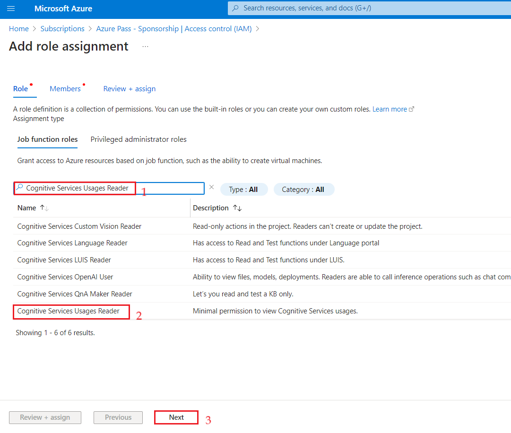

6.  In the **Add role assignment** tab, select Assign access to User
    group or service principal. Under Members, click **+Select members**

    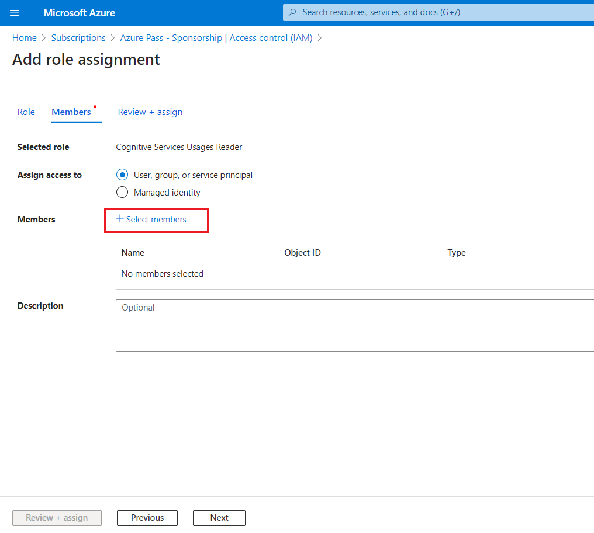

7.  On the Select members tab , search your Azure OpenAI subscription
    and click **Select.**

    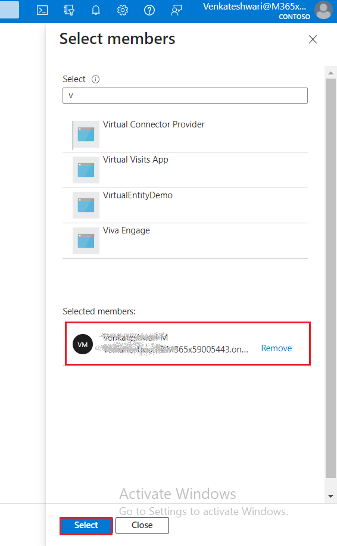

8.  In the **Add role assignment** page, Click **Review + Assign**, you
    will get a notification once the role assignment is complete.

    

    

9.  You will see a notification – added as Cognitive Services Usage
    Reader for Azure Pass-Sponsorship.

    

10. In Azure subscription page from the left menu, click on the **Access
    control(IAM).**

    

11. On the Access control(IAM) page, Click +**Add** and select **Add
    role assignments.**

    

12. Type the [**Cognitive Services
    Contributor**](https://learn.microsoft.com/en-us/azure/ai-services/openai/how-to/role-based-access-control#cognitive-services-contributor)
    in the search box and select it. Click **Next**.

    

15. In the **Add role assignment** page, Click **Review + Assign**, you
    will get a notification once the role assignment is complete.

    

17. Click on **Home**, search for +++**Azure OpenAI**+++ in the search
    bar and select **Azure OpenAI.**

    

18. Click on your **Azure OpenAI** service.

    

19. From the left menu, click on the **Access control(IAM).**

    

21. Type the [**Cognitive Services
    Contributor**](https://learn.microsoft.com/en-us/azure/ai-services/openai/how-to/role-based-access-control#cognitive-services-contributor)
    in the search box and select it. Click **Next**.

    

22. In the **Add role assignment** tab, select Assign access to User
    group or service principal. Under Members, click **+Select members**

    

23. On the Select members tab , search your Azure OpenAI subscription
    and click **Select.**

    

24. In the **Add role assignment** page, Click **Review + Assign**, you
    will get a notification once the role assignment is complete.

    

    

25. You will see a notification – added as Cognitive Services Usage
    Reader for Azure Pass-Sponsorship.

    

### **Task 2: Create an Azure Storage Account by using the portal**

1.  Sign in to the +++**<https://portal.azure.com/>+++**

2.  Click on the **Portal Menu**, then select **+ Create a resource**

    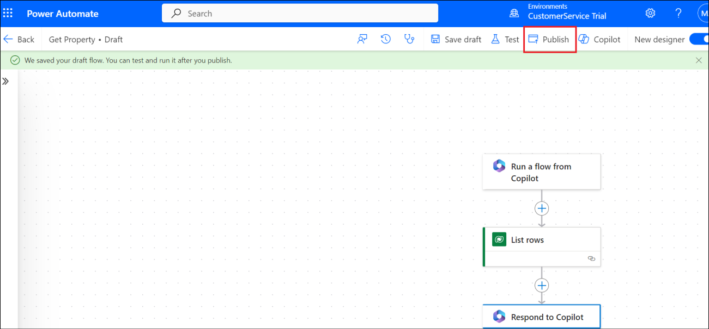

3.  In the **Create a resource** window search box, type +++**Storage
    account**+++ and then click on the **storage account**.

    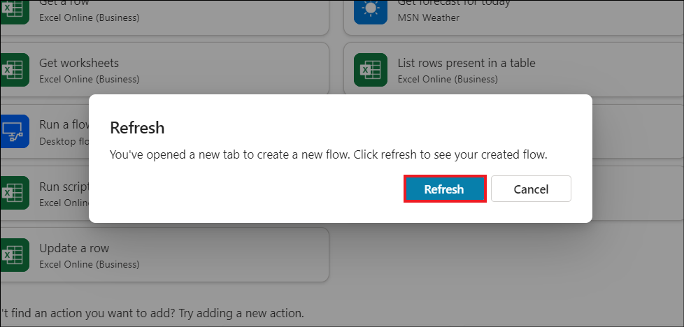

4.  In the **Marketplace** page, click on the **Storage account**
    section.

    

5.  In the **Storage account** window, click on the **Create** button.

    

6.  On **Create a storage account** window, under the **Basics** tab,
    enter the below details to create a storage account and then click
    on **Review + create**

- 

    | **Subscription** | Select your Azure OpenAI subscription |
    |----|----|
    | **Resource group** | Select AOAI-RGXX |
    | **Storage account name** | **azureopenaistorageXX**(XX can be a unique number) (here, we entered **azureopenaistorage39**) |
    | **Region** | **East US** |
    | **Performance** | **Standard: **Recommended for most scenarios (general-purpose v2 account) |
    | **Redundancy** | **Locally-redundant storage (LRS)** |

    

7.  On the **Review** tab, click on the **Create** button.

    

8.  This new Azure Storage account is now set up to host data for an
    Azure Data Lake. Click on the **Go to resource** button.

    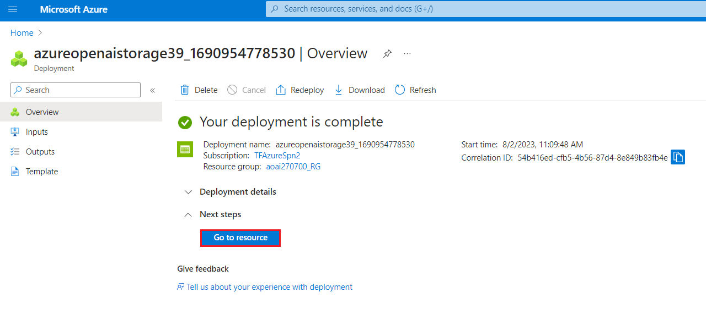

9.  After the account has been deployed, you will find options related
    to Azure Data Lake in the Overview page. In the left-side navigation
    pane, navigate to **Data storage** section, then click on
    **Containers**.

    

10. On **azureopenaistorageXX \| Containers** page, click on
    **+Container.**

    

15. In **Upload blob** pane, click on the **Upload** button.

    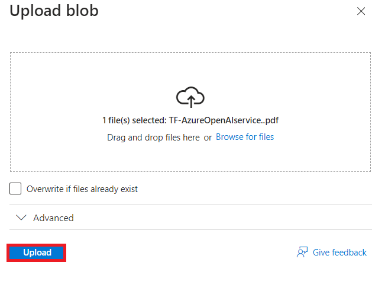

16. You will see a notification – **Successfully uploaded blob** when
    the uploaded is succeeded.

    

    

3.  In the **Create a resource** page search bar, type **Azure AI
    Search** and click on the appeared **azure ai search**.

    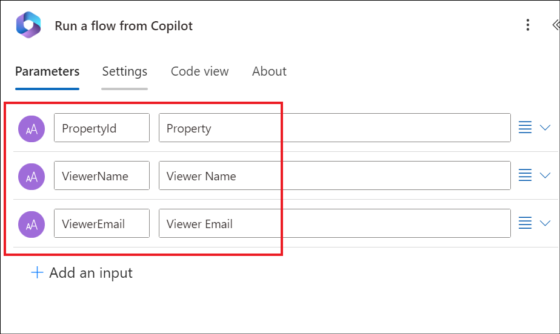

4.  Click on **azure ai search** section.

    

5.  In the **Azure AI Search** page, click on the **Create** button.

    

6.  On the **Create a search service** page, provide the following
    information and click on **Review+create** button.

    | **Field**          | **Description**                                |
    |--------------------|------------------------------------------------|
    | **Subscription**   | Select your Azure OpenAI subscription          |
    | **Resource group** | Select your Resource group                     |
    | **Region**         | EastUS                                         |
    | **Name**           | **mysearchserviceXX** (XXcan be unique number) |
    | **Pricing Tier**   | Click on change Price Tire\>select **Basic**   |

    

    

7.  Once the Validation is passed, click on the **Create** button.

    

    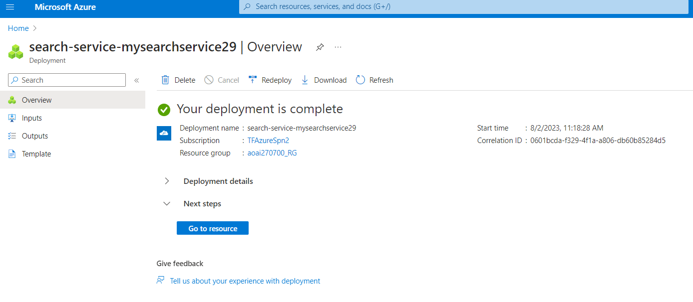

8.  After the deployment is completed, click on the **Go to resource**
    button.

    

9.  In the **mysearchserviceXX** Overview page. In the left-side
    navigation pane, under **Settings** section, select **Semantic
    ranker**.

    

11. You will see a notification -**Successfully updated semantic ranker
    to free plan**

    

> **Note**: If you are directed to the **Azure OpenAI Studio** home
> page, then skip steps from \#2 to \#4, else continue.

2.  In the **Microsoft Azure** window, enter your **Sign-in**
    credentials, and click on the **Next** button.

    

3.  Then, enter the password and click on the **Sign in** button**.**

    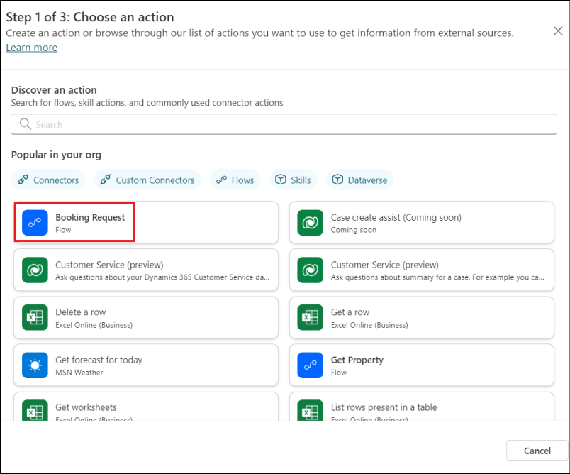

4.  In **Stay signed in?** window, click on the **Yes** button.

    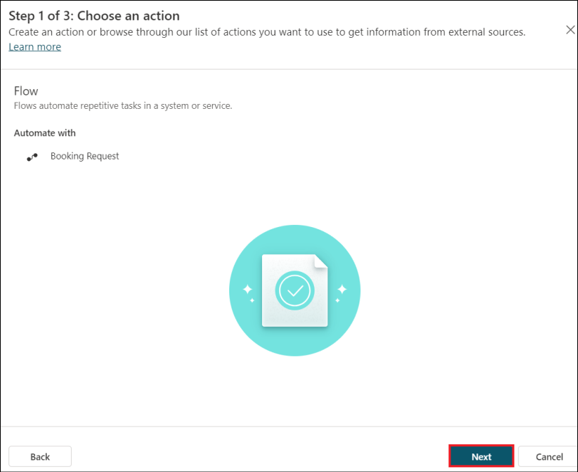

5.  On the **Welcome to Azure OpenAI Studio** dialog box, under the
    **Subscription** field, enter the subscription assigned to you, and
    in the **Resource** field, select the existing AOAI Resource name,
    and then click on the **Use resource** button.

    

6.  Within few minutes **Azure OpenAI Studio** page will appear.

    

7.  On the **Azure OpenAI Studio** homepage, click on **Create new
    deployment** button.

    

8.  In the **Deployments** page, click on +**Create new deployment**.

    

9.  Enter the below details and click on the **Create** button. 

    -	Model – Select **gpt-35-turbo**
    
    -	Deployment type – **Standard**
    
    -	Deployment name - +++**gpt-35-turbo**+++

    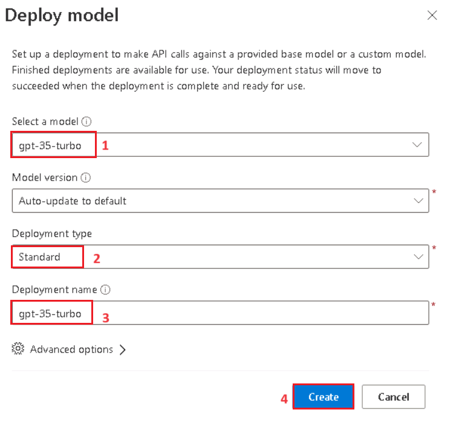 

You will see a notification – **Successfully Created deployment** when the deployment is succeeded. (You can also view the notification by clicking on the bell icon beside **Azure AI \| Azure AI Studio)**.

    

## Exercise 4: Create a Copilot app with custom data

### **Task 1: Create a chatbot with custom data**

1.  Select **Chat** to open the Chat playground.

    

2.  In **Chat playground pane** , under the Assistant setup select **Add
    your data** and then select the **+Add data source** .

    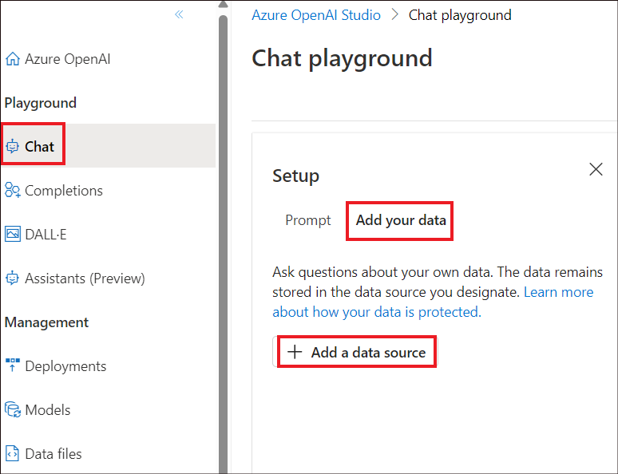

3.  In the **Add data** page, under **Select or add data source** enter
    the following details and select **Next.**

    | **Select data source** | **Select Azure Blob Storage(preview)** |
    |----|----|
    | **Subscription** | Select your Azure OpenAI subscription |
    | **Select Azure Blob storage resource** | Select **azureopenaistorageXX** |
    | **Select storage container** | Select **source** |
    | **Select Azure AI Search resource** | Select **mysearchserviceXX** |
    | **Enter the index name** | **copilot-index** |
    | **Indexer schedule** | Once |

    

***Note**: In case, you encounter an error – **Can‘t manage CORS on this
resource. Please select another storage resource**, then syn your VM
time, as mentioned in Lab \#1, Task \#1.*

4.  In the **Add data** page, on the **Data management** tab select
    **Keyword** under **Search type,** select the chunk size as
    **1024(default).**Then, click on **Next.**

    

6.  The data will be added in your Chat Playground. This will take
    approximately 4-5 minutes.

    

    

7.  In Azure AI Studio **Chat playground**, click on the V chevron
    button beside **Deploy to**, then navigate and click on **A new
    copilot in Copilot Studio(preview)**

***Note:** In case, you did not see **Deploy to** button on your VM,
then use Ctrl+- or Ctrl+minus keyboard shortcut to zoom out and decrease
the font size.*

    

8.  **Deploy to a copilot in Copilot Studio(preview)** dialog box
    appears, then click on the **Continue in Copilot Studio** button.

    

10. In the **Create a copilot pane,** enter **Copilot name** as
    **TF-Copilot** and click on **Create** button.

    

11. Wait for the deployment to complete. The deployment will take around
    **15-16** minutes.

    

12. In the **New features in Copilot Studio** dialog box, click on the
    **Skip** button.

    

13. In the Copilot Studio, select **Topics** under the **Overview .**

    

16. In the **Create generative answers properties** pane, under Azure
    OpenAI Services on your data select **Connection properties** .

    

17. Under the **Data sources**, in the **Connect data** field enter
    +++**content+++** and click on the **plus(+)** symbol.

    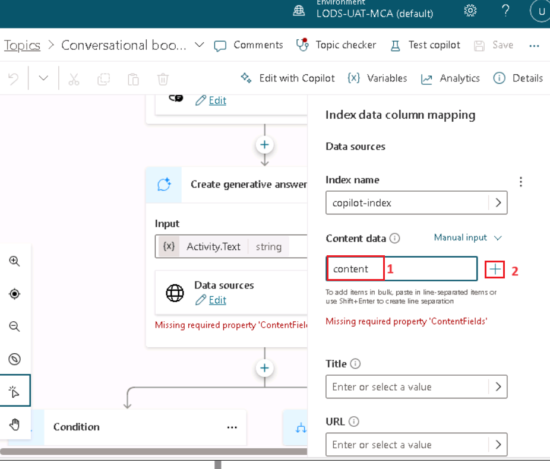

18. In your **Copilot Studio \| TF-Copilot** window, navigate to the
    **Test copilot** pane enter the following text and click on the
    **Submit icon** as shown in the below image.

**TextCopy**

**How do I get access to Azure OpenAI?**

    

    

### **Task 2: Delete the deployed models**

1.  In Azure OpenAI Studio, on the left pane, under the **Management**
    section, click on **Deployments**.

    

2.  Select **gpt-35-turbo0301** deployment name and click on **Delete
    deployment**.

    

3.  In the **Confirm delete** dialog box, click on the **Delete**
    button. You will see the notification – **Successfully Deleted
    deployment** (In case, you did not see the notification, then click
    on the bell icon beside **Azure AI \| Azure AI Studio**).

    

    

4.  In Azure OpenAI Studio, on the left pane, under the **Management**
    section, click on **Deployments**.

    

5.  Select **text-embedding-ada-002** deployment name and click on
    **Delete deployment**.

    

6.  In the **Confirm delete** dialog box, click on the **Delete**
    button. You will see the notification – **Successfully Deleted
    deployment** (In case, you did not see the notification, then click
    on the bell icon beside **Cognitive Services \| Azure OpenAI
    Studio**).

    

### **Task 3: Delete the Azure storage account, Azure cognitive search and Azure Web app**

1.  To delete the storage account, navigate to Azure portal home page,
    type **Resource groups** in the Azure portal search bar, navigate
    and click on **Resource groups** under **Services**.

    

3.  Carefully select storage account, Azure Cognitive Search, Azure web
    app, CosmosDB that you’ve created.

**Note**: Don’t select Azure OpenAI service.

    

4.  In the Resource group page, navigate to
    the command bar and click on **Delete**.

    **Important Note**: Don’t click on **Delete resource group**. If you
    don’t see the **Delete** option in the command bar, then click on the
    horizontal ellipsis.

    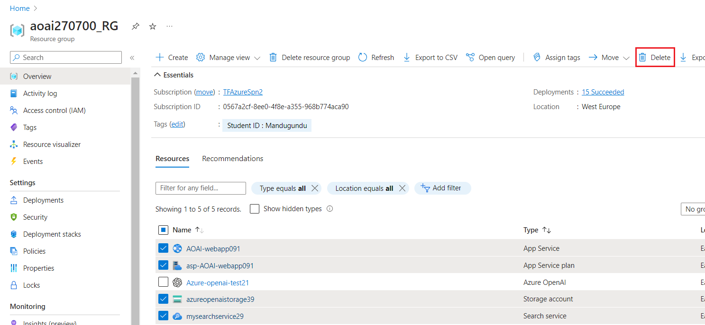

5.  In the **Delete Resources** pane that appears on the right side,
    enter the **delete** and click on **Delete** button.

    

6.  On **Delete confirmation** dialog box, click on D**elete** button.

    

7.  Click on the bell icon, you’ll see the notification – **Executed
    delete command on 4 selected items.**

    

> **Summary**
>
> You've created a storage account, container, and Azure cognitive
> service in Azure portal, then you've deployed gpt-3-turbo model in
> Azure AI Studio. You’ve added data in Chat Playground and tested the
> Assistant setup by sending queries in a chat session. Then, you've
> launched a new app and started conversation with the chatbot. You've
> deleted the gpt-3-turbo model, Azure storage account, cognitive search
> service, and the new web app to effectively and efficiently manage the
> Azure OpenAI resources.
