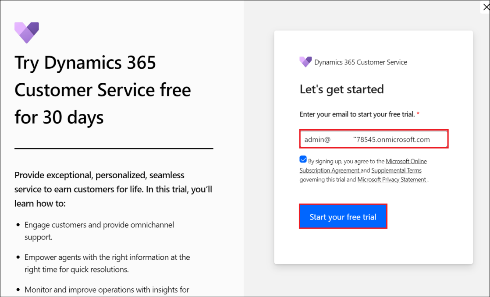
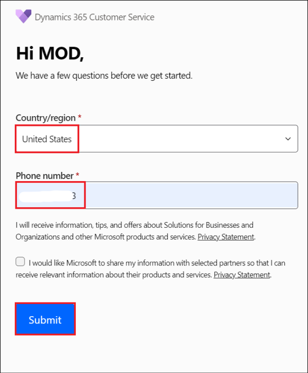
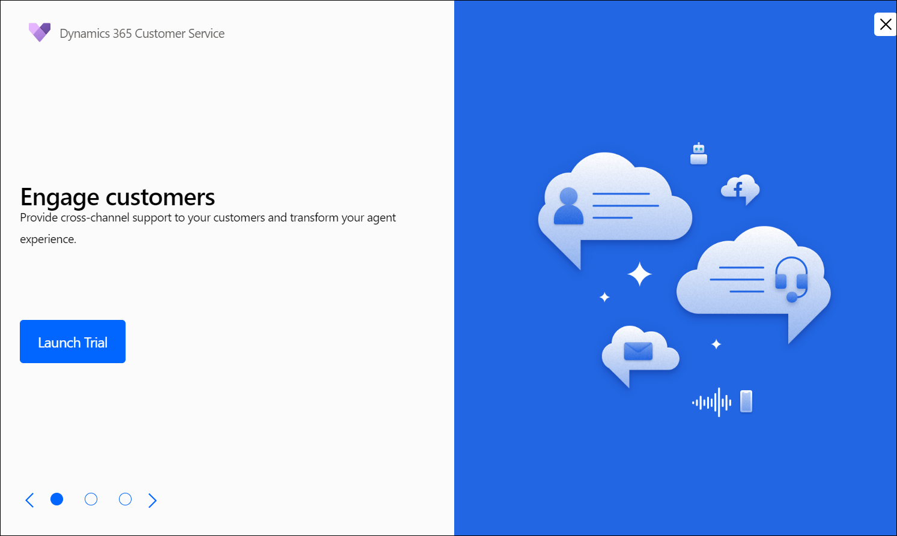
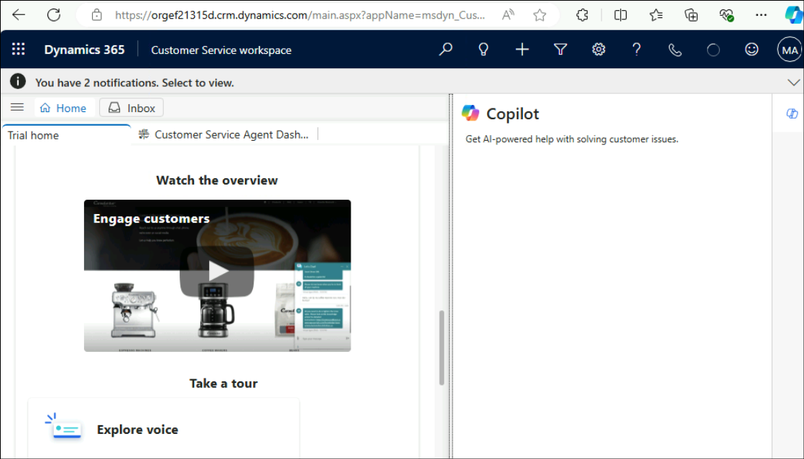

# Lab 03: Configure Dynamics 365 Customer Service

### Task 1: Sign up for Dynamics 365 Customer Service trial

1.  Login to
    !!https://dynamics.microsoft.com/en-us/customer-service/overview/!!

2.  Login using the **Office 365 Tenant details** from the **Home** tab
    if prompted.

3.  Click on **Try for free**

    

4.  Enter your **Office 365 Administrative Username** from the
    **Home** tab, select the check box and click on **Start your
    free trial**.

    

5.  Enter the region as **United States**, enter your **Phone number**
    and click on **Submit**.

    

6.  If you see an option to Launch Trial for Engage customers, click on
    **Launch Trial**.

    

7. Once activated, your Customer Service workspace will open automatically.

   

**Summary:**

In this lab, we have activated the Dynamics 365 Customer Service which will be used in the Day 2 lab.
   
