# **Lab 04_Creating and deploying a Microsoft Copilot Studio copilot from Teams**

**Lab duration** – 30 minutes

**Objective:**

In this lab, you will Install the Copilot Studio app in Microsoft Teams,
create a new copilot in a team and test it.

## **Exercise 1: Install the Copilot Studio app in Microsoft Teams**

1.  Open the link
    +++https://www.microsoft.com/en-in/microsoft-teams/download-app+++
    From a browser. Click on **Download the new Teams app** -\>
    **Download for Windows (64-bit)**

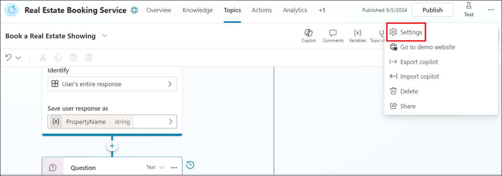

2.  **Double click** on the **downloaded file** to install the Teams for
    School app.

3.  Follow the prompts to install.

4.  Once installed, **Sign in** using your **office 365 tenant
    credentials**.

>  alt="A screenshot of a sign in Description automatically generated" />

5.  Click on **Apps**. Search for +++**Copilot Studio**+++ and select
    **Microsoft Copilot Studio** and click on **Add**.

**Note:** If you are not able to find Copilot Studio, you will have to
search for and select **Power Virtual agent** and add it.

6.  Click on **Start now**.

## **Exercise 2: Create a new copilot in a team**

1.  Select **Contoso** and click on **Continue**.

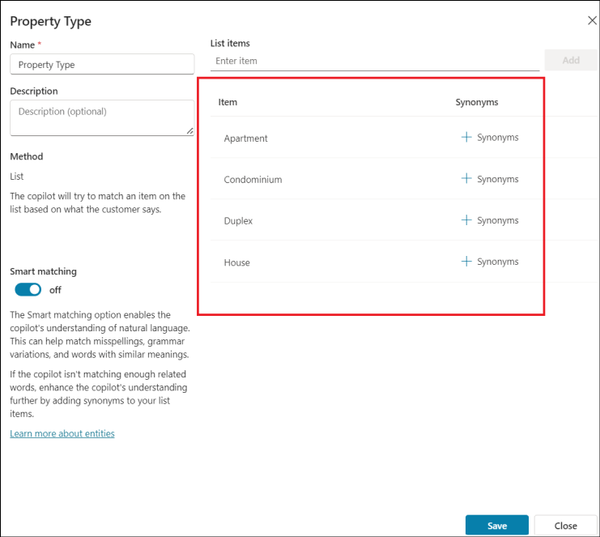

2.  In the Create a copilot pane, provide the name of the Copilot as
    +++**HR Support Copilot**+++ and click on **Create**.

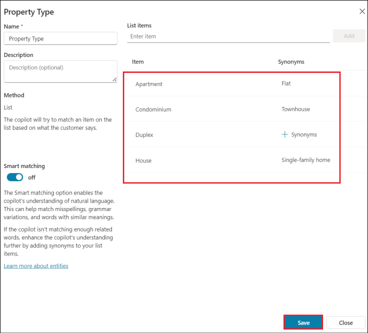

3.  A success message stating, **Your chatbot is provisioned** is
    obtained.

## **Exercise 3: Build an employee time-off topic for common time-off queries**

1.  Click on **Topics** from the left pane. Click on **+ New topic -\>
    From blank.**

2.  Click on the **Details** icon.

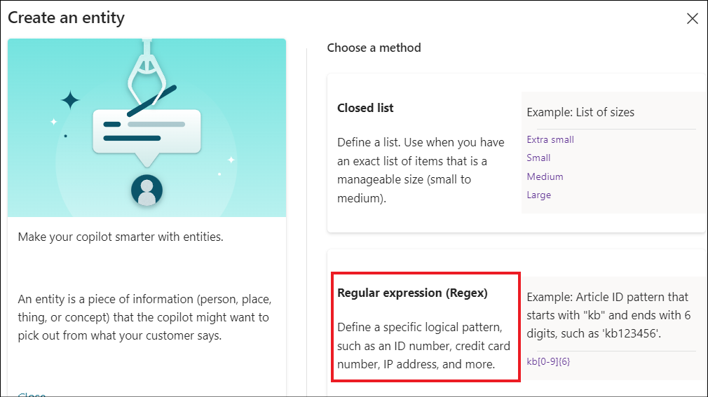

3.  In the Details pane, provide the name as +++**Employee time off**+++
    and Description as +++**Employee time off topic for common time-off
    queries**+++.

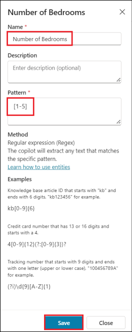

4.  Click on **Save**.

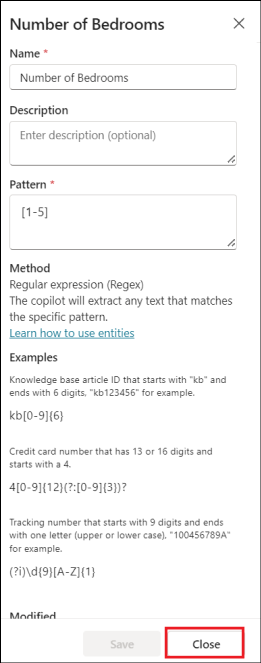

5.  Click on the **Trigger phases.**

6.  Add in a trigger phrase, +++**I need help with time off**+++ and
    click on **+.**

7.  Add in the below trigger phrases.

- +++**Need information on time off**+++

- +++**I need help with time off**+++

- +++**How many days of paid vacation do I have**+++

- +++**What are the national holidays**+++

- +++**I need extended leave**+++

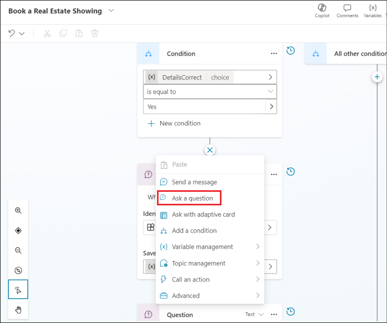

8.  Add a Message node and enter the text, +++I can help with questions
    related to time-off*+++*.

9.  As an HR employee, you know the most common time-off questions are
    about paid vacation time and national holidays. When a question node
    with user response options is added, the topic automatically gets a
    forked branch for each response.

10. Select the (**+**) icon below the message node, then select **Ask a
    question** to add a question node to the topic.

11. Enter *What information are you looking for?* in the **Ask a
    question** text box. The employee might ask this question.

> 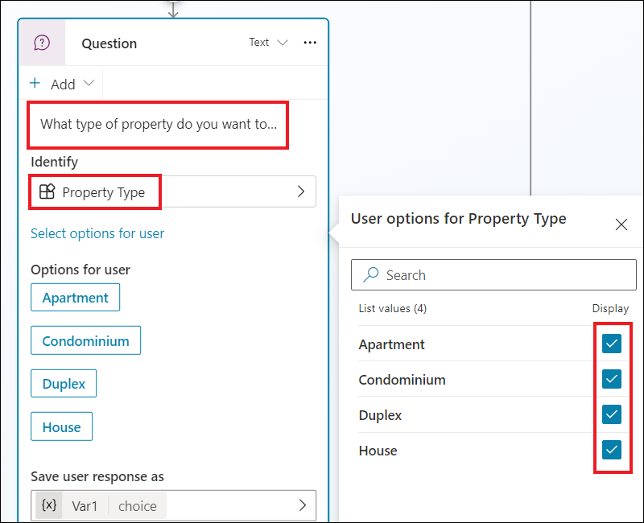 alt="A screenshot of a chat Description automatically generated" />

12. Under **Options for user**, add +++Paid
    vacation*+++* and +++National Holidays*+++* as two options.

>  alt="A screenshot of a questionnaire Description automatically generated" />

13. User choices are stored in a variable and the topic branches off,
    based on the option the user chooses. You can rename the variable to
    track it better in the topic.

14. On the variable, under **Save response as**, select the pencil icon
    to edit the variable properties.

15. The **Variable properties** pane opens. Rename the variable
    to +++TimeoffType*+++*. Close the **Variable properties** pane and
    you see the changes reflected in the authoring canvas.

> 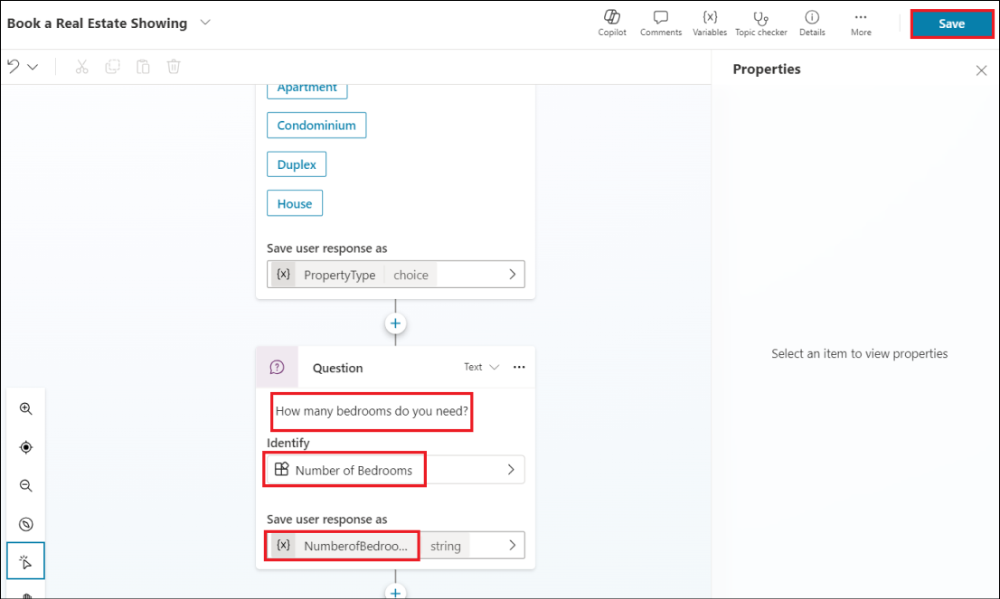 alt="A screenshot of a computer Description automatically generated" />

16. Add a message node for the Paid vacation branch with this message to
    the user: +++**For paid vacation time-off, go to
    www.contoso.com/HR/PaidTimeOff**+++ to submit time-off requests.

17. Add a node by selecting the (**+**) icon to end the conversation
    with a survey. Select **End the conversation**, then **End with
    survey**. This survey is the customer satisfaction survey prebuilt
    in the copilot for use in topics.

>  alt="A screenshot of a chat Description automatically generated" />

18. In the **National Holidays** path, add a message node with the
    following text:

> National holidays for 2020:

1.  New Year's Day: January 1st

2.  Memorial Day: May 25th

3.  Independence day: July 4th

4.  Labor Day: September 7th

5.  Thanksgiving: November 26th - 27th

6.  Christmas Eve and Christmas Day: December 24th - 25th

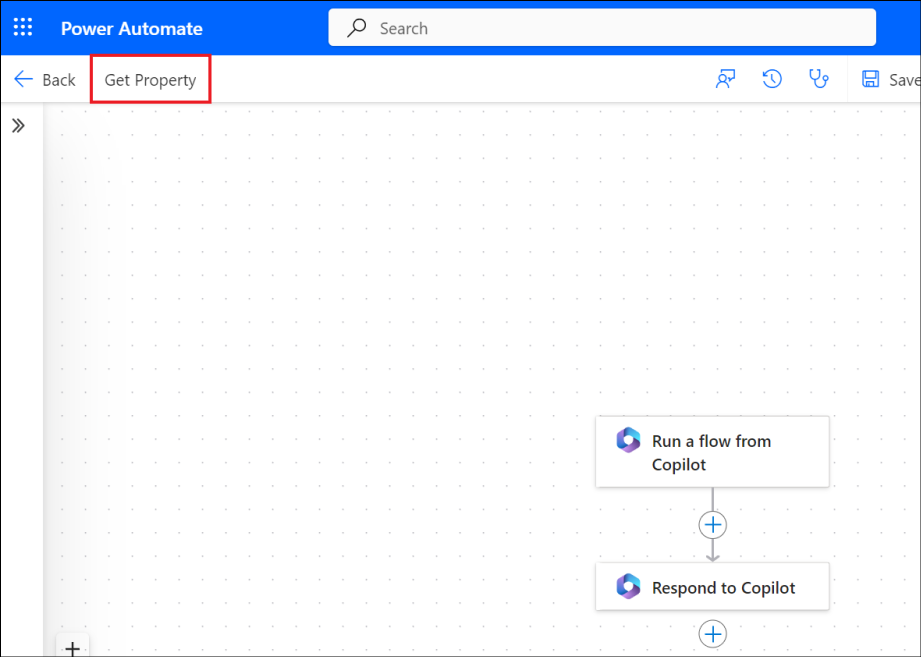

19. Click on **Save**.

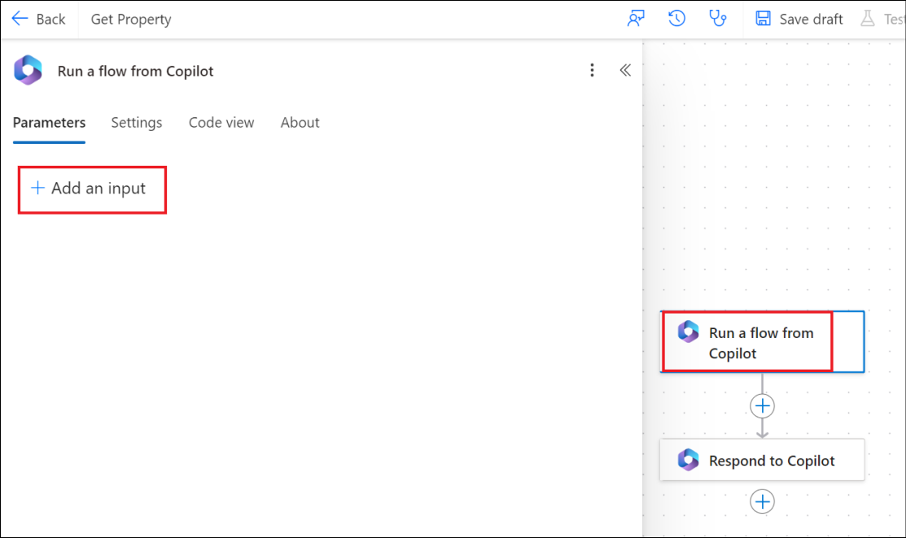

## **Exercise 4: Test copilot for expected behavior**

1.  Select the copilot icon at the bottom of the screen to launch the
    test copilot canvas.

2.  Type **I need time off information** into the copilot chat.

3.  Select **Paid vacation**.

4.  You receive the response as per our configuration.

>  alt="A screenshot of a chat Description automatically generated" />
>
> 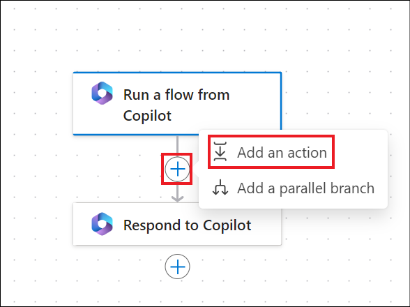 alt="A screenshot of a chat Description automatically generated" />
>
> **Summary:**
>
> In this lab, we have learnt to add the Copilot Studio app to Teams and
> create a classic bot in Teams.
