# Lab 05 - Integrate an agent with the Dynamics 365 Customer Service app and implement automated case escalation to the live agent

## Exercise 1: Configure the Dynamics 365 Customer Service workspace

### Task 1: Configure Omnichannel Power Virtual Agent Extension

1.  Open the link,
    !!<https://appsource.microsoft.com/en-cy/product/dynamics-365/mscrm.omnichannelpvaextension?tab=Overview&ref=dynamicsforcrm.com>!!
    and click on Get it now in the Omnichannel Power Virtual Agent
    Extension page.

    

    

    

2.  Select the **CustomerService Trial** under **Select an
    environment**, select the check boxes and click on **Install**.

    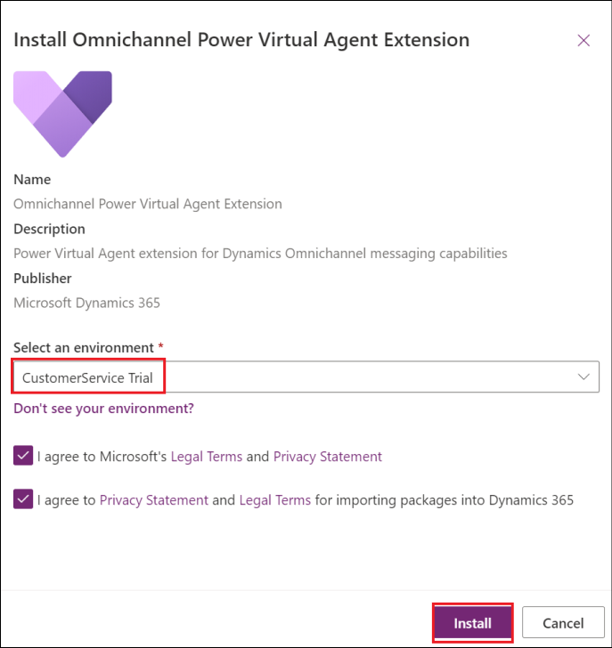

3.  In the Dynamics 365 apps page, click on the entries that shows
    **Update available**, **select** the **check box** to agree to the
    terms and click on **Update**.

Make sure to do this for **all** the entries with **Update available**
as the Status.

    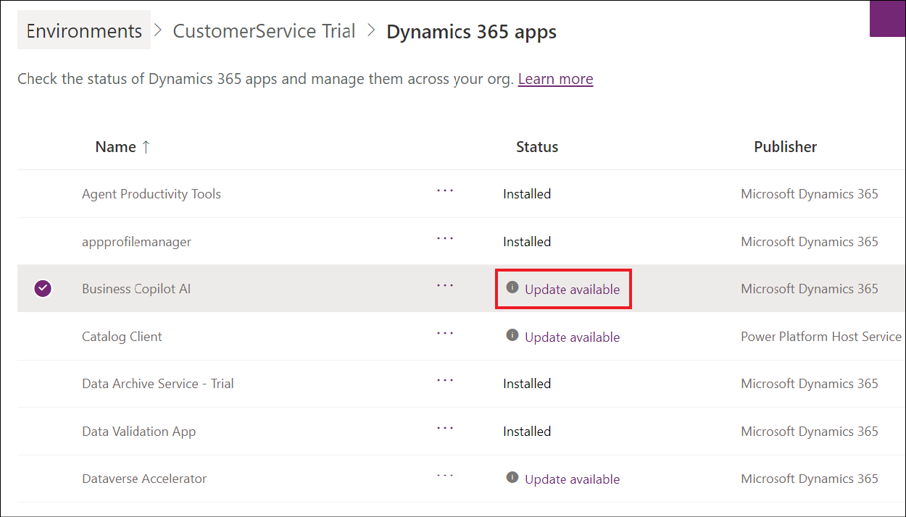

    

### Task 2: Configure search settings in the Power Platform admin center

1.  Login to !!<https://admin.powerplatform.microsoft.com/>!! using
    your tenant details. Select **Environments** -\> **CustomerService
    Trial**.

    

2.  Select the drop down next to **Resource** (in the top pane) and
    select **Dynamics 365 apps**.

    

3.  Make sure that **Omnichannel for Customer Service** is
    **Installed**.

    

4.  Navigate back to the **Environments -\> CustomerService** **Trial**
    page in the admin center. Select **Settings** from the top pane.

    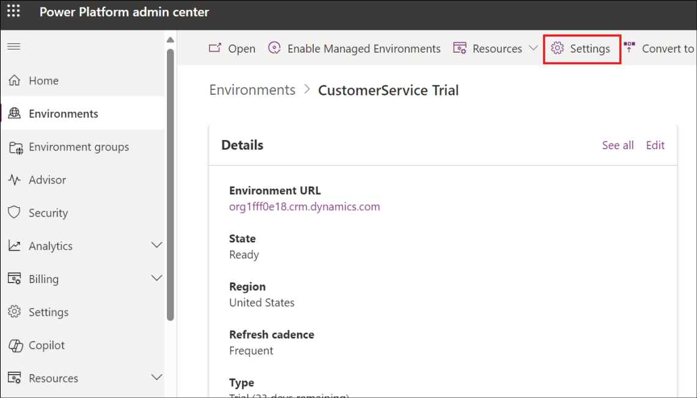

5.  Select **Product** -\> **Features**.

    

6.  Toggle **Dataverse Search** and **Single table search** option to
    **ON.**

    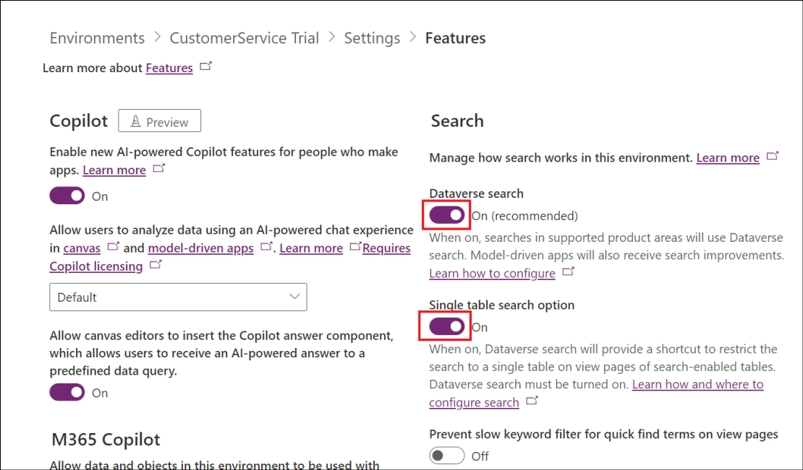

    Scroll down and click on the **Save** button at the bottom right.

    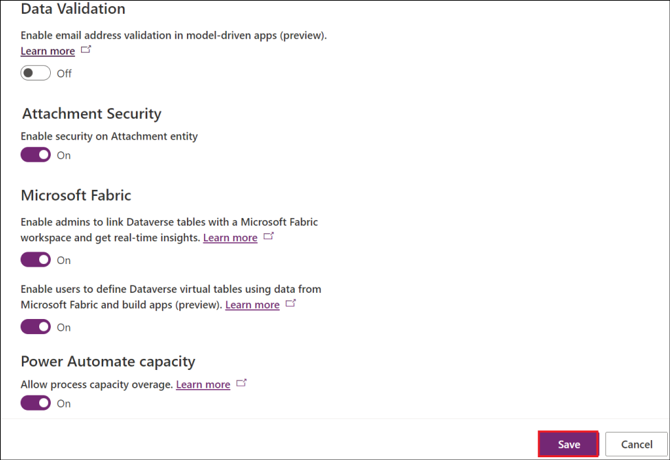

## Exercise 2: Create an agent

1.  From the Copilot Studio home page,
    !!https://copilotstudio.microsoft.com!!, select the
    **CustomerService Trial** Environment from the top right.

    

2.  Select **Agents** from the left pane. Click on the **+ New Agent**
    to create a new agent.

    

3.  In the Type your message text area, type **!!You are a customer
    service agent who helps in identifying stores nearby.**!! And hit
    **send**.

    

4.  Type the message !!**Maintain a polite tone**!! next and hit
    **send.**

    

5.  Click on **Create**.

    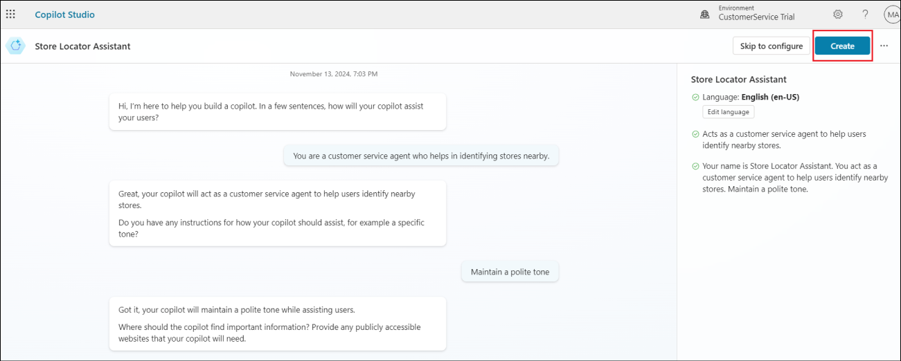

6.  The created agent opens up with a message, **Your agent is ready**.

    

## Exercise 3: Connect the copilot to Dynamics 365 Customer Service and configure the Escalate topic

### Task 1: Configure the Escalate topic

We are focusing here on showcasing the escalation to live agent concept.
So, we will directly work towards it without creating any other new
topics.

1.  Select the **Topics** tab and then select the **System** tab. Select
    the **Escalate** topic.

    

2.  Select the message node of the topic and replace the existing
    content with, !!**You will be transferred to a live agent
    shortly**!!

    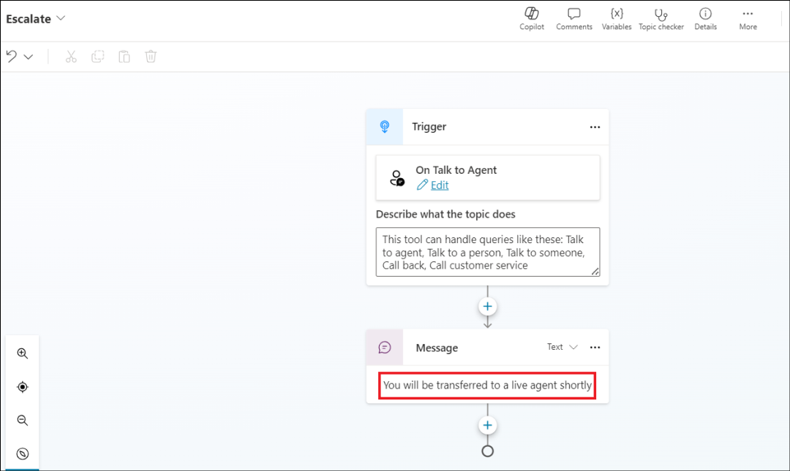

3.  Click on the + symbol to add a node next to the Message node.

4.  Select **Topic management** -\> **Transfer conversation**.

    

5.  Give a message !!The customer wants to talk to a live agent!! in the
    Transfer conversation node.

    

6.  **Save** the Topic.

    

7.  **Publish** the agent.

    

### Task 2: Connect the copilot to Dynamics 365 Customer Service

1.  Once published, from the copilot page top right, click on
    **Settings**.

    

2.  Select **Security**, and **Authentication** under Security.

    

3.  Select the **No authentication** option and then click on **Save**.

    

4.  Select **Save** in the confirmation dialog box.

    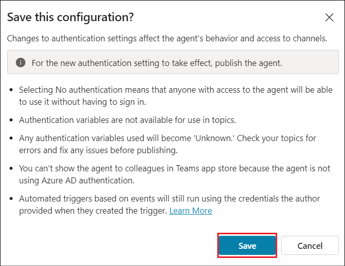

5.  Close the **Settings** pane.

6.  Click on **Channels** (If the Channels is not visible, click on the
    +1 to view the **Channels** option)

    

7.  Select **Dynamics 365 Customer Service** from the Customer
    engagement hub pane.

    

8.  On the Dynamics 365 Customer Service page, click on **Connect**.

    

9.  Once you get a **successfully connected** message, click on
    **Close**.

    

## Exercise 4: Create workstream and channel in Dynamics 365 admin center

### Task 1: Manage a user in Omnichannel for Customer Service

1.  Login to !!https://admin.powerplatform.microsoft.com!! using your
    admin tenant credentials and select **Environments** from the left
    tab. The **CustomerService Trial** will be listed here. **Select**
    it.

    

2.  Click on the **url value** under **Environment URL**.

    

3.  This opens up the **Dynamics 365 Customer Service admin center**
    page.

    

4.  In **Dynamics 365 Customer Service admin center**, in the site map,
    select **User management** under **Customer support** group.

5.  On the **User management** page, select **Manage** next
    to **Users**.

    

6.  Click the dropdown next to **Enabled Users** and select
    **Omnichannel Users**.

    

    >[!Alert] **Important:** If you are not able to see the **Omnichannel Users**
option, it is due to some back-end changes that is happening recently.
If you are not able to complete this step, then you will not be able to
complete the Exercises 7 and 8. Please omit them.

7.  On the **Omnichannel Users** page, select a user **MOD
    Administrator** in the list.

    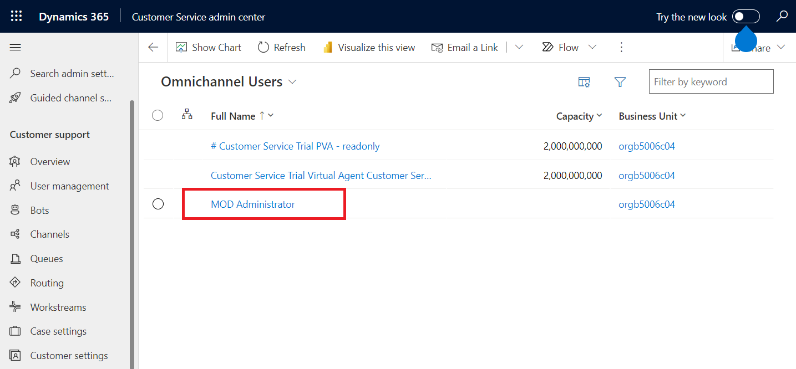

8.  On the **MOD Administrator** page, select the **Omnichannel** tab.

    

9.  Specify the following in the user page.

    | Setting   |   Value |
    |:---------|:---------|
    |   Capacity |  100|
    |   Default Presence | available    |
    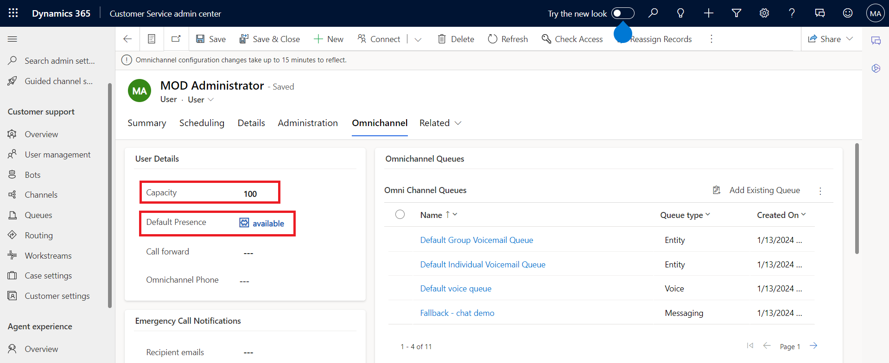

10. Select **Save and close**.

    

### Task 2: Configure workstream 

1.  From the admin center page, select **Workstreams** under **Customer
    support** from the left pane and then select the **+ New
    workstream** option.

    

2.  Fill in the below details, scroll down and click on **Create**.

    - Name - !!**New Workstream**!!

    - Owner – **MOD Administrator** (Selected by default)

    - Type – **Messaging**

    - Channel – **Chat**

    

    

3.  Once the workstream is created, click on **Set up chat** to set up
    the chat channel.

    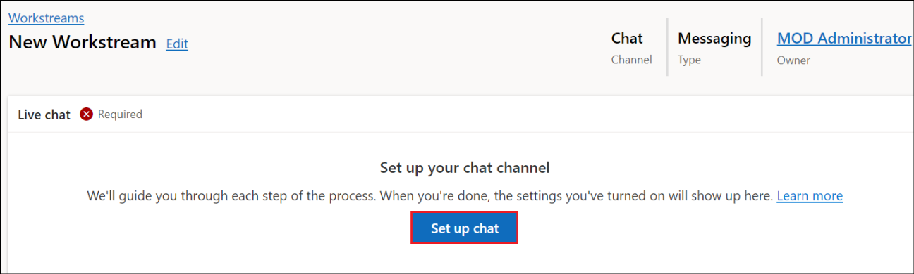

4.  In the **Live chat setup – Channel details** screen, fill in the
    below details and click on **Next**.

    - Name - !!**Chat Channel**!!

    - Language – **United States**

    

5.  In the Live chat setup – Chat widget screen, provide the name as
    !!**Store Locator Assistant**!!, accept the other defaults and
    click on **Next**.

    

6.  In the **Live chat setup – Behaviors** screen, accept the defaults
    and click on **Next**.

    

7.  In the **Live chat setup – User features** screen, toggle **File
    attachment** and **Voice and video calls** options to **off** and
    click on **Next**.

    

8.  In the **Live chat setup – Review and finish** screen, select
    **Create channel**.

    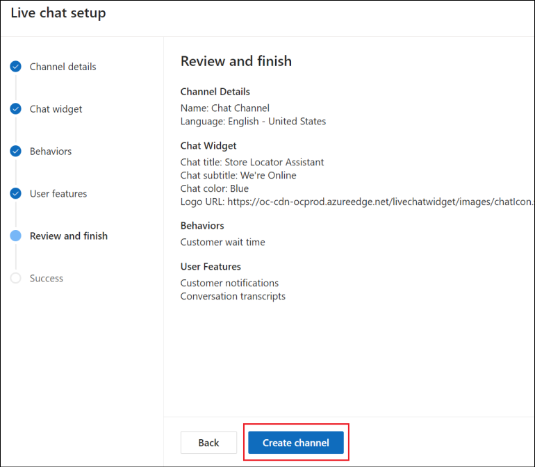

9.  **Copy** the widget that appears in the **Live chat setup –
    Success** screen and **save** it in a notepad to add it to a webpage
    in the upcoming exercises. Then, click on **Done** to complete the
    configuration.

    

### Task 3: Add the copilot to the workstream

1.  Back in the **New Workstream** page, scroll down and click on **+
    Add bot** in the Bot section.

    

2.  From the list of copilots on the Add bot screen, select the **Store
    Locator Assistant** copilot and click on **Connect**.

    

3.  Ensure that the bot is added to the workstream as in the screenshot
    below.

    

4.  From the left pane, select **Bots**.

    

5.  Ensure that the Real Estate Booking Service copilot is connected.

    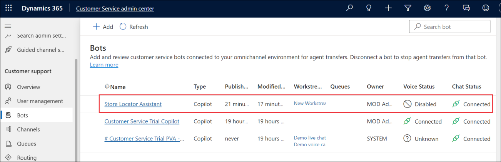

## Exercise 5: Create a webpage and test the escalation to agent

1.  Login to !!https://make.powerpages.microsoft.com/!! using your
    tenant admin credentials.

    

2.  Ensure that you are in **CustomerService Trial** environment.

3.  Click on **Get started**.

    

4.  Click on Skip in the **Tell us about yourself** page.

    

5.  Scroll down in the next page and click on **Start with a template**
    option to start creating the site with a template.

    

6.  Select a template and click on **Choose this template**.

    

7.  In the Give your site a name textbox, enter the name as !!**Contoso
    Store assistant**!!, accept the other defaults and click on
    **Done**.

    

8.  Once the site is created, click on **Edit site header** in the
    **Company name** title.

    

9.  In the **Edit site header** pane, provide the **Site title** as
    !!**Contoso Store assistant**!!.

    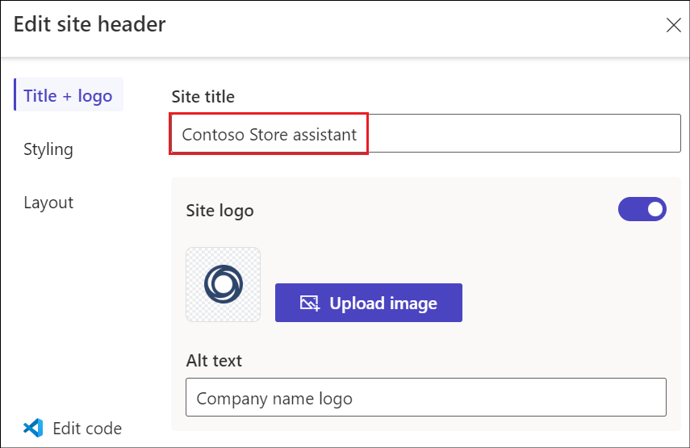

10. Click on Edit code in the top right corner of the page.

    

11. Click on **Open Visual Studio Code**.

    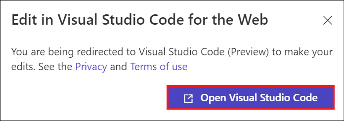

12. Click **Allow**.

    

13. The Home page of the web page opens up in the Visual Studio Code.

    

14. Scroll to the end of the file. Add the **script** copied while
    creating the workstream, after the last line of this file.

    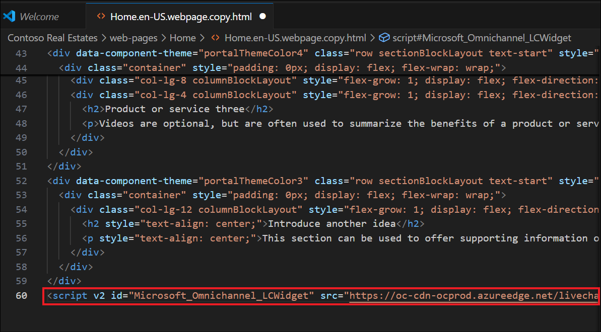

15. Save the file, close the Visual Studio Code tab and return to the
    Power pages. Click on **Sync**.

    

16. Once the Sync is completed, select **Preview** -\> **Desktop.**

    

17. Your web page opens in a new tab. Find the **Store Locator
    Assistant** embedded to the page at the bottom right of the web
    page. **Click** on it.

    

18. Enter !!Talk to agent!!.

    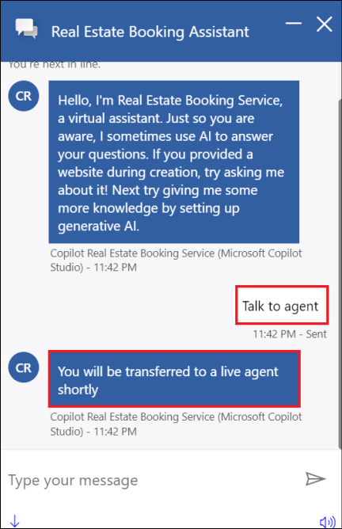

19. From the Customer Service admin page, click on **Customer Service
    admin center** and select the app **Customer Service workspace**
    from it.

    

    

20. In the Customer Service workspace page, you will get a **chat
    request**. **Accept** it.

    

21. Once accepted, the chat screen opens up with the message that we had
    given in the Escalate topic. We can also add any other information
    provided by the user here to the live agent.

    

22. Simulate the chat between the live agent and the customer if you
    wish to see how it works and then ends.

    

    

**Summary**

In this lab, we have learnt to

- Build an agent from the Copilot Studio and configure the Escalate
  topic.

- Publish the agent to Dynamics 365 workspace and integrate it in a web
  page.

- Configure and test the escalation to a live agent.

