# **Lab 12\_ Sending messages from a Copilot(classic) to a Teams channel**

**Lab duration** – 30 minutes

**Objective:**

In this lab, we will send message from a Copilot to a Teams channel by
invoking a flow.

## **Exercise 1: Add channel and Team**

1.  Open Microsoft Teams from the VM and login using your tenant
    credentials if not done already. Select Teams option.

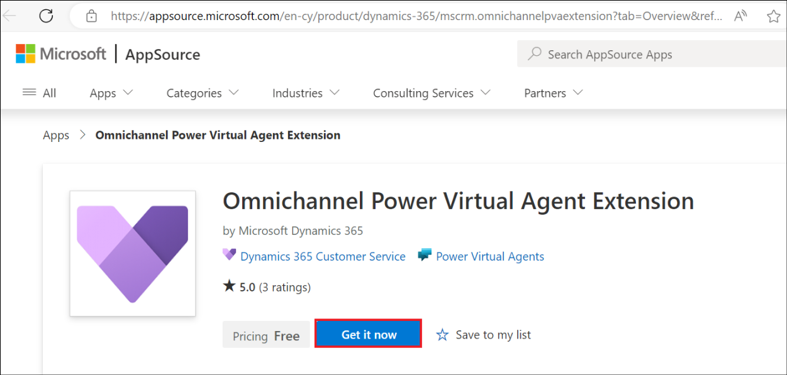

2.  From the Teams, select **More options** and select **+ -\>**
    **Create team**.

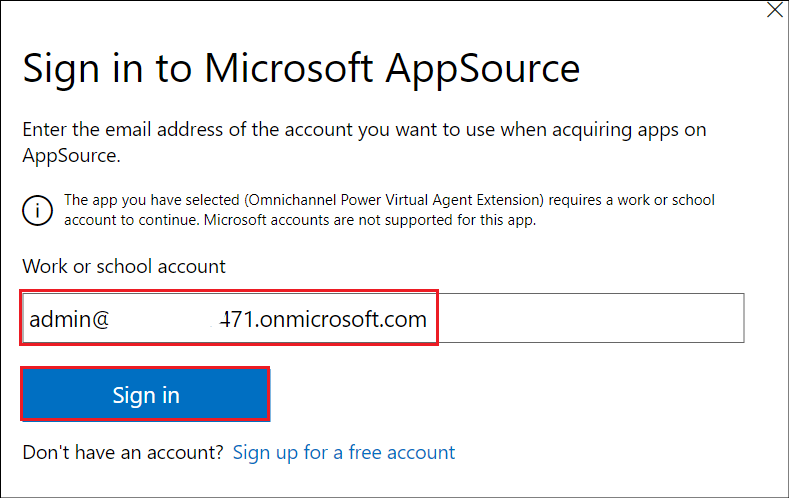

3.  Name the team as +++**HR Team**+++ and select **Create**.

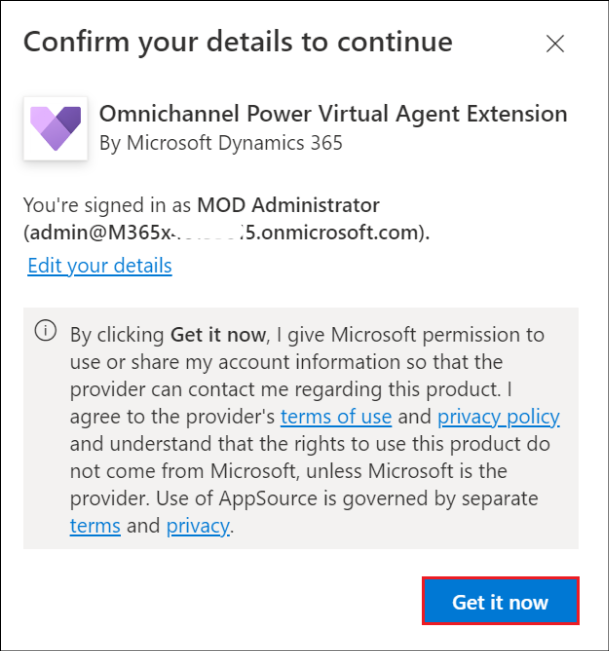

4.  Select **Skip** on ‘Add members to HR Team’ window.

5.  Select **More options** (…) infront of the **HR Team** and then
    select under **Add channel.**

6.  Provide the Channel name as +++**HR Experts**+++. Choose the Privacy
    as **Private** and click on **Create**.

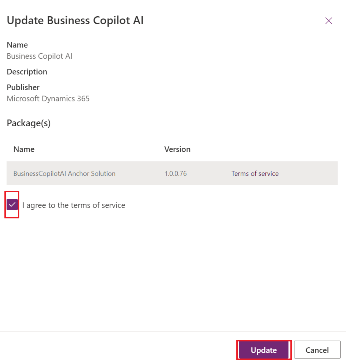

7.  Select **Skip** on ‘Add members to the HR Experts channel’ window.

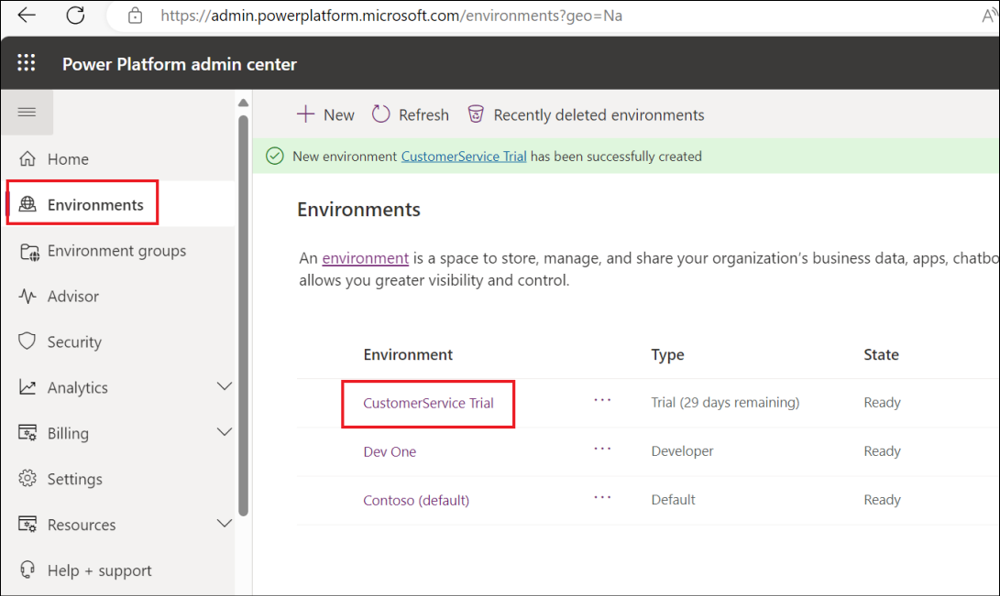

## **Exercise 2: Enhance topic to handle complex queries by escalating to HR experts**

1.  From the Teams app, select the Copilot Studio app(Power Virtual
    Agents), select **Copilots** tab and open the **HR Support
    Copilot**.

> 
>
> **Note:** If Copilot Studio shortcut is not found, search for
> **Copilot Studio/Power Virtual Agents under Apps** and select
> **Open**)

2.  Select **Topics** from left pane and return to the topic you created
    earlier(**Employee time off**) and go to the authoring canvas.

>  alt="A screenshot of a chat Description automatically generated" />

3.  In the **Ask a question node**, add an option named **Extended
    leave**.

>  alt="A screenshot of a computer Description automatically generated" />

4.  Under the Condition node of Extended leave, add a question node
    asking for a description for the issue and add the text +++**How
    would you describe the issue?***+++*

> 

5.  Select **User’s entire response** under Identity and save the
    description in a variable named +++**Description**+++.

>  alt="A screenshot of a computer screen Description automatically generated" />

6.  Select **Save**.

7.  Add a node under the question and select **Call an action**. Select
    **Create a flow** which launches the Power Automate within the
    Copilot Studio in Teams.

8.  Choose the **Power Virtual Agents Flow** Template option.

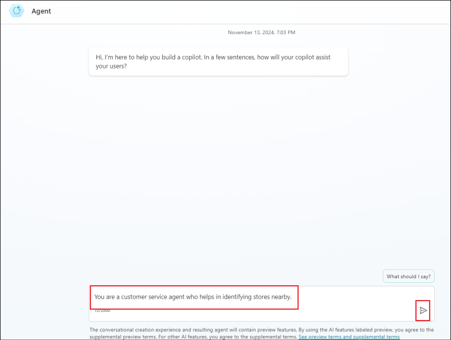

9.  Add a **Text** input field by clicking on **+ Add an input** in the
    first step. Replace the Input by **Description**.

10. Insert a **new step** and select **Add an action**.

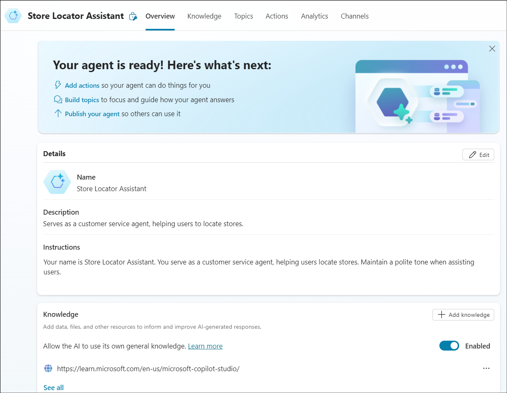

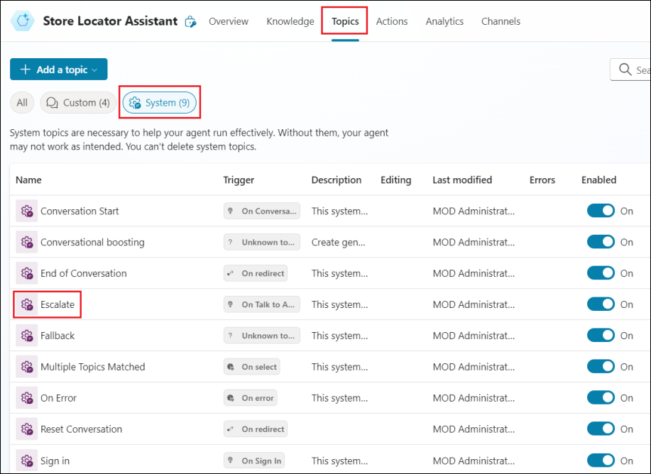

11. Select **Microsoft Teams** under **Choose an operation**.

12. Select **Post message in a chat or channel**.

13. Provide the below details:

- Post as – **User**

- Post in – **Channel**

- Team – **HR Team**

- Channel – **HR Experts**

- Message **– Description** from **Dynamic Content**

14. Rename the flow as +++**Send a message to HR team**+++ and click on
    **Save**.

>  alt="A screenshot of a computer Description automatically generated" />

15. Click on **Close** to close the Power Automate and return to the
    Authoring canvas.

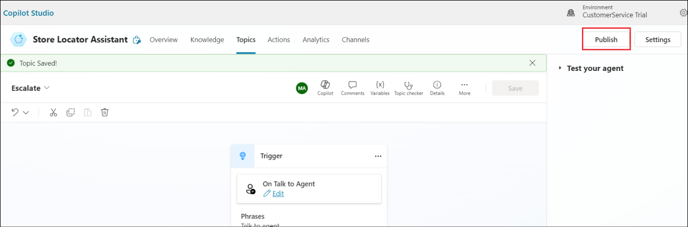

16. From the Authoring canvas, add a node – **call an action** -\>
    **Send a message to HR team**.

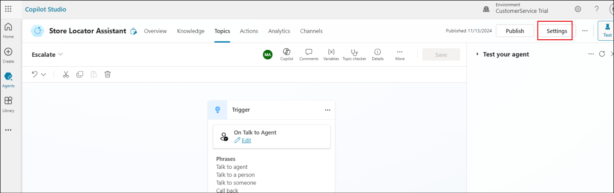

17. Add in the input as **Description**.

18. Add in a message node with the message, +++**We notified the expert.
    They’ll reach out shortly**+++.

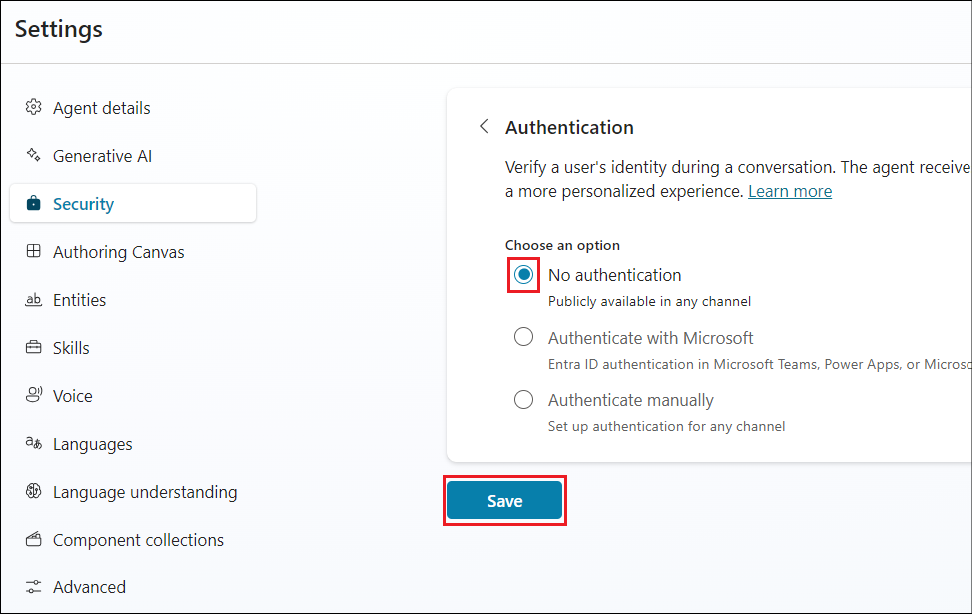

19. End the conversation \> End the survey.

20. Click on **Save** to save the topic.

21. A success message of **Topic saved** is obtained.

## **Exercise 3: Test your chatbot**

1.  Select Test your chatbot from the left pane.

2.  Send a message +++**I need help with time off**+++ and select
    Extended leave to answer the chatbot.

3.  Describe a reason for your leave extension. Here, we have given it
    as +++**I need extended leave of one month for travelling**+++.

4.  The bot replies with “We notified an expert…..” message.

>  alt="A screenshot of a chat Description automatically generated" />

## **Exercise 4: Check the message in Teams.**

1.  Click on Teams from the left menu of the MS Teams app.

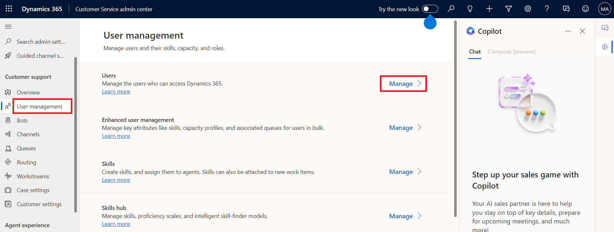

2.  Select the **HR Experts** channel under the **HR Team** team. Notice
    that the message from the user to the bot has been sent here.

## **Exercise 5: Publish your copilot – Teams**

1.  Go back to Microsoft Copilot Studio app. Select the chatbot **HR
    Support Copilot**.

2.  Select Publish from the left pane.

3.  Click on **Publish**.

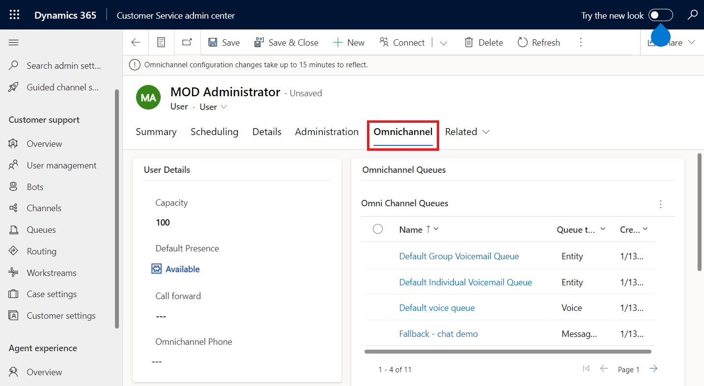

4.  Select Publish in the **Publish latest content?**

5.  Success message is obtained as in the screenshot below. Click on the
    **Availability options**.

6.  The **Add to Contoso** option adds the bot to the specific team.

7.  **Show to my team mates and shared users** makes the bot to appear
    under the Built by colleagues section.

8.  **Show to everyone in the org** submits the request to the admin to
    get the bot listed under the **Built by org** section.

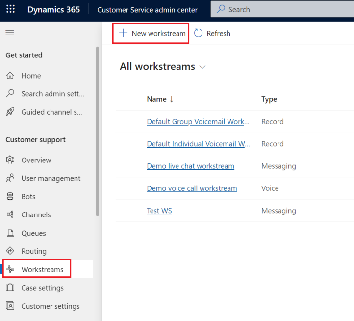

**Summary:**

In this lab, we have learnt to post a message to the Teams channel from
the bot.
