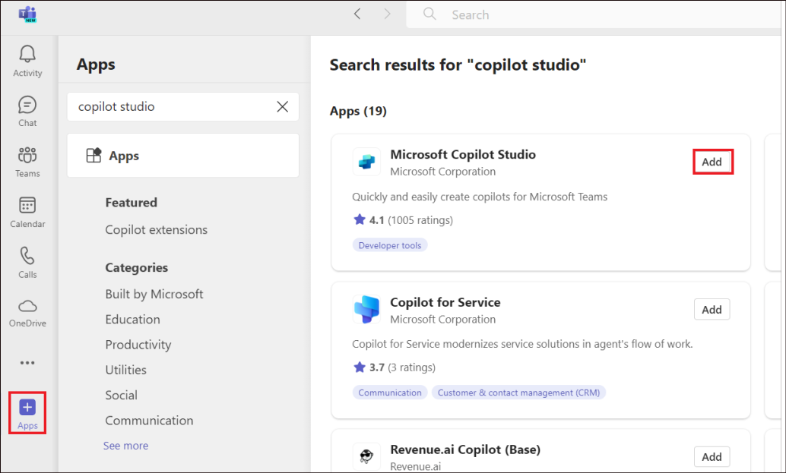
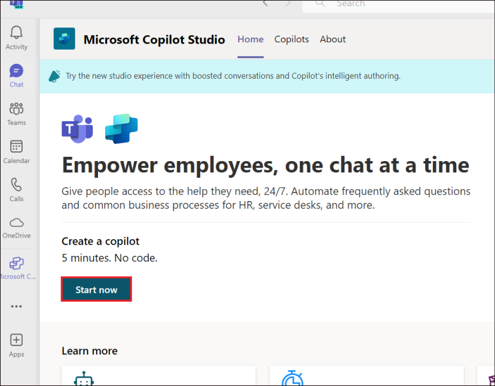
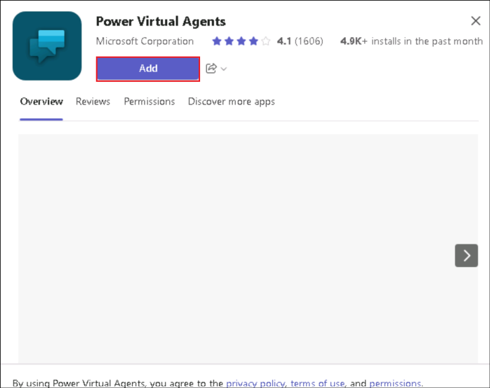
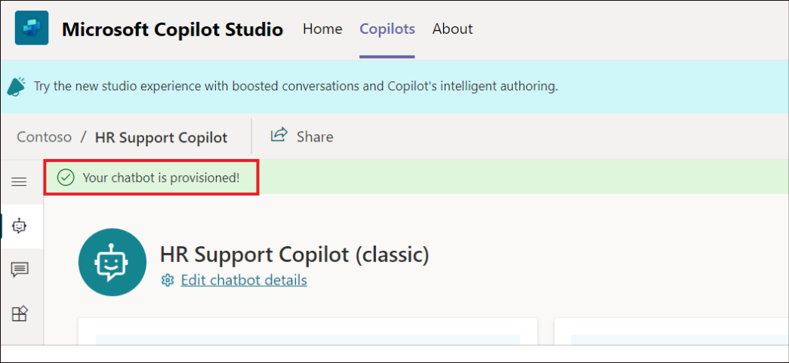
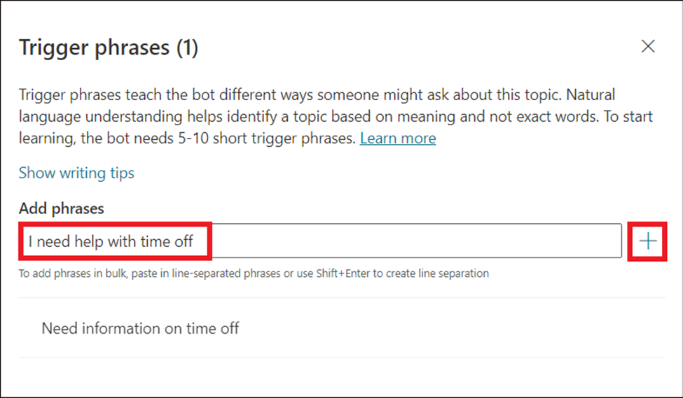
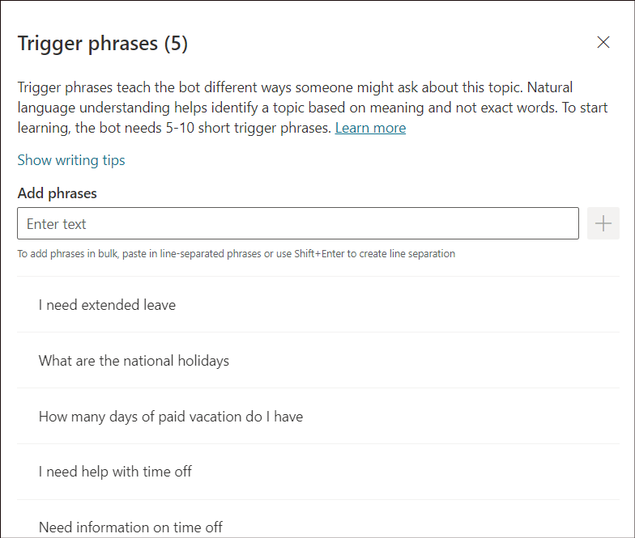
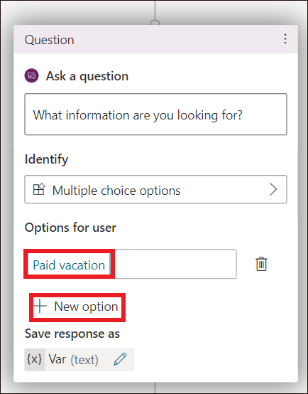
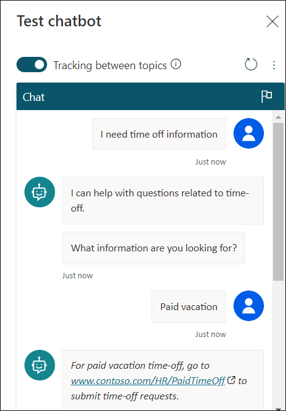

# **Lab 06_Creating and deploying a Microsoft Copilot Studio copilot from Teams**

**Lab duration** – 30 minutes

**Objective:**

In this lab, you will Install the Copilot Studio app in Microsoft Teams,
create a new copilot in a team and test it.

## **Exercise 1: Install the Copilot Studio app in Microsoft Teams**

1.  Open the link
    !!https://www.microsoft.com/en-in/microsoft-teams/download-app!! from a browser. Click on **Download Teams** under **Download Microsoft Teams for Windows desktop**

    

2.  **Double click** on the **downloaded file** to install the Teams for
    School app.

3.  Follow the prompts to install.

4.  Once installed, **Sign in** using your **office 365 tenant
    credentials**.

    

5.  Click on **Apps**. Search for !!**Copilot Studio**!! and select
    **Microsoft Copilot Studio** and click on **Add**.

    **Note:** If you are not able to find Copilot Studio, you will have to
search for and select **Power Virtual agent** and add it.

    

    

6.  Click on **Start now**.

    

## **Exercise 2: Create a new copilot in a team**

1.  **Sign in** to **Teams** using your **office 365 tenant
    credentials**.

    

2.  Click on **Apps**. Search for !!**Copilot Studio**!! and select
    **Microsoft Copilot Studio** and click on **Add**.

    

    

>[!Alert]**Important:** If you are not able to find Copilot Studio, you will have
to search for and select !!**Power Virtual agent**!! and add it.

    

    

3.  Click on **Start now**.

    

4.  Select **Contoso** and click on **Continue**.

    

    

>[!Alert] **Important:** This step may take around 10 minutes. If it is taking too
long, close it, select Copilot Studio or Power Virtual Agents from Apps
in the left pane and redo step 4.

5.  In the Create a copilot pane, provide the name of the Copilot as
    !!**HR Support Copilot**!! and click on **Create**.

    

6.  A success message stating, **Your chatbot is provisioned** is
    obtained.

    

## **Exercise 3: Build an employee time-off topic for common time-off queries**

1.  Click on **Topics** from the left pane. Click on **+ New topic -\>
    From blank.**

    

2.  **Close** the Trigger phrases pane for now.

    

3.  Click on the **Details** icon.

    

4.  In the Details pane, provide the name as !!**Employee time off**!!
    and Description as !!**Employee time off topic for common time-off
    queries**!!.

    

5.  **Close** the Details pane.

    

6.  Click on **Save**.

    

7.  Click on the **Trigger phases.**

    

8.  Add in a trigger phrase, !!**I need help with time off**!! and
    click on **+.**

    

9.  Add in the below trigger phrases.

    - !!**Need information on time off**!!

    - !!**How many days of paid vacation do I have**!!

    - !!**What are the national holidays**!!

    - !!**I need extended leave**!!

    

    Close the Trigger phrases pane.

10. Add a Message node and enter the text, !!I can help with questions
    related to time-off*!!*.

    

11. As an HR employee, you know the most common time-off questions are
    about **paid vacation** time and **national holidays**. When a
    question node with user response options is added, the topic
    automatically gets a forked branch for each response.

12. Select the (**+**) icon below the message node, then select **Ask a
    question** to add a question node to the topic. Enter *What
    information are you looking for?* in the **Ask a question** text
    box.

    

13. Under **Options for user**, add !!Paid
    vacation*!!* and !!National Holidays*!!* as two options.

    

14. User choices are stored in a variable and the topic branches off,
    based on the option the user chooses. You can rename the variable to
    track it better in the topic.

15. On the variable, under **Save response as**, select the pencil icon
    to edit the variable properties.

16. The **Variable properties** pane opens. Rename the variable
    to !!TimeoffType*!!*. Close the **Variable properties** pane and
    you see the changes reflected in the authoring canvas.

    

17. Add a message node for the Paid vacation branch with this message to
    the user: !!**For paid vacation time-off, go to
    www.contoso.com/HR/PaidTimeOff**!! to submit time-off requests.

    

18. In the **National Holidays** path, add a message node with the
    following text:

National holidays for 2024:

    - New Year's Day: January 1st

    - Memorial Day: May 27th

    - Independence day: July 4th

    - Labor Day: September 2nd

    - Thanksgiving: November 28th

    - Christmas Eve and Christmas Day: December 24th - 25^(th)

    

19. Click on **Save**.

    

    

## **Exercise 4: Test copilot for expected behavior**

1.  Select the **Copilot/Power Virtual Agent** icon at the top of the
    screen to launch the test copilot canvas.

    

2.  Type **I need time off information** into the copilot chat.

3.  Select **Paid vacation**.

4.  You receive the response as per our configuration.

    

    

**Summary:**

In this lab, we have learnt to add the Copilot Studio app to Teams and
create a classic bot in Teams.
