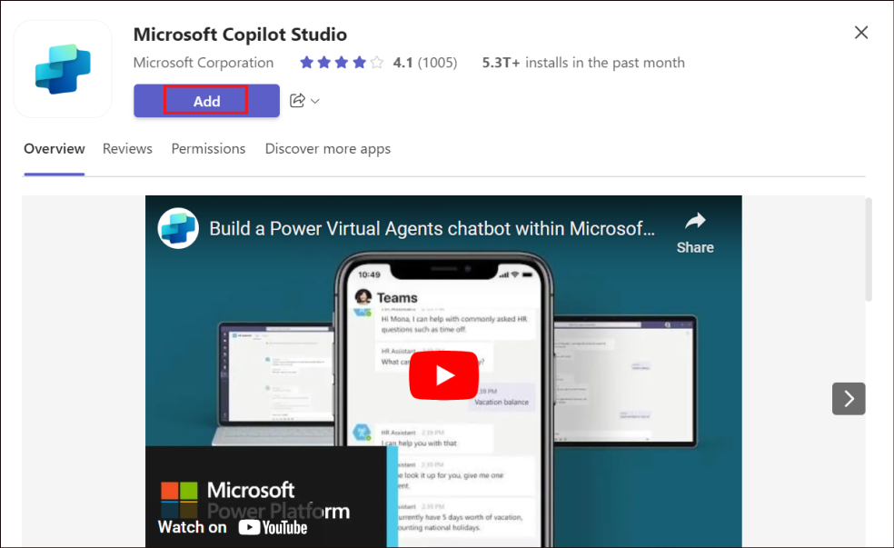
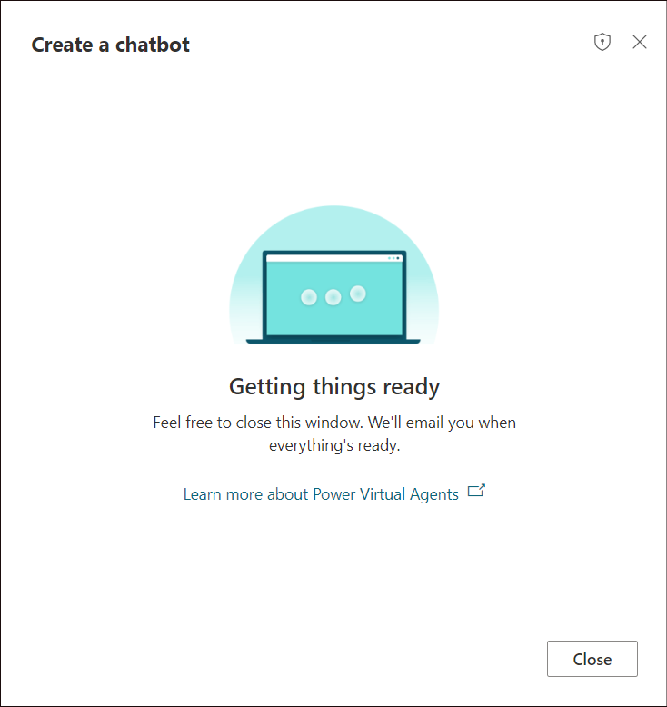
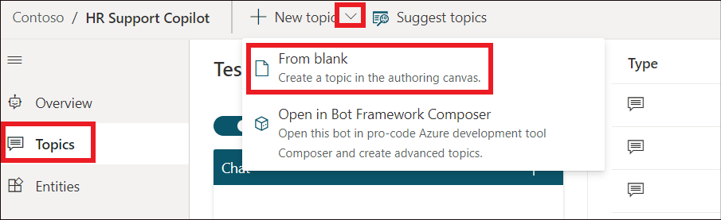
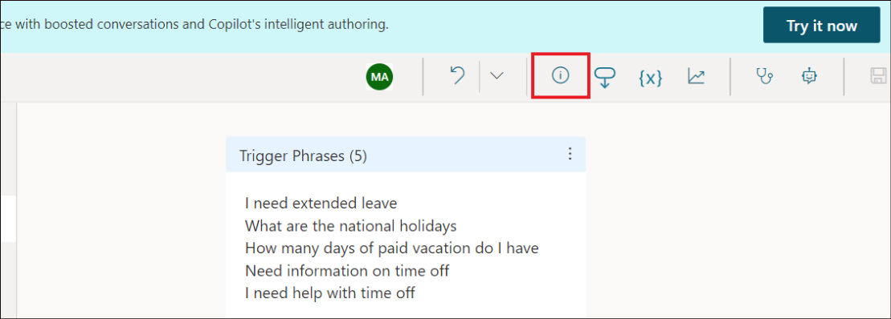
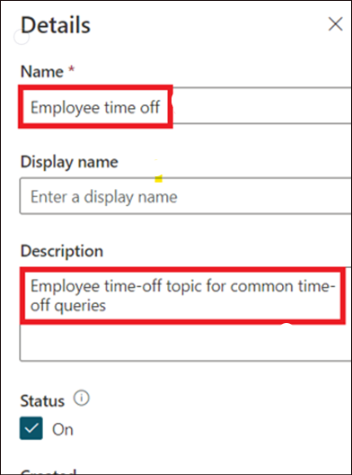
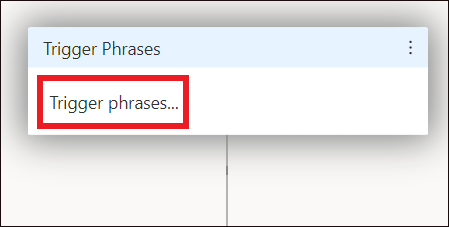

# **Lab 06 - Creating and deploying a Microsoft Copilot Studio copilot from Teams**

**Lab duration** – 30 minutes

**Objective:**

In this lab, you will Install the Copilot Studio app in Microsoft Teams,
create a new copilot in a team and test it.

## **Exercise 1: Install the Copilot Studio app in Microsoft Teams**

1. Open the **Microsoft Teams**(Work or School) from the Start menu.

    

3.  Click on **Apps**. Search for !!**Copilot Studio**!! and select
    **Microsoft Copilot Studio** and click on **Add**.

    **Note:** If you are not able to find Copilot Studio, you will have to
search for and select **Power Virtual agent** and add it.

    

    

4. Click on **Open** to open the app.

    
   
5.  Click on **Start now**.

    

## **Exercise 2: Create a new copilot in a team**

1.  Select **Contoso** and click on **Continue**.

    

    

    :::danger
    
    **Important:** This step may take around 10 minutes. If it is taking too long, close it, select Copilot Studio or Power Virtual Agents from Apps in the left pane, and click on Start now again.

    :::

2.  In the Create a copilot pane, provide the name as
    !!**HR Support Copilot**!! and click on **Create**.

    

3.  A success message will display once the Copilot is created.

    

## **Exercise 3: Build an employee time-off topic for common time-off queries**

1.  Click on **Topics** from the left pane. Click on **+ New topic -\>
    From blank.**

    

2.  **Close** the Trigger phrases pane for now.

    

3.  Click on the **Details** icon.

    

4.  In the Details pane, provide the name as !!**Employee time off**!!
    and Description as !!**Employee time off topic for common time-off queries**!!.

    

5.  **Close** the Details pane.

    

6.  Click on the **Trigger phases.**

    

7.  Add in a trigger phrase, !!**I need help with time off**!! and
    click on **+.**

    

8.  Add in the below trigger phrases.

    - !!**Need information on time off**!!

    - !!**How many days of paid vacation do I have**!!

    - !!**What are the national holidays**!!

    - !!**I need extended leave**!!

    

    Close the Trigger phrases pane.

9. In the Message node and enter the text, !!I can help with questions related to time-off!!.

    

10. As an HR employee, you know the most common time-off questions are
    about **paid vacation** time and **national holidays**. When a
    question node with user response options is added, the topic
    automatically gets a forked branch for each response.

11. Select the (**+**) icon below the message node, then select **Ask a
    question** to add a question node to the topic. Enter !!**What information are you looking for?**!! in the **Ask a question** text
    box.

    

12. Under **Options for user**, add !!Paid vacation!! and !!National Holidays!! as two options.

    

13. User choices are stored in a variable and the topic branches off,
    based on the option the user chooses. You can rename the variable to
    track it better in the topic.

14. On the variable, under **Save response as**, select the pencil icon
    to edit the variable properties.

15. The **Variable properties** pane opens. Rename the variable
    to !!TimeoffType!!. Close the **Variable properties** pane and
    you see the changes reflected in the authoring canvas.

    

16. Add a message node for the Paid vacation branch with this message to
    the user: !!**For paid vacation time-off, go to www.contoso.com/HR/PaidTimeOff to submit time-off requests**!!.

    

17. In the **National Holidays** path, add a message node.
    Copy the following text to a notepad and then copy it from there and paste it to the newly added Message node.
    
    ```
    National holidays for 2025:
    -	New Year’s Day:	Jan 1
    -	Martin Luther King Jr. Day: Jan 20
    -	Washington’s Birthday (Presidents’ Day): Feb 17
    -	Memorial Day: May 26
    -	Juneteenth National Independence Day: June 19
    -	Independence Day: July 4
    -	Labor Day: Sep 1
    -	Columbus Day / Indigenous Peoples’ Day: Oct 13
    -	Veterans Day: Nov 11
    -	Thanksgiving Day: Nov 27
    -	Christmas Day: Dec 25
    ```
    
    

19. Click on **Save**.

    

    

## **Exercise 4: Test copilot for expected behavior**

1.  Select the **Copilot/Power Virtual Agent** icon at the top of the
    screen to launch the test copilot canvas.

    

2.  Type !!**I need time off information**!! into the copilot chat.

3.  Select **Paid vacation**.

4.  You receive the response as per our configuration.

    

    

**Summary:**

In this lab, we have learnt to add the Copilot Studio app to Teams and
create a classic bot in Teams.
