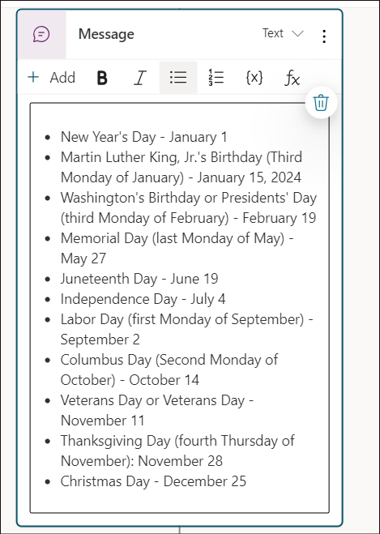
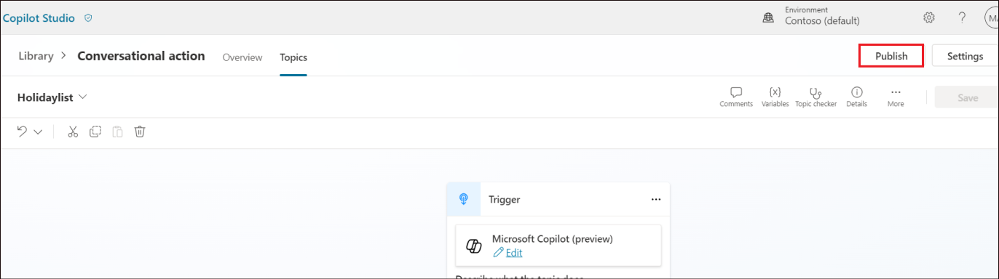

# **Lab 08 - Extending Microsoft Copilot with connector actions (preview)**

**Lab duration** – 20 minutes

**Objective:**

Connector actions let you define connectors that can be invoked from AI
surfaces in Power Platform. For connector actions, you need to identify
the actions enabled for use in the Copilot. You can also capture the
information that large language models require to effectively identify
and utilize the plugin, such as summary and description fields.

In this lab, we will learn how to add a connector action and publish it.

## **Exercise 1: Add a connector action**

### **Task 1: Select the Copilot experience and choose connector action**

1.  Login to the Copilot Studio at
    +++https://copilotstudio.microsoft.com+++ using your tenant
    credentials if not done already.

2.  On the home page, select **Copilots** and select **Copilot for
    Microsoft 365**.

3.  Select **Actions** and then select **+ Add action**.

4.  Select **connector**.

5.  Select **SharePoint**.

6.  The **Add a connector action** pane opens. Accept the defaults and
    click on **Next**.

7.  Select the **Get lists**, accept the other defaults and click on
    **Next**.

8.  **Review** the action’s parameters and click on **Next**.

9.  The screen again lands in the Add a connector action to enable
    adding more actions. We can select **Next** since we are adding only
    one action here.

10. In the Review, test and publish your action screen, click on **+ New
    connection**.

11. Select **Create**.

12. Login using your tenant credentials. Once the connection is
    established, select it (if not automatically selected) and then
    click on **Next**.

13. In the next screen, your connection action gets published.

14. Once done, you will get a message stating that the **Your**
    **connector action is now published to Copilot for Microsoft 365**.
    Click on **Go to details page** to see the details.

Your connector action is now published to **Copilot for Microsoft 365**.
It will show up in copilot experiences only if you have a valid Copilot
license.

**Summary:**

In this lab, we have learnt how to add a connector option, viewed the
different types of actions available and publish it.
