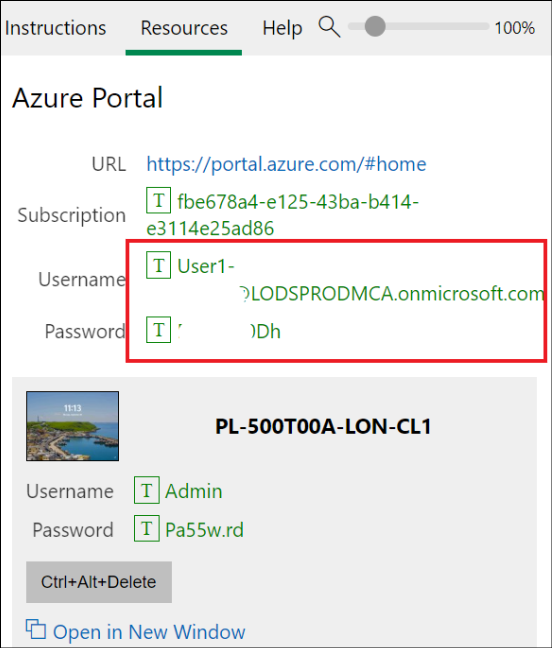
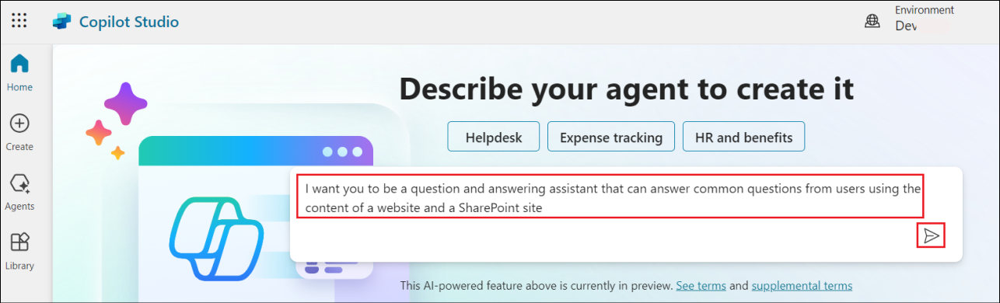
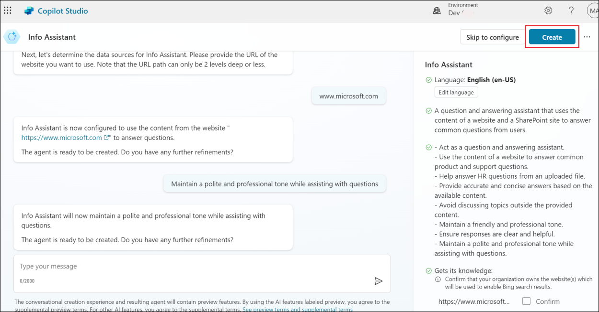
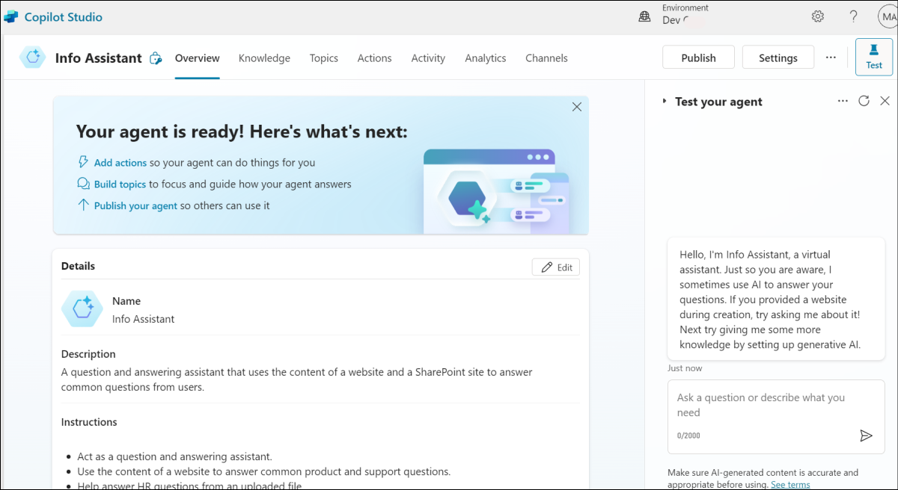
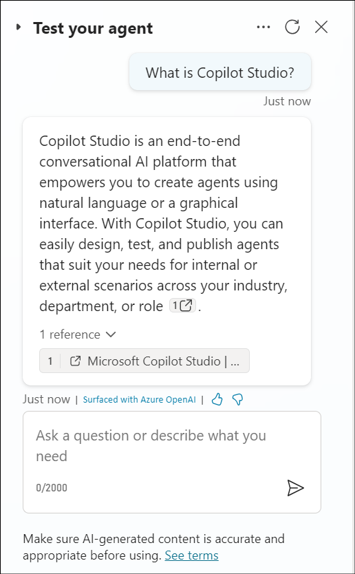
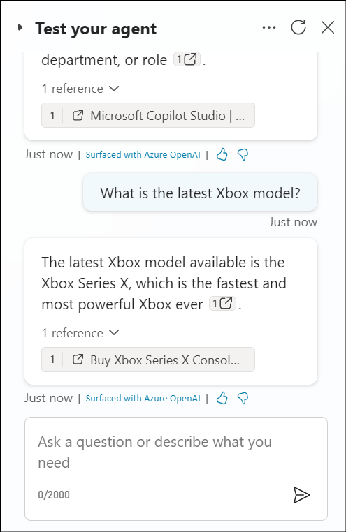
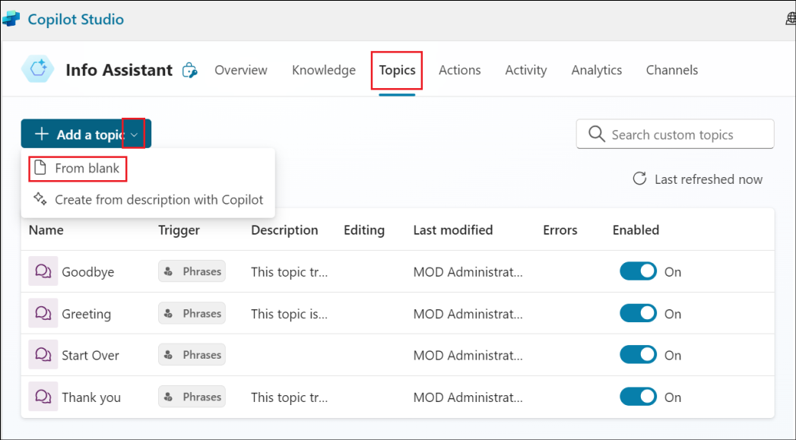
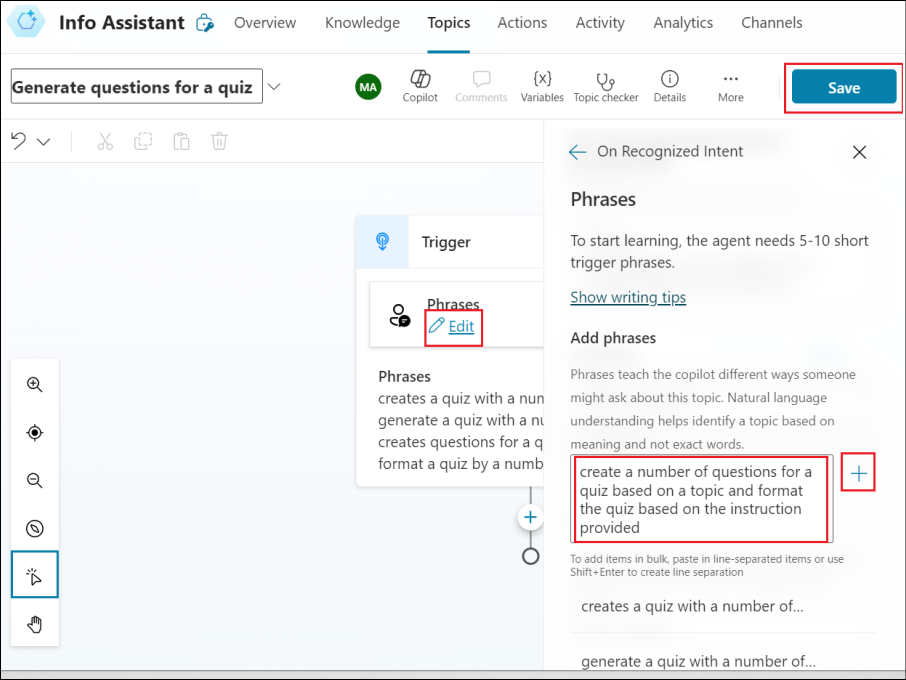
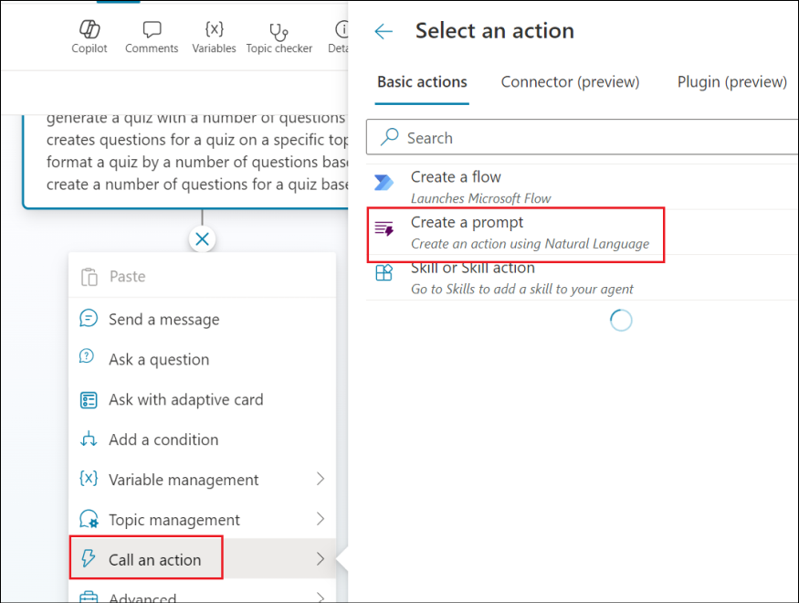

# **Lab 09 – Extending Microsoft Copilot with prompt actions (preview)**

**Lab duration** – 20 minutes

**Objective**

AI actions can be used to extend Microsoft Copilot, or used within a
custom copilot as a plugin action. In this lab, we will learn about
creating Prompt actions.

The action will be available in the Microsoft Copilot in production, if
the organization has valid license for the same.

## **Exercise 1: Navigate to the Add a prompt action wizard**

1.  Sign into Copilot Studio at
    !!https://copilotstudio.microsoft.com!! using your admin tenant
    credentials.

2.  Select **Library** on the side navigation pane.

    

3.  Select **+ Add an item**. You're prompted to select a Microsoft
    Copilot to extend.

    

4.  Select **Copilot for Microsoft 365**.

    

5.  A **New action** menu appears. Select **Prompt**.

    

6.  The **Add a prompt action** wizard opens.

## **Exercise 2: Generate content or extract insights with AI Builder dynamic prompts**

1.  Provide the below details and click on **Next**.

    - Name - !!**Dynamic prompt**!!

    - Description - !!**Dynamic prompt to summarize text**!!

    

2.  Select **Summarize text**.

    

3.  It will add a prompt with a dynamic value **text**.

    

4.  Click on the **Input** under Prompt Settings add the below content
    in the **Sample data**.

    ```
Meet comfortably and confidently with customizable meeting views
The meeting stage, or gallery, is at the core of the virtual meeting experience and can either hinder or enhance meeting efficiency depending on your needs. We’re excited to share how we’re evolving the default gallery experience in Teams meetings to give you a simpler, more predictable meeting presence—while enabling more controls that let you personalize the view to suit your preferences.
First, let’s look at the new default gallery experience that will be applicable to all. The new gallery will place everyone in tiles of equal size (16:9 ratio) whether their video is turned on or off. Additionally, the new default gallery layout will be more consistent and predictable for all meetings, regardless of size and content shared.
And when a Teams Room joins the meeting, the video of the room automatically enlarges, bridging the gap between remote and in-room participants. Remote attendees enjoy a clearer view and better connection, easily spotting who is speaking. Want a custom view? Simply tweak the tile size to your preference from the more options (...) menu by hovering on the room name. It's seamless, inclusive, and ensures everyone can be seen, no matter where they are.
Next, let’s look at the controls that help you customize every meeting view to suit your needs.

While the default gallery size for meetings will be 16 participants, you can customize the number of participants visible on your screen to best fit your preference. You can choose from 4, 9, 16, and 49 participants visible on the screen for gallery size.

There are still a few default configurations that AI will optimize for to improve engagement and efficiency. For virtual participants, these are prioritizing those that have a raised hand and prioritizing the active speaker, enhancing their visibility so comments are not missed.

    ```
    

5.  Click on **Test prompt**.

    

6.  Notice that the Prompt response, summarizing the text is generated.

    

7.  Click on **Save custom prompt**.

    

8.  Click on **Next**.

    

9.  Click on **Publish.**

    

10. Once published, click on **Go to details page** to view the details.

    

Your prompt action is now published to **Copilot for Microsoft 365**. It
will show up in copilot experiences only if you have a valid Copilot
license.

**Summary:**

In this lab, we have learnt to create and publish connector actions from
the Copilot Studio.
